# Cisco Virl ネットワークシミュレーター

{{ TOC }}

## 経験は机上の知識に勝る

コンピューターネットワークに詳しくなるにはどうすればよいかと問われれば、
多くのエンジニアは「TCP/IPの詳細について学べばよい」と答えるかもしれません。
これは自動車について詳しくなるにはどうすればよいかと聞かれた際に、
「自動車の仕組みを学んで、どういう構造になっているか知ること」と答えるのと同じです。
間違った答えではありませんが、自動車を知るということが構造を知ることなのか、
運転方法を学ぶことなのかにより学ぶ手段が変わります。

自動車の知識を得るのは多くの人にとって、それを生活や仕事にいかすためであり、
使えて初めて役にたちます。
「車のエンジンやブレーキの仕組みには詳しいけれども、運転できません」では困ってしまいます。
同じようにネットワークでも「内部的にどう動いているか」というミクロな知識よりは、
「どのようにネットワークを構築運用するか」というマクロレベルでの知識が要求されることが多いです。

TCP/IPにいくら詳しくなったとしてもマクロレベルの知識が不足していれば実務ではあまり役にたちません。
むしろTCP/IPの深い仕組みは実務ができるようになった初級者が

自動車の運転を学ぶ際に座学(どう使うか机上で学ぶ)と教習(実際に試して慣れる)があるように、
ネットワークの構築や運用を学ぶにも実際に手を動かすことが必要です。
自動車の運転の練習をするのに自動車が必要なように、
ネットワークの構築や運用を学ぶにはネットワーク機器が必要となります。

昔のネットワークエンジニアはそれを職場の機械や、人によっては個人購入するなどして調達していましたが、
今はシミュレーターと呼ばれるPC上で動かせるソフトウェアが広く用いられるようになりました。
シミュレーターは仮想化と呼ばれる「ハードウェアの上で複数のOSを動かす技術」を使うことで、
PCのうえにネットワーク機器を複数作り、それを操作する環境を提供します。

高額なものが多いネットワーク機器を学習のために多数揃えるのは金銭的に難しいことが多いですが、
シミュレーターであればデスクトップPC(パワーが不要ならノートPCでも大丈夫)を準備して、
無償か少額のソフトウェアライセンス代を支払えば学習環境を構築できます。

## ネットワークシミュレーターVirlの導入

ネットワークシミュレーターにはいくつかの種類があり、GNS3などは昔から広く利用されています。
GNS3はCisco社のネットワーク機器のOSイメージを使って仮想的なネットワーク機器を作成し、
機器間の接続や操作画面などをGUIで提供しています。

ただ、ハードウェアに強く依存したネットワーク機器をOSのイメージだけで模倣することが難しいため、
ルーターはまだしもスイッチと呼ばれる製品をシミュレーター上で利用することが難しいです。
また、これはCisco社公認のツールではないため、
「CiscoのOSを勝手に他の場所で使ってよいのか」というグレーゾーンな前提を持つソフトウェアであることも否めません。

ただ、Cisco社としてもシミュレーターを使った学習や検証に需要があることは昔から認識していました。
例えば私がCisco社で働いていた際は社内ツールとしてIOUやIOLといったUnix/Linux上で動作させるソフトウェアが広く利用されていました。
また、Ciscoの機器を学習したいというユーザーに向けて「Cisco Packet Tracer」というツールも提供しており、
これを使うことで実際にCiscoの機器を模擬的に設定して試験対策などに活用することもできます。
ただ、Packet Tracerができることは多くなく、あくまでも初心者向けの初歩的な学習環境にすぎません。
IOUやIOLにいたってはCisco関係者以外は利用することが禁じられています。

この状況が大きく変わったのがCiscoが製品としてネットワークシミュレーターの販売に乗り出したタイミングです。
この製品は「**Virl**」と呼ばれるもので、
これを使うことでCisco社公認のもとで実際に利用されているルーターやスイッチのOSを仮想的に利用することができます。
Virlで利用するCiscoのOSは、実際にCiscoの製品(ハードウェア)にインストールするOSをベースとして、
ハードウェアに依存した場所をソフトウェアで再実装されています。
そのため、GNS3と違ってスイッチをシミュレーター上で利用することも可能です。

Virlには企業向けのものと、個人向けのものが存在しており、
個人向けのものは個人が買うことができる価格設定(2018年時点で年間200$)となっています。
これは人によっては高額かもしれませんが、
きちんと勉強をして業界標準よりも優れたネットワークエンジニアになることができるのであれば、
それを昇給や昇進、はたまた転職といったご自身のキャリアに活用することができるのではないでしょうか。

## Virl環境の構築

Virlを利用するには、Virlをインストールするハードウェア(個人だとデスクトップPC、企業だとサーバーが一般的)と、
Virlのソフトウェアが必要となります。
以下でハードウェア及びソフトウェアの調達法及び、インストール方法について述べます。
ただ、こういった情報は変化しますので、Virlのドキュメントなどを参照して正確な手順はご自身で確認してください。

### ハードウェア

Virlを利用するには「Virlの実行環境(Linux)」と、Virlが動かすルーターやスイッチを動かすだけのハードウェアリソースが必要となります。
考慮をする必要があるのはCPUとメモリ程度で、特別な使い方をしないのであればインストールするディスク(100G以上あれば大丈夫)や、
ネットワーク(インターネットに接続できれば問題なし)には高い要件はありません。

ただ、仮想化の技術を使って何台ものOSを動かすため、
CPUのコア数は4コア以上あることが望ましく、メモリも16G程度は欲しいです。
2,3台程度しかルーターやスイッチを動かさないのであればCPU2コアで8Gメモリでもまかなえるかもしれませんが、
それだとすぐに不足してしまいます。
十分に予算があればパワフルなデスクトップPCを新調してもよいかと思いますが、
私は5年型落ちしているIntelのコアi7にDDR2メモリを16G持つMac Miniで十分まかなえています。
新しいもののコア数とメモリが少ないマシンよりは、古くてもいいのでコア数とメモリ容量が大きいマシンを準備したほうがよいかもしれません。

なお、後述するVirl環境の基盤としてVMWare ESXiを利用するのであれば、
ESXiでそのCPUを利用できるか調べてみたほうがよいかもしれません。

### Virlを動かす基盤

VirlはLinux上で動くアプリケーションですが、
利用環境の構築は「Linux上にVirlをインストールする」のではなく、Virlが使えるカスタマイズされたLinuxをセットアップするという手法を使います。

Virl用のLinuxを動かす環境としては3つの選択肢が用意されており、
一番主流なのがVMWare ESXiに仮想マシンとしてセットアップするというものです。
VMWare ESXiはハイパーバイザーと呼ばれる仮想化環境を動かす専用OSとして普及しており、
機能制限がされた無料版も存在しています。
IT関係の会社や一般企業のIT部門として働いておりVMWare環境を使えるのであればそれを利用し、
そうでないのなら自前で前記のハードウェアを用意して無料版のESXiをインストールするのがよいかと思います。

ハイパーバイザーとしてインストールが必要となるESXiが準備できない場合は、
WindowsやMac上で動かすVMWare Player/Workstation/Fusionといったソフトウェアを使うこともできます。
これらのソフト上でESXiと同じく仮想マシンを動かせます。
デスクトップPCやノートPCを持っていれば気軽に試すことができますが、
前述のESXiに比べると仮想マシンの性能が劣るため、高性能なものを使う必要があるかもしれません。

最後の手法がVirl用のLinuxをDVDを使って直接ハードウェアにインストールするというものです。
インストールされた仮想マシンを展開するのに比べるとセットアップは難しいですが、
パフォーマンスは高いです。

私は前述のようにESXiの6.0で仮想マシンとしてVirlを動かしています。

### Virlイメージの取得

VirlはCisco社の製品ですので、Virlを利用するには購入する必要があります。
Googleなりで「Cisco Virl」と検索してCisco Learning Network Store (https://learningnetworkstore.cisco.com/) の購入ページで買ってください。
購入すれば同サイトのアカウントページより、Virlのイメージ及びライセンス情報をダウンロードできるようになります。

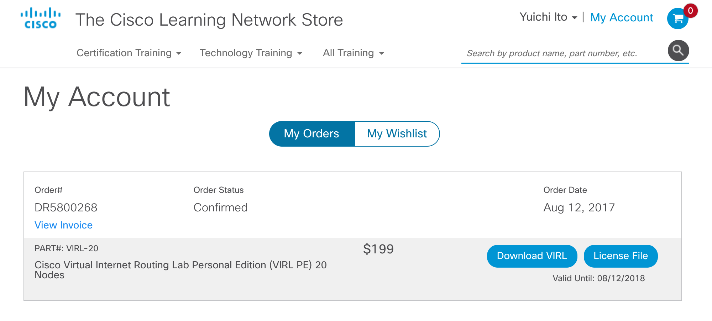

ダウンロードするイメージは先程の基盤によって異なっており、
ESXi上に仮想マシンとして展開するためのOVA、
そしてWindowsやMac上で動かす仮想化ソフトウェアVMWare Player/Workstation/Fusion用のOVA及び、
ハードウェアに直接インストールするためのISOがあります。
どのようなかたちでVirlを利用するかに応じて、適切なイメージを取得してください。
ここではESXi用のイメージを取得して話を進めます。

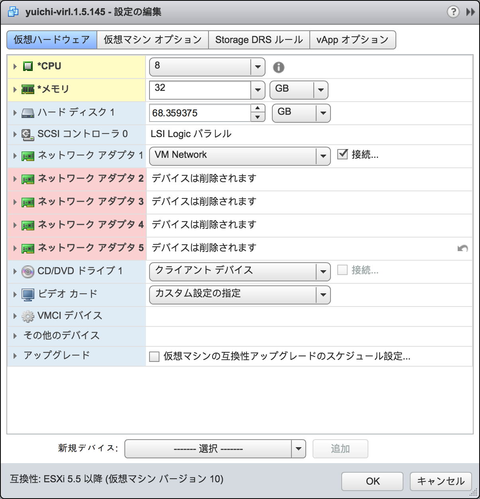

なお、以後の話はVirlのドキュメントページに記載されています。
2018年の夏時点での最新版である1.5.Xの手順を日本語で少し丁寧めに書き下しただけなので、
概要を把握したら本家サイトの手順書も確認した上で導入をしてください。

http://virl.cisco.com

### VMWare基板上でのVirlイメージの展開

OVAイメージは仮想マシンの仮想ディスク及び構成ファイルなどがまとめられたファイルもしくはディレクトリです。
それをVMWare環境に取り込むことで仮想マシンとしてVirlを使うことができます。

OVAを展開して仮想マシンとして使うには「OVFテンプレートのデプロイ」というインポート作業をします。
ファイルを与えて仮想マシン名を決めれば、テンプレートに沿った仮想マシンが作成されます。

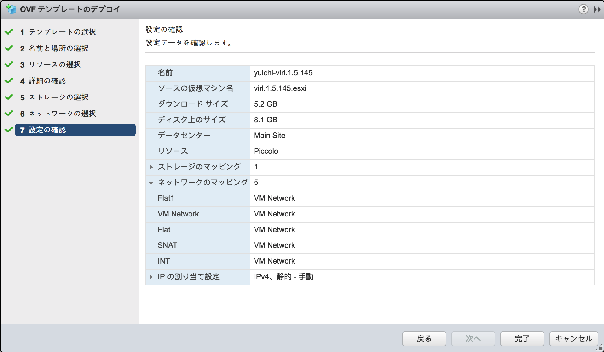

NICが5つ存在しており、それぞれに役目があります。
ただ、必須なのはインターネットに接続できるインターフェースひとつだけですので、
簡単な利用法とするためにインターフェース1以外は仮想マシンの設定から消してしまいます。
それと同時に仮想CPUと仮想メモリのサイズを変更します。

これにてVirlの仮想マシンとしての展開及び設定変更は完了です。

### コンソールを使ったVirlの初期設定

デスクトップPCの画面を見るにはディスプレイを使いますが、
仮想マシンで同じことをするには仮想マシンの「コンソール」を表示します。
VirlのVMをパワーオンし、コンソールを開くと最初に以下のような画面が表示されています。

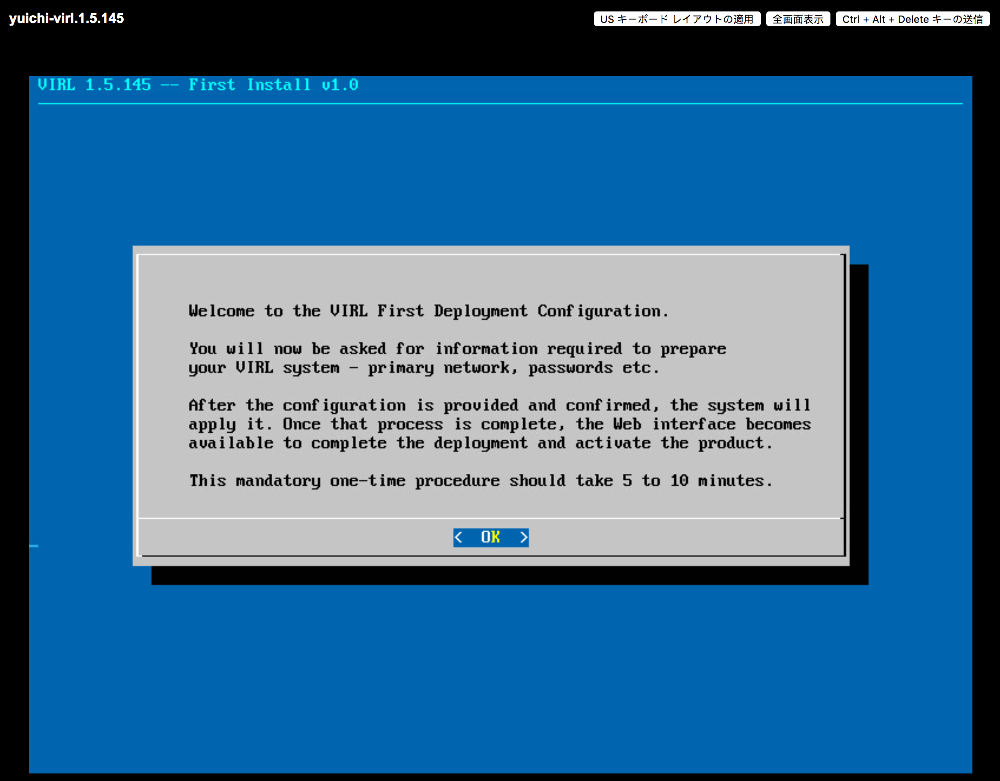

キーボードだけで操作するGUIの画面に従って初期設定を進めていくことで、
Virlの設定は完了します。

ホスト名やドメイン名、NTPサーバーを指示に従って設定します。
特にこだわりがなければデフォルトのままで構いません。

次にネットワークの設定を行います。
どのインターフェースをプライマリー(インターネットへの接続に使うメインとなるインターフェース)にするかという選択をします。
その次に、そのインターフェースのアドレス設定をします。
DHCPを使った自動取得にしても構いませんが、
Virlはサーバーとしてアクセスされる機器であるためIPアドレスが変わってしまうと運用が面倒となります。
ここで固定IPを設定してしまうことを推奨します。

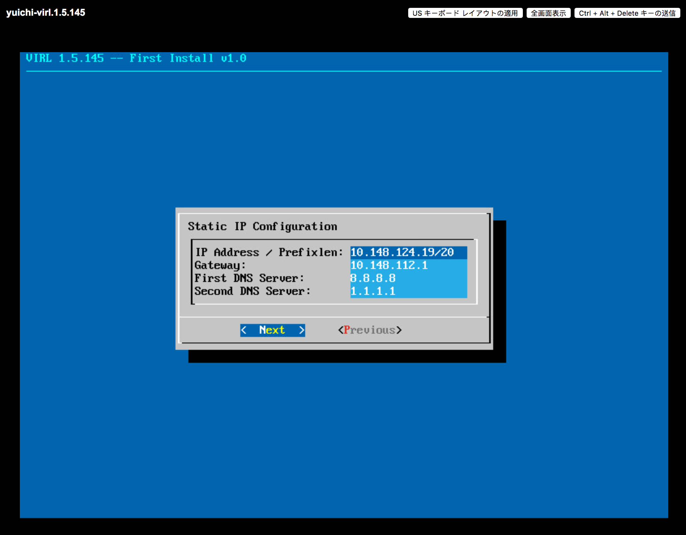

その次にパスワード設定をしますが、特にこだわりがなければデフォルトのままで構いません。
ただ、認証系にはおおまかに「ウェブを使った管理画面」「VMのコンソール画面」「Virlでのシミュレーション実行」の3つがあり、
それぞれがここで設定した値を使います。

デフォルトは以下のようになっています。

* infrastructure(システム内部。あまり触らない)のパスワード : password
* UWM Admin(ウェブ管理画面ユーザー)のパスワード : password
* Primary Project名(シミュレーターの第一ユーザー名) : guest
* Primary Projectパスワード : guest
* コンソールユーザーvirlのパスワード : VIRL

これが完了したらクラスタ化(複数のVirlサーバーを連携するか)の設定をしますが、
ここではクラスタ化をしないためチェックをせずに次に進みます。

以上で設定が完了したので設定確認画面が表示され、問題なければ設定を終了します。
プログレスバーで設定状況が表示され、しばらくすると仮想マシンが再起動されてコンソール画面が以下のようになります。

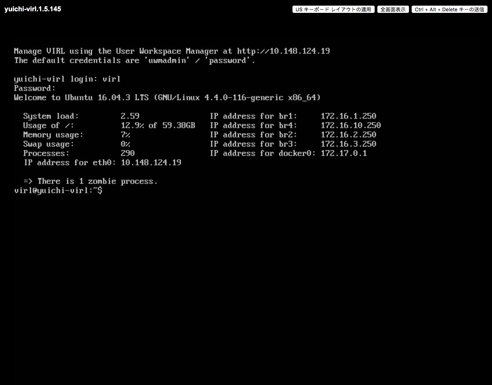

コンソールユーザー名virlとパスワード(デフォルトはVIRL)でログインし、
pingなどでデフォルトゲートウェイへの疎通及び、名前解決を含むインターネットへの疎通に問題ないか確認をしてください。

問題がなければブラウザでこのアドレスに対してアクセスをすれば、virlの管理画面が表示されます。
ユーザー名はuwmadminとパスワード(デフォルトはpassword)を入力すれば、以下のような画面が表示されるはずです。
これで初期設定は完了です。

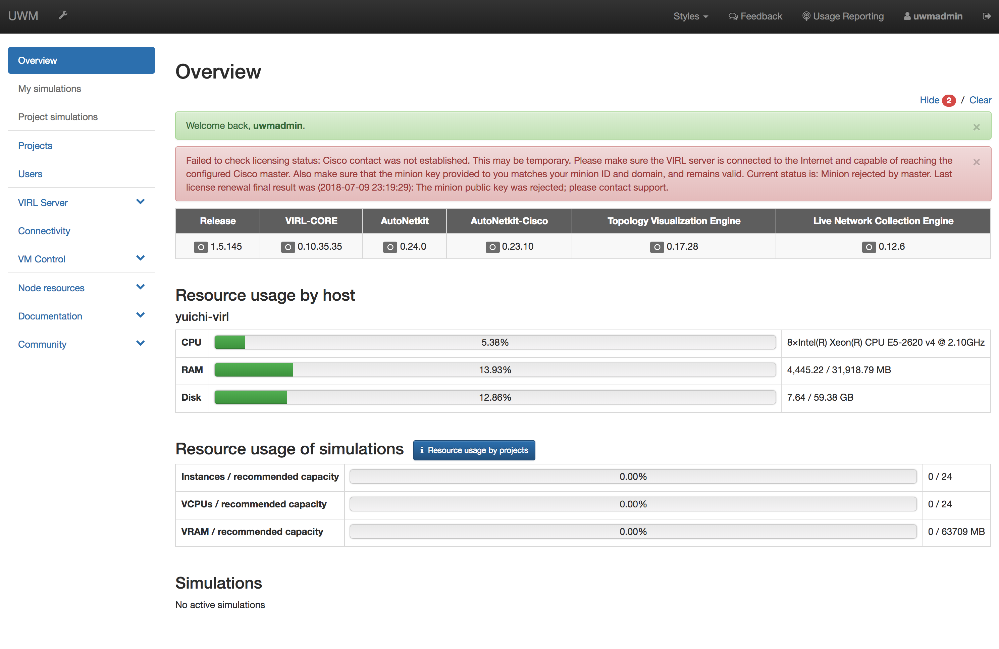

### Virlのアクティベーション

Virlは有償の製品ですので簡単に作成できる仮想マシンの展開だけでは利用できず、
購入時に与えられるライセンス情報を設定する必要があります。
ライセンスはファイルとして提供されており、
イメージをダウンロードしたCisco Learning Network StoreのサイトのアカウントページのVirlの注文履歴に「License File」というボタンがあるので、
それを押せばライセンスファイルをダウンロードします。

準備が整ったら、先程作成したVirlのアドレスにブラウザでアクセスし、管理画面を開きます。
左側のナビゲーションから「Virl Server」->「Salt Configuration and Status」として「Salt Status」のページに移ります。
この画面はラインセンス管理に利用している「SaltStack」というシステムの状態を表示していますが、
登録してしまえば終わりなので詳細な仕組みを覚える必要はありません。

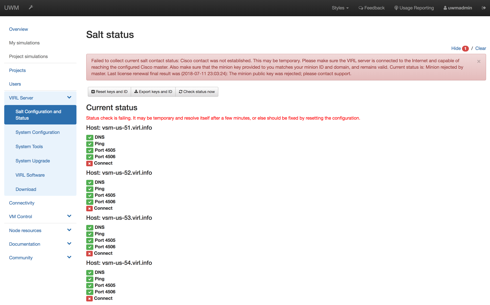

左上の「Rest keys and ID」をクリックして設定画面に移り、「Load config file」ボタンよりさきほどのライセンスファイルを指定します。
必要な情報が埋められるので、残る「List of Cisco salt masters」から適切な地域(日本であればAP)をクリックし、
「Master sign public key」で「eft.pub」を選択します。

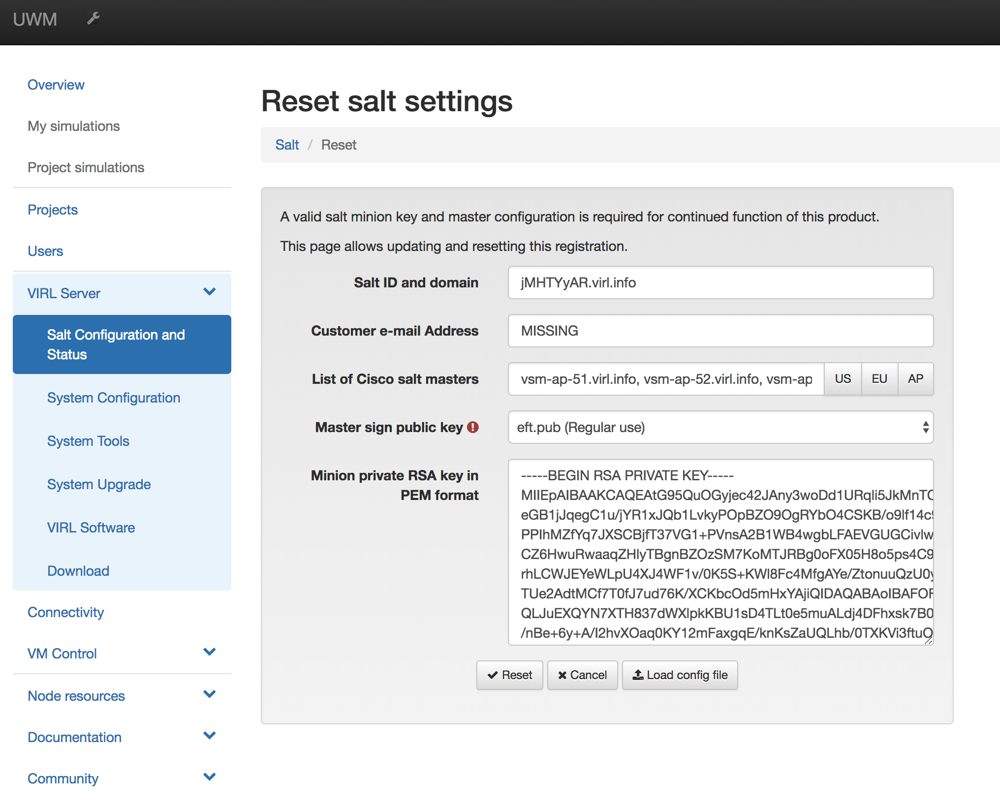

設定しおえたら「reset」ボタンを押すと、この内容で設定がリセットされます。
リセット後のサーバーへの認証にしばらく時間がかかりますが、待っていると完了して画面遷移します。

特にトラブルがなければサーバーに接続してSuccess状態となります。
これにてアクティベーションは完了です。

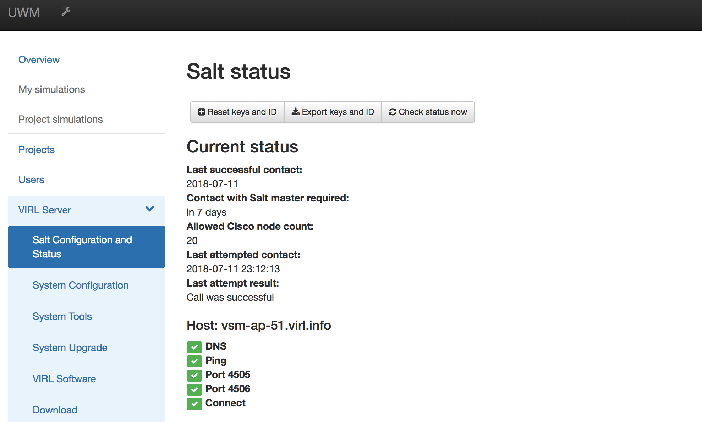

### Virlを操作するツールのダウンロードとセットアップ

Virlを使ったシミュレーションをするためには「VM Maestro」というツールを使います。
これはWindows及びMacで利用できるデスクトップアプリケーションです。
ウェブの管理画面から「VIRL Server」->「Download」と進み、
ご自身の環境にあったアプリのイメージをダウンロードしてそれを起動します。

このツール上でシミュレーターを利用しますが、シミュレーターはこのアプリ自体ではなく、
あくまでもVirlサーバーとなります。
そのため、アプリに対してVirlサーバーを登録する必要があります。

アプリの右下にある鍵マークがユーザ及びサーバーの登録情報ですので、
クリックして設定画面を開きます。
Master Credentialsにインストール時に設定したPrimary Projectとそのパスワードを設定します。
そして下部にWeb ServicesのURL(REST API)のアドレスをサーバーのアドレスに書き換えます。
アドレス以外はそのままにしておいてください。

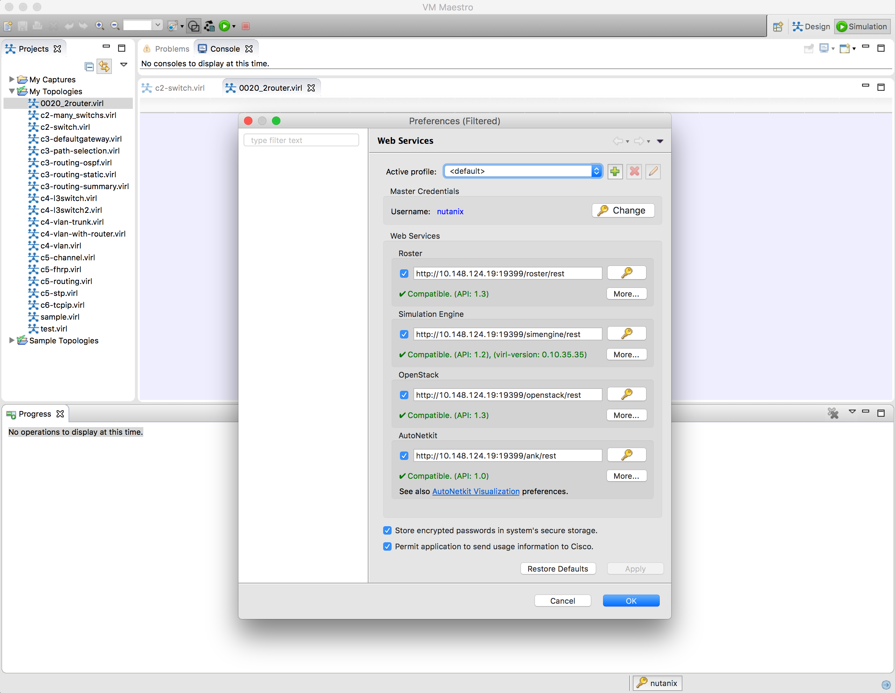

サーバーに接続できれば、緑色で問題なしという表示になりますので、
OKを押して設定を終了してください。
これでサーバー及びツールの準備が完了したので、実際にシミュレーションを行えるようになりました。

## Virlを使ったシミュレーション

### プロジェクトの作成

どういった機器をどのように接続し、どのような設定を持つかといったVirlでのシミュレーション環境の構成は、
トポロジーファイルという構成ファイルにまとめられています。

これは自分の手で作成する必要はなく、VirlのGUIで新規作成にて作ります。
新規作成で「New Topology Folder」とすればトポロジーファイルをまとめるフォルダーを作り、
新規作成で「New Topology File」とすればトポロジーファイルが作られます。
今回はフォルダーをwebとし、ファイルを0000_01としました。

新規作成時は勝手にそのトポロジーが選択されていますが、
これらはVirlの「Projects」というペインにまとめられていますので、
過去に作ったものをダブルクリックで選択することもできます。

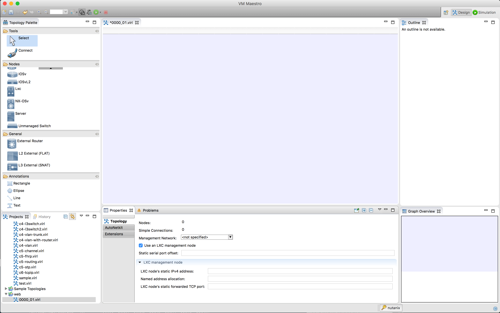

上記画面はトポロジの作成画面となっています。
トポロジは「デザインモード」と「シミュレーションモード」があり、それは画面の右上のボタンで切り替えます。
シミュレーションを実行するまえにデザインが必要となるので、
シミュレーションモードとなっていればデザインモードに移ります。

左側には先程のProjectsペインに加えて、
シミュレーションで使う機材の一覧がある「Nodes」というペインや結線などをするための「Tools」というペインがあります。
初歩的な使い方としてはNodesペインにある「IOSv(標準的なCisco Router)」と「IOSvL2(標準的なCisco L3 Switch)」を結線で結ぶだけです。
Nodesにある機材をクリックして選択し、右側の青いエリアでクリックすることで配置できます。
ここでは2つのルーター(IOSv)を配置します。
エスケープボタンで機材の選択が解除されます。

Toolsの「Connect」がケーブルですので、それをクリックで選択して右側の機材の2つをクリックすると、
その2つの機材が結線で結ばれます。

作成したトポロジー

アプリケーションVM Maestroを開き

### 機器の準備と結線

