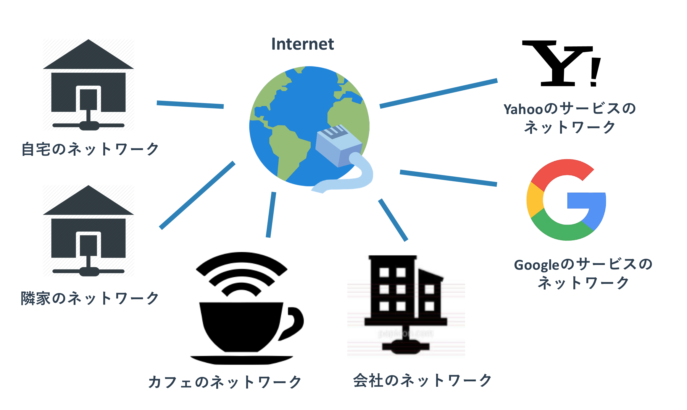
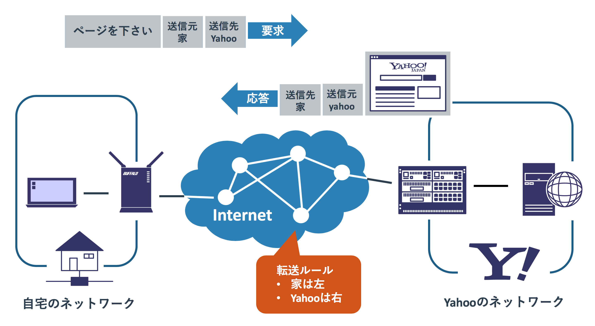
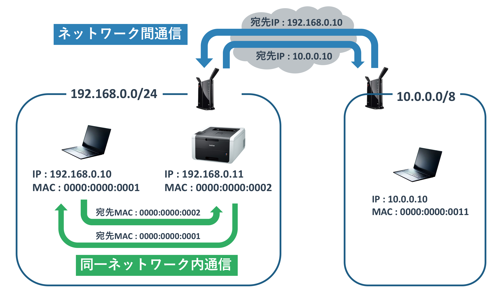
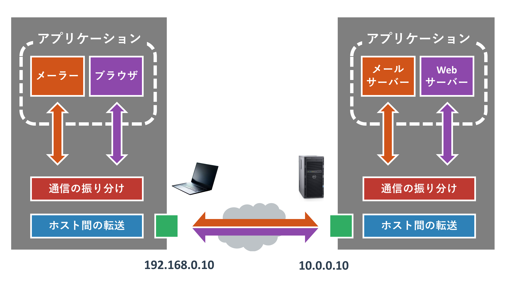
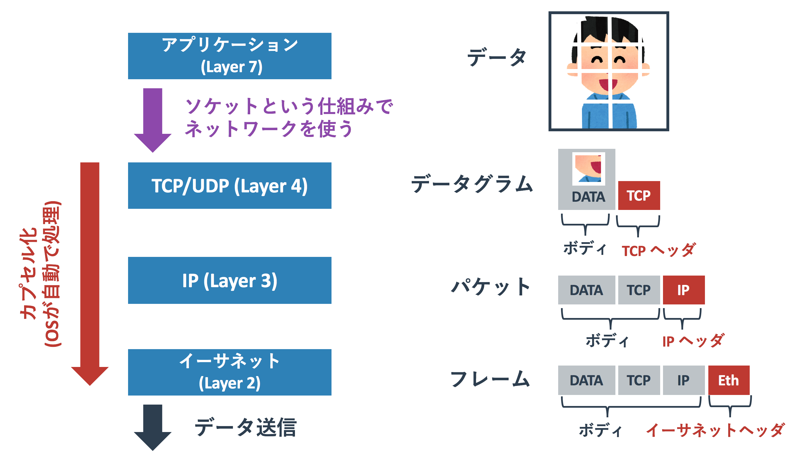
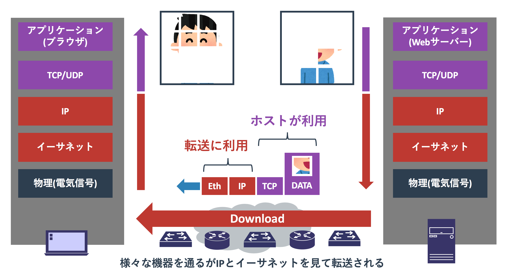

# 自宅環境で学ぶネットワークの基礎

{{ TOC }}

## 概要

## 自宅ネットワークとインターネット

インターネットの回線を持つ一般的な家では、無線LANルーターを中心としたネットワークが作られています。

この図のルーターのポート(ケーブルをさす穴)には2種類あります。
インターネット側にさすポートと、無線LANルーターを使うPCやプリンタを有線でさすポートです。
インターネット側にさすポートは引っ越しをしたときに工事をして作ってもらったり、
アパートやマンションから提供されているなど色々なかたちがあります。
図のようにONUやモデムといった機械が自宅内か集合住宅の共用部にあり、
それが電線の一部である光ケーブルと接続することで外とつながっています。

自宅内のPCやスマホには直接インターネット回線はさされていないので、
インターネットを使うにはインターネットに接続された無線LANルーターに中継をしてもらう必要があります。
そのため、wifi(無線LAN)やLANケーブル(有線LAN)でPCやスマホを無線LANルーターに接続します。

Wifiは物理的にポートというかたちでは存在しませんが、PCやプリンタをさすポートとほとんど同じ役割をはたします。
PCやスマホで「wifiを選んでSSIDとパスワードを入力して接続する」ということをしますが、
これは「ルーターに接続」して「ルーターを経由してインターネットを使う」ためです。
スマホは外で4G回線を利用するように家の中でも直接インターネットに繋げますが、
ルーターを経由すればキャリアの通信制限を気にせずに自由に高速なインターネット回線を利用できます。

無線LANルーターを境界にして「家の中」と「家の外」が分かれています。
インターネット側のポートからがインターネットであり、PCなどをさすポートやwifiが自宅内のネットワークです。
インターネットがどのように作られているかは後ほど話しますが、
大事なのは「自宅のネットワークとインターネットは分かれている」ということです。

インターネットという巨大な1つのネットワークがあるのではなく、
世界中にある数え切れないネットワークが存在し、それらが互いに接続しあってインターネットが構築されています。

インターネットに接続されるネットワークはあなたが使うものだけでなく、
お隣のAさんが使う自宅ネットワークや、yahooやgoogleといったウェブページを提供する会社のネットワークもあります。

たとえば「自宅のネットワーク」「会社のネットワーク」「カフェやホテルのネットワーク」といった様々な環境にPCやスマホを接続するかと思いますが、
それらのネットワークは別々のものであるため、会社に繋いだPCから自宅のネットワークプリンタを使うといったことは通常できません。
もし世界中の機械が一つの巨大なインターネットというネットワークに繋がっているのであれば、
特に何もせず家の中でプリンタを使うように、会社からでも自宅のプリンタを使うことができるはずです。

インターネット(Internet)という単語は「Inter Network」に由来しています。
この「Inter」は「中間」という意味を持っていますので、Internetを日本語に直訳すると「ネットワークの中間」ともいえます。

## IPアドレスはインターネット上の住所

### なぜIPアドレスが必要か

ブラウザを利用してyahooなりgoogleなりのページを見るには、まずインターネットへの接続が必要です。
yahooやgoogleもインターネットに接続しているので、インターネットを通じて両者のサービスにアクセスできます。

ただ、インターネットには多くの小さなネットワークと機械が接続されているので、
「どこにアクセスするか」ということを示す必要があります。
これはちょうど宅急便を送るのに相手の住所を書く必要があることに似ています。

自分のPCの住所を送り元としてYahooの住所に対して「このページの情報を下さい」とリクエストを出します。
そうするとインターネットの中でそのリクエストがYahooの住所に届けられるように転送されていき、
最終的にYahooにそのリクエストが届きます。

Yahooはそのリクエストを確認してページ情報をレスポンスとして送り返します。
その送り返す宛先の住所は先ほど送り元とした自分のPCの住所となっています。
自分のPCからYahooにリクエストが届いたのと同じように、インターネットのなかでレスポンスが自宅のPCの住所まで転送されていき、
最終的に自分のPCに届けられます。
これで通信が完了です。

インターネットの世界では住所の表記に「IPアドレス」を使っています。
Yahooにアクセスするためにはデータの送信先のIPアドレスにYahooのアドレスを指定します。
そして送信元のアドレスには自分のPCのIPアドレスを指定しています。
こうすることで、インターネットの中でYahoo宛のIPアドレスを持ったデータ(リクエスト)はYahooに届けられ、
自宅のPCのIPアドレスを持ったデータ(レスポンス)は自宅のPCに届けられるのです。

なお、接続をするにはYahooのIPアドレスを入力する必要がありますが、
通常はIPアドレスに対応する「**ドメイン名**」というものを使います。
「yahoo.co.jp」などが自動的にIPアドレスに変換されて、そのIPアドレスで接続先が指定されます。
これには「**DNS(ドメインネームシステム)**」と呼ばれる仕組みが使われています。

### IPアドレスの形式

自宅のPCやスマホのIPアドレスを確認すると、
たとえば「192.168.0.5」「172.16.0.5」「10.0.0.5」などといったものになっているかと思います。

IPアドレスの形式はドット「.」区切りの4つの数字から構成されていて、
それぞれの数字は2進数が8桁(8bit)で表現できる「0から255まで」のいずれかとなります。
ドットの間の各数値は「**オクテット**」と呼ばれており、前から第一オクテット、第二オクテットとなります。
たとえば「192.168.0.5」の第一オクテットは192で、第四オクテットは5です。

使えるアドレスは「2進数8桁」が4つあるため、「2進数32桁」で表現可能な範囲です。
これは2の32乗(2x2x2を32回繰り返す)の約43億です。
各オクテットの組合せ「256 x 256 x 256 x 256」で約43億個といったほうがわかりやすいかもしれません。

このIPアドレスですが、中に区切りがあり「**ネットワークアドレス**」と「**ホストアドレス**」に分かれています。
ネットワークアドレスは「ネットワークを特定する」ために使われていて、
ホストアドレスは「そのネットワークのなかの機械を特定する」ために使われています。
たとえば「192.168.0.5」ですと前半の「192.168.0」がネットワークアドレスで、
後半の「.5」がホストアドレスといった具合です。

上記の図では「1.0.0.1」「1.0.0.2」といった機器が属するネットワークと、
「2.0.0.1」「2.0.0.2」といった機器が属するネットワークがあります。

昔は第一オクテットの値に応じて、ネットワークアドレスとホストアドレスの境界が決められていました。
たとえば「10.0.0.5」ですと第一オクテットが10なので区切りは「10」「0.0.5」となり、
「192.168.0.5」だと第一オクテットが192なので「192.168.0」「5」と分かれるといったものです。

ただ、上記のルールだと融通が効かなくてアドレスが足りなくなったため、
今は「**サブネット**」という仕組みで、どこまでがネットワークアドレスかを示すようになりました。
たとえば「1.0.0.1」というIPアドレスの「1」までをネットワークアドレスとするか、
「1.0.0」までをネットワークアドレスとするかは任意に決めることができるということです。
この「どこで区切るか」を示すには「**サブネットマスク**」が使われます。

サブネットマスクの詳細はここでは割愛しますが、「1.0.0.1/X」という形式のXで、
何ビット目までがネットワークアドレスかを示すます。

IPアドレスの各オクテット(ドット区切りの中の数値)は8ビットですので、「/8」であれば第一オクテットがネットワークアドレスとなります。
同様に「/24」であれば第三オクテットまでがネットワークアドレスとなります。

* 1.0.0.1/8 : ネットワークアドレスが「1」でホストアドレスが「0.0.1」
* 1.0.0.1/16 : ネットワークアドレスが「1.0」でホストアドレスが「0.1」
* 1.0.0.1/24 : ネットワークアドレスが「1.0.0」でホストアドレスが「1」

サブネットとして8,16,24以外を指定することもできますが、その場合は計算が必要になり複雑になります。
現実のネットワークではこれら以外の値も利用されるため説明しますが、
パット見で分かりにくくなるため本サイトのサンプル可能な限り8,16,24のサブネットを使います。

### サブネットマスクの表記方法

255.255.255.0の話

### 設定例

#### 図: Windowsのネットワーク設定

#### 図: Macのネットワーク設定

## MACアドレス

無線LANルーターが作る自宅ネットワークにはPCやスマホだけでなく、プリンタなどが接続されているかもしれません。
自分のPCでプリンタを使う場合はデータの転送にIPアドレスではなく「**MACアドレス(Media Access Control アドレス)**」が利用されます。
MACアドレスはそれぞれの機械のネットワークのポートやwifiを使うためのパーツが持っていて、
IPアドレスのように設定されることはありません。

PCの通信は大きく2種類に分けられます。
それは「同じネットワーク内での通信」と「異なるネットワークへの通信」です。
「192.168.0.1/24」と「192.168.0.2/24」はどちらも「192.168.0.0/24」のネットワークに属しているため、
同じネットワーク内での通信です。
一方、「192.168.0.1/24」と「10.0.0.1/24」の通信は異なるネットワークに属するため、
「異なるネットワークへの通信」となります。

細かい話は以後のページで扱いますが、
いちばん重要なのは「**同じネットワーク内の通信はMACアドレスを基準にデータが転送される**」ことと
「**異なるネットワークへの通信はIPアドレスを基準にデータ転送される**」という事実です。

ただ、データの転送にはMACアドレスを使うものの、
相手がどのようなMACアドレスを持っているか分からないため、相手の特定にはIPアドレスを利用します。
自宅のプリンタやNASの設定をされたことがあれば分かるかもしれませんが、
プリンタやNASを使うには自分のPCからそれらをIPで指定をします。

通信相手を指定するのに「IPアドレス」を使い、実際の通信には「MACアドレス」を使うという順序があるため、
「IPアドレスからMACアドレスを特定する」仕組みが必要となります。
これには「**ARP**」という仕組みが用いらており、これを使うことで「IPアドレスXに対するMACアドレスはY」といったことが分かります。
この対応が分かれば「IPアドレスXの機器あての通信はMACアドレスYに送る」とすることができます。

MACアドレスとMACアドレスを使ったデータの転送の仕組みは、ネットワークにとって非常に重要です。
ただ、PCの利用者がそれを意識する場面はほとんどないため、きちんと知っている人は多くありません。
自宅ネットワークの構築程度であれば意識はしなくても問題ないですが、
企業レベルのネットワークになるとVLANなどの設定をするためにはきちんとした理解が必要になります。

### MACアドレスの形式

MACアドレスの形式は「32:61:3C:4E:B6:05」といった16進数2桁の組合せが6つから構成されています。
各数値の組み合わの区切りはコロンが利用されることが多いですが、
ハイフンで区切って「04-A3-43-5F-43-23」などとすることが多いです。

16進数は10進数でいう「0から15」までを1桁で表現する記法で、
10進数の10はA、11はB、12はC、13はD、14はE、15はFと表記されます。
16進数2桁は実は2進数8桁と同じです。
「16の2乗=256」と「2の8乗=256」が同じことからも分かります。
そのため1オクテット(8bit)を表現するのに16進数が用いられます。

MACアドレスの前半3オクテットは「**ベンダーコード**」と呼ばれ、製造ベンダーに対応する値が記されます。
後半3オクテットはベンダーが独自につける番号で、機器の種類ではなくそれぞれの機器で独自の値をそのベンダーのルールで設定します。
たとえば全く同じ1ギガのインターフェースカードを2枚買ってきたとしても、
それぞれが持つMACアドレスは別のものとなります。

## ポート番号

IPアドレスとMACアドレスはホスト(PCなど)間のデータ転送に使われます。
ただ、これに加えて「**ポート番号**」がホストの上で動く「アプリケーション」にデータを届けるために使われます。

PCはブラウザだけではなく、メールやミーティングシステム(Skypeなど)を使うことができ、
それらの通信が同時に流れています。
どのデータがどのアプリケーションかを識別するためにポート番号が使われます。
たとえばYahooにブラウザでアクセスしながら、Yahooにメールを同時に送ったとすれば、
ブラウザ通信とメール通信の送信元のIPアドレスと宛先のIPアドレスは全く同じになります。
IPアドレスではデータの区別ができないので、ポート番号で両者を区別します。

また、サービスを提供するサーバーと呼ばれる業務用のPCでは、
ポート番号ごとにサービスを提供できます。
どのサービスがどのポート番号を使うかということについては、一般的なルールがあります。
たとえばブラウザが使うHTTPという通信は80番ポートを使います。
ポート番号1から1024までは「ウェルノウンポート(well known port:よく知られたポート)」ということで、
有名なサービス(ブラウザ、メール、その他)と結び付けられています。

そのため、Yahooのウェブページの情報を取得したければ相手の80番ポートを指定して接続すれば構いません。
自分側のポート番号はなんでもよいので、上記のウェルノウンポート以外の利用していない番号を一時的に利用します。

ネットワークの中でのデータ転送はあくまでもIPアドレスとMACアドレスを基準として行われます。
そのため、ネットワークエンジニアにとってポート番号やアプリケーションの重要性はそれほど高くありませんでした。
ただ、近年はセキュリティの関係でネットワークに流れる通信のポート番号やアプリケーションの種類を意識する場面が多くなってきています。
きちんとIPアドレスとMACアドレスを使った転送の仕組みを理解できたら、
ポート番号やアプリケーションの通信についても勉強してみてもよいかもしれません。

## TCP/IPとプロトコルスタック

今まで話してきたIPアドレスやMACアドレス、ポート番号の定義は「**TCP/IP**」という標準化されたルールで決められています。

日本語しか知らない日本人と英語しか知らないアメリカ人の会話がなりたたないように、
機器同士も共有する言葉がないとお互いに会話することができません。
機器同士がやりとりできているのも、この標準化された「TCP/IP」と呼ばれるルールがあるからこそです。
PCやスマホといった一般的な機器だけでなく、
業務用のスイッチやルーターも全てこのTCP/IPのルールに従って動作をしているためインターネットが存在できます。

TCP/IPにおける一番重要なコンセプトは「**機能をレイヤーに分ける**」というものです。
ネットワーク全てを一つの巨大なルールで定めるのではなく、この機能はこれ、この機能はこれとして細かく区切り、
それを重ねたり組み合わせることでネットワークを作っています。

以下にTCP/IPの全体像を記載します。

レイヤー2(L2)レイヤー3(L3)、レイヤー4(L4)が積み重ねられており、
L2は隣接する機器同士の通信に責任を持ち、L3は最終的に通信しあうホスト間の通信に責任を持っています。
そしてL4はネットワークを使うアプリケーションにデータを届ける仕事に責任を持っています。

TCP/IPにおいては各レイヤーごとにプロトコルを置き換えることができますが、99%のネットワークでは以下の構成となっています。

* L2: イーサネットプロトコル(MACアドレスを使った通信)
* L3: インターネットプロトコル(IPアドレスを使った通信)
* L4: TCPもしくはUDP(ポート番号及びアプリケーションにデータを届ける)

### カプセル化

TCP/IPでは各レイヤーごとにデータを「**カプセル化**」します。
カプセル化ではデータをマトリョーシカのように「**ヘッダ**」で包んでいきます。
包まれる部分を「**ボディ**」と呼んでいます。

データを送信する側では、
アプリケーションはデータをプログラミング言語が提供する「**ソケット**」という仕組みを使って送ります。
ソケットではL4のプロトコルとしてTCPまたはUDPを選び、宛先IPと宛先ポート番号を与えます。
新しいプログラミング言語だとソケットを抽象化した簡易なものが提供されていますが、仕組みは大差ありません。

ソケットに渡されたデータはTCPもしくはUDPでカプセル化されます。
このとき、宛先ポート番号は指定されたもので、送信元ポート番号は空いているものが勝手に選ばれます。
L4でカプセル化されたデータは「**データグラム**」または「セグメント」と呼ばれています。

データグラムは次にIPアドレスでカプセル化されます。
宛先IPはソケットで指定されたものが設定され、送信元IPは自分のIPが設定されます。
L3(IP)でカプセル化されたデータは「**パケット**」と呼ばれています。

パケットは次にイーサネットプロトコルでカプセル化されます。
宛先MACアドレスはARPで解決されたものを設定(詳細は長くなるため後述)し、送信元IPは自分のMACアドレスが設定されます。
L2(イーサネット)でカプセル化されたデータは「**フレーム**」と呼ばれています。
厳密にいえばネットワーク上を流れているデータは全てL2のフレームですが、
特にレイヤーを気にしない場合はパケットと呼ばれることが多いです。
私は特別な背景がないかぎりは全てパケットと呼んでいます。

最後に物理インターフェース(有線LANや無線LANなど)からフレームが電気信号に変換されて、隣の機器に伝えられます。
この電気信号周りの処理の詳細は通常はネットワークエンジニアというよりはハードウェアエンジニアの範疇に含まれます。
そのため、ネットワークエンジニアはフレームから上の世界と、
使う物理インターフェースの種類や特性までを認識していれば問題ありません。

データの宛先のアプリケーションもソケットを使ってデータを待っています。
カプセル化されたL2フレームが宛先に到着すると、L2ヘッダ、L3ヘッダと順番に外されていき、
TCPまたはUDPがデータをソケットからアプリケーションに提供します。
これで送信元のアプリケーションと宛先のアプリケーションがデータのやりとりを完了します。

 - レイヤーごとのカプセル化と役割
 - IPアドレスとMACアドレス
 - ネットワークアドレスとサブネットマスク
 - ネットワークのサブネット化

インターフェース層:同じネットワーク内の通信
インターネット層:ホストからホストへの通信
トランスポート層:順序など
アプリケーション層:使う側

## 初級者の学習方針

ネットワークを理解するための目標としては「TCP/IPの仕組みを知る」ことと、
「ネットワーク機器がどのようにTCP/IPのルールにしたがってデータ転送を行うかを理解する」ことです。
他に細かい話は山ほどありますが、ネットワークエンジニアとして中級レベルになるまでは、
データがどのように機器間を転送されていくかということを集中して学ぶのがよいかもしれません。

## コラム

自宅からサービスプロバイダーまでの接続
GPON、GEPON
帯域保証とベストエフォート。お金
