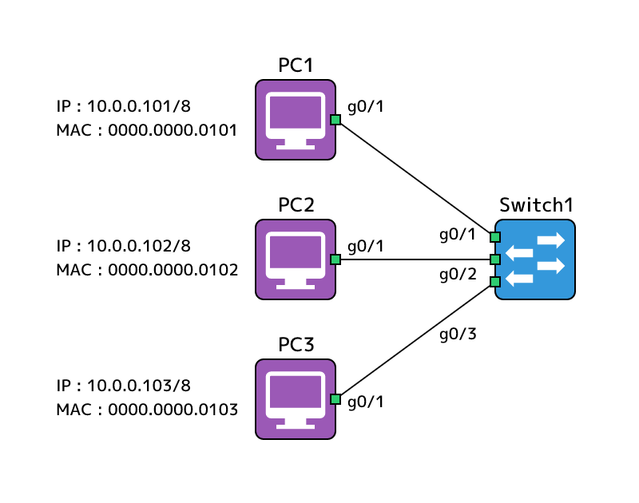
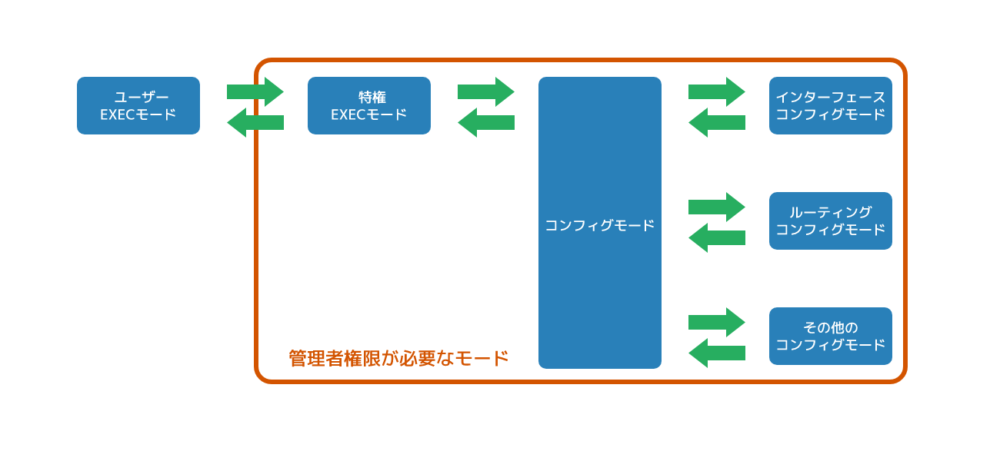
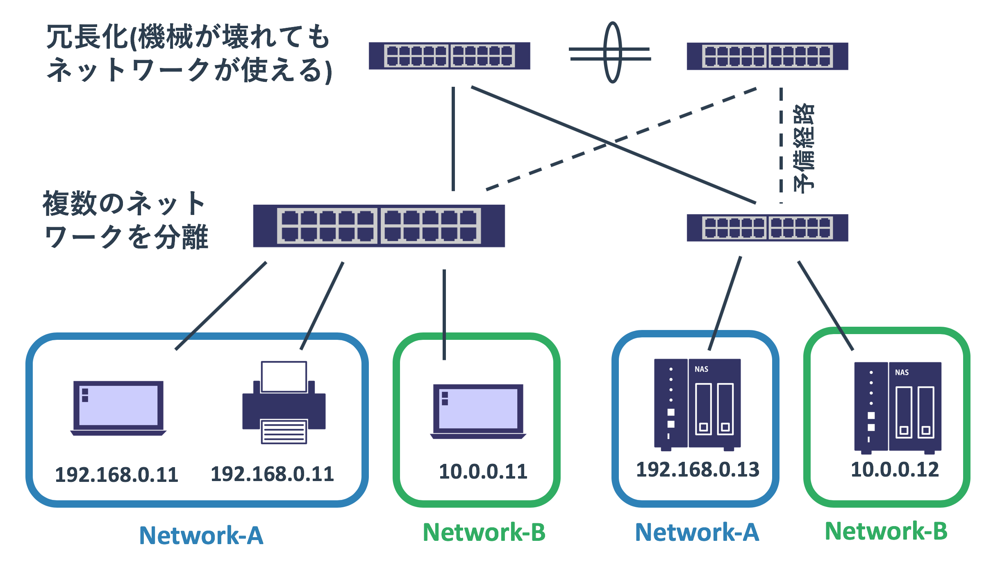
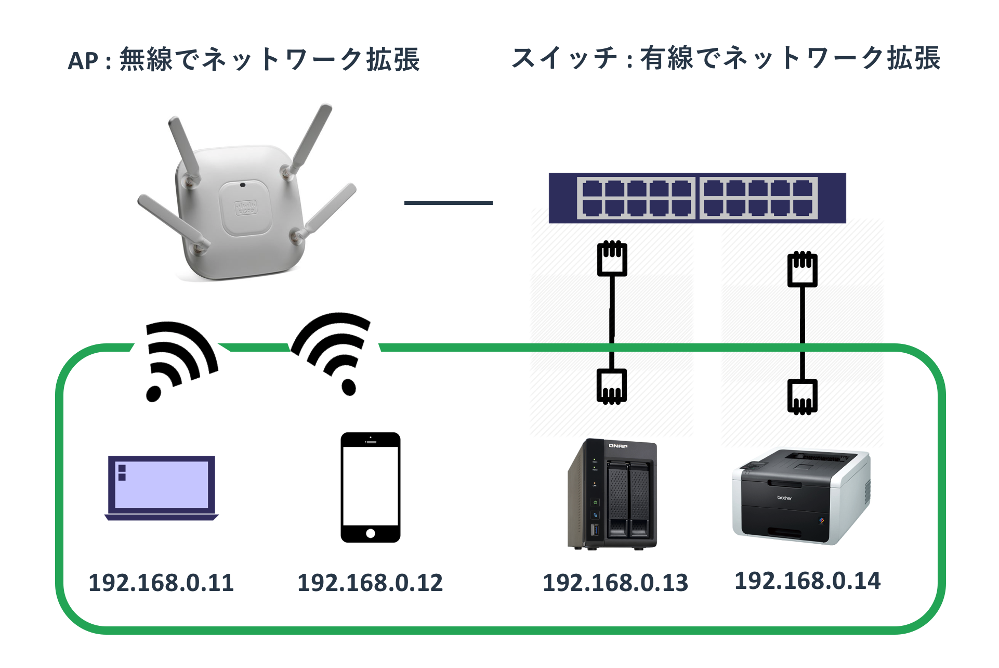
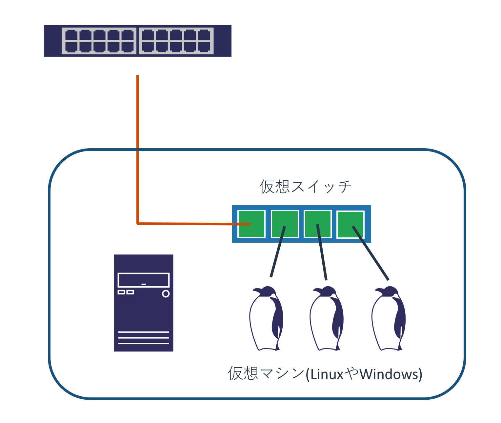
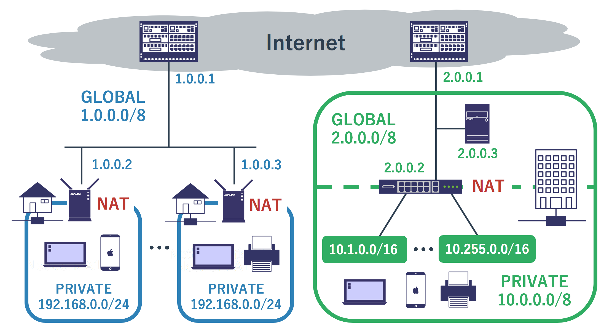
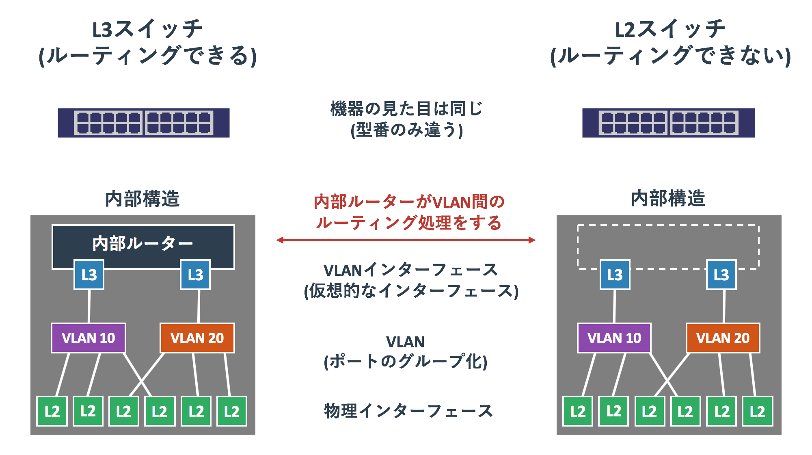
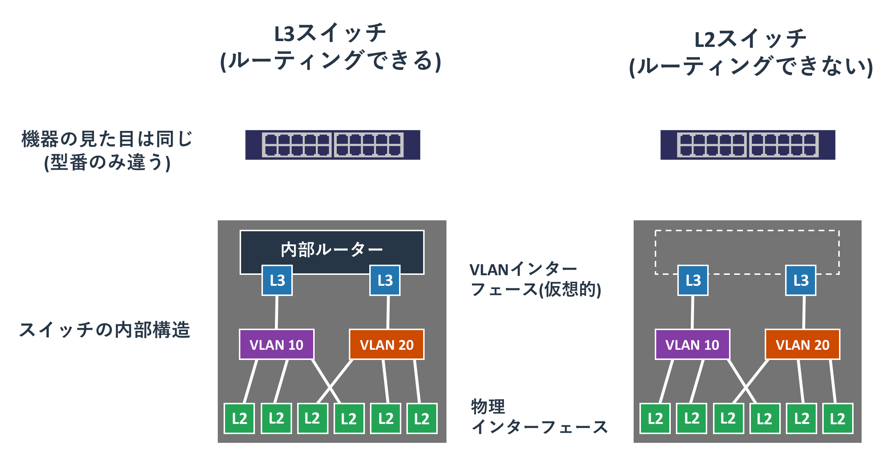

# 機器の種類

## 概要

## 機器の種類について

ネットワークを学ぶときはTCP/IPや、パケットの転送といった抽象的な話が中心となります。
初心者の人にとってパケットという目に見えないデータや、
見たことも触ったこともない機械でそれがどう扱われるかということは想像し辛いかもしれません。

実際に機械に物理的に触って、設定を加えることが理解への一番の近道なのでしょうが、
それはネットワークエンジニアやIT管理者といった限られた人しかできません。
本気で学ぶのであれば型落ちした安い機器をオークションなどで買ってもいいと思いますが、
ここでは実際の機器を紹介することで理解の手助けをしたいと思います。

ネットワークで利用される機器といっても、役割に応じて多種多様なものがあります。
おおまかにカテゴリ分けをすると、以下のグループに分けられます。

* PCやサーバーといったネットワークを利用する機器
* 信号の変換や長距離のデータ転送のためのネットワーク機器
* 同一ネットワーク内でL2転送をするためのネットワーク機器
* 異なるネットワーク間のL3転送をするためのネットワーク機器
* ファイアウォールやロードバランサーといった特定用途のためのネットワーク機器

ネットワークの中心となるのはL2転送及びL3転送です。
他のセキュリティ機器などはそれらの基礎知識を知った上で操作をするものですので、
まずはL2機器であるスイッチとL3機器であるルーターについて学ぶのがよいです。

## ホスト

ホストはネットワークを経由した通信の発信元と最終的な宛先地となる機器です。
通信を中継するスイッチやルーターではなく、
たとえば「Yahooのページを見ようとするノートPC」と「ノートPCにデータを提供するウェブサーバー」などです。

ネットワーク機器は多数のホストから送られてくる通信を中継するための機器であるため、
それぞれの通信の主役ではなく、あくまでも手助けをしているにすぎません。
AさんとBさんの手紙のやりとりでいえば、主役はAさんとBさんでありポストや郵便局は単なる手紙の仲介者にすぎないのと同じです。

一方、ホストは通信の主役となります。
手紙のやりとりでいえば、宛先と送り主がホストだといえます。
ホストは他のホストからの自分に関係のない通信を無視します。
興味があるのはあくまでも「自分から相手にデータを送ること」と「自分宛てに届いたデータの処理をすること」だけです。
通信に関わる機器は様々ですが、ホストはその終端(エンド)に存在しているため、
「**エンドホスト**」と呼ばれることもあります。

ホストはネットワーク機器に比べると複雑です。
ネットワーク機器はホストに比べると高価であるため勘違いされやすいですが、
ネットワーク機器は大量の処理に適しているだけであり、動作としてはそれほど複雑なことはやっていません。
一方、ホストはネットワーク機器ほど大量の処理はできないものの、
通信の内容そのものに責任を持って動作しています。

#### 図:クライアントサーバーモデル

通信をしあう両ホストの関わりですが、
一般的には「**クライアントサーバーモデル**」と呼ばれる構成をとっています。
「**サーバー**」は何かを提供するという意味で、
「**クライアント**」はお客さんという意味なのでサービスを受けるという意味になります。

たとえばYahooのウェブページの閲覧でいえば、Yahooのウェブサーバーは名前の通りページを提供するサーバーであり、
それを閲覧するPCやスマホはクライアントです。
同じようにネットワークを介してプリンタを使う場合は、
プリンターがサーバーであり、プリンターを使うPCがクライアントです。

想像すれば分かるようにYahooが持つウェブサーバーの数はYahooにアクセスするPCの数よりも少ないです。
一般的なクライアントサーバーモデルでは、少数のサーバーが多数のクライアントを持つという構成になっています。
スイッチやルーターははホストとホストの通信の内容には全く興味を持っていないため、
誰がクライアントで誰がサーバーであるかは全く意識をしていません。
単純に宛先のMACアドレスとIPアドレスに従ってデータを転送しているだけです。

なお、業務用の高機能なスイッチやルーターであれば、
ホストから届けられたフレームやパケットの転送をするだけでなく、
自分自身から管理用の通信を行うことができます。
それらの管理用の通信においては、ネットワーク機器もホストとしてふるまいます。

## L2機器

L2の機器は同一ネットワーク内の複数の機器間の通信を正しい宛先に届けるという役割を持っています。
これを使うことで「10.0.0.0/8」や「172.16.0.0/24」といった単体のネットワークに繋げる物理ポート数を増やせるため、
多くの機器を同じネットワークに接続できるようになります。

L2の機器だけでなく、ホストやL3の機器も同一ネットワーク内での通信にはMACアドレスを使ったL2転送をします。
ただ、L2の機器は他の機器への通信を中継するのにたいして、
ホストやL3の機器は同一ネットワーク内の通信を中継することはありません。

インターネットという大きな世界で見れば、データの転送の主役はL3の機器であるルーターなどとなります。
ただ、同じネットワーク内での転送の主役はL2機器であるスイッチです。
スイッチの存在なくしてネットワークを構築することはできません。

L2の機器はスイッチと呼ばれていますが、家庭用と業務用などでいくつかの細かい分類があります。
単純な家庭用スイッチの説明をしたあとで、業務用スイッチの説明をします。

### ノンインテリジェントスイッチ

一般的な家庭で利用している5000円以下のスイッチはほぼ「**ノンインテリジェントスイッチ**」です。
家電量販店や通販などで買うようなものだと、バッファローやIOデータのスイッチが日本だと主流かと思います。

ノンインテリジェントという名前が表すように、
この種類のスイッチはL2のフレーム転送以外に特別な機能はありません。
MAC学習と宛先に応じて適切なポートからフレームを転送するだけが仕事です。
つまり、単純にネットワークに接続する機器のポートが足りないから増やすという目的で使われます。
PCのUSBポートが足りない際にUSBハブをさすのと似ています。

#### 図: ノンインテリジェントスイッチ

ノンインテリジェントスイッチは安価で電源ケーブルとLANケーブルをさすだけで動きます。
業務用のL2スイッチよりも手軽に導入できるため、ネットワークが一つしかない自宅内では気軽に利用することができます。

ノンインテリジェントスイッチに似た製品に「**ハブ**」というものがあります。
用途はネットワークの拡張という点では同じですが、これはL2の機器ではなくL1の機器です。
イーサネットプロトコルを理解せず、単純に電気信号的に複数のケーブルを接続しているため、
届いたフレームを他の全てのポートに拡散させます。

ノンインテリジェントスイッチが安価に購入できる現在では、
あえてハブを選ぶ理由はありません。
ハブはパフォーマンスがスイッチに比べて悪く、
トラフィックが他のポートに流れるという点でセキュリティ的に問題があります。

### L2スイッチ

業務用のスイッチにもいくつかの種類があり、L2の機能のみを持つものは「L2スイッチ」と呼ばれています。
ノンインテリジェントスイッチと異なり、様々な機能があり管理もできるため「インテリジェントスイッチ」と呼ばれることもあります。
本サイトでスイッチと記載する場合は基本的に業務用のスイッチをさします。

L2スイッチの主な役割はノンインテリジェントスイッチと同じくMAC学習と適切なインターフェースへのフレーム転送です。
ただ、それに加えてVLANという「ブロードキャストドメインを区切る仕組み」を使うことができます。
これは複数のネットワークをVLANごとに使うことができるということとほぼ同義です。

また、スイッチ間を不適切にケーブルを接続してもネットワークのなかでループが発生しないようにするといった、
ネットワークを保護する仕組みなどもあります。

#### 図: ノンインテリジェントスイッチとインテリジェントスイッチの違い

この業務用のスイッチはネットワーク管理者によって適切に設定管理されることを前提としています。
ノンインテリジェントスイッチは電源さえ入れれば動きますが、
業務用のスイッチは設定を加えないと使えません。

### アクセスポイント

アクセスポイントはホストに対してwifiによる無線アクセスを提供する機器です。

ケーブルの有無という物理的な大きな違いはるものの、
アクセスポイントの動作はL2スイッチと大差はありません。
アクセスポイントが繋がるネットワークを物理的(電波)に拡張して、
参加できるホストの数を増やします。

#### 図: アクセスポイント

スイッチのように物理的なポートがあるわけではないため多くの機器を繋げますが、
あまり多くのホストを接続して同時に利用するとパフォーマンスが低下します。
自宅で利用するようなものであれば20台程度までで、業務用のものであれば40台程度を上限として利用します。
業務用のものは「あるアクセスポイントが壊れても、他のアクセスポイントがカバーできる」ことを前提として設計するので、
実際には20-30人にひとつで、15-20m四方をカバーするという程度の設計が多いようです。

アクセスポイントはホストに対して「SSID」を見せています。
これは複数アクセスポイントが存在する状況下で、どのネットワークに属するか(どのアクセスポイントに接続するか)を選択させる意味があります。
また、SSIDにパスワードをかけることで第三者が勝手にネットワークに接続してくることを防げます。
スイッチは「物理的に接続できる」といったかたちでセキュリティを保てますが、
wifiは近くにいる部外者にも電波が届いてしまうため、セキュリティにより気を配る必要があります。

家庭向けのアクセスポイントはネットワークをホストに提供するという機能のみを持ちます。
業務用のアクセスポイントだとVLANが使えたり、
アクセスポイント用のコントローラーで複数のアクセスポイントを一括管理したり、
高度な認証システムによるアクセス制御ができるという特徴があります。
もちろんこれらの設定には専門的な知識が必要となります。

### ハイパーバイザーと仮想スイッチ

昨今の物理サーバーのCPUパワーは高く、多くのメモリーを搭載することができます。
このような状況で2005年あたりから「**仮想化**」と呼ばれる「1つの物理ハードウェアで複数のOSを動かす仕組み」が利用され始めました。
VMWare Player(fusion)やVirtualBoxを使っているかたであれば、それの業務版だと思ってもらえば分かりやすいかもしれません。

仮想化では「**ハイパーバイザー**」と呼ばれる特別なOSが、内部で「**仮想マシン(VM)**」と呼ばれるOSを複数動かします。
ハイパーバイザーが物理的に持つCPUやメモリを複数の仮想マシンに分け与えることで資源を共有します。
1台のハードウェアでサーバーOSを何台も動かせるため経済的で、なおかつハードウェア故障の影響も小さくなるため多くの企業が導入しています。

仮想マシンもネットワークに接続する必要があるため、ハイパーバイザーはその内部で動く仮想マシンに対してL2スイッチを提供しています。
ハイパーバイザーが持つスイッチですので当然ながら物理的なハードウェアを持つスイッチではなく、
ハイパーバイザーがソフトウェアとして実現しているスイッチです。
これは「**仮想スイッチ**」と呼ばれています。

#### 図: 仮想スイッチ

利用するハイパーバイザーの種類により仮想スイッチの詳細は変わってきますが、
VLAN程度であればどのハイパーバイザーの仮想スイッチも使えます。
ハイパーバイザーとして比較的主流であるVMWare社のESXiなどだと、
仮想化独自の機能が仮想スイッチに搭載されていたりします。

## L3機器

L3の機器の役割はネットワークとネットワークを接続することです。
送信元のネットワークから宛先となるネットワークまで、
ネットワークの境界にある機器で「宛先IPアドレスとルーティングテーブルを比較して正しい中継先に渡す」ということを繰り返してパケットを届けます。

L3の機器同士や、L3の機器とホストは同一ネットワークに属しています。
そのため、「次に誰にパケットを渡すか」という判断はL3の範疇ですが、
実際にパケットを相手に届けるためには「同一ネットワークのL2通信」を使います。

L3の機器はL2の通信に関わらないと勘違いしている人は結構多いので注意をしてください。
L2スイッチのように同一ネットワーク間にある他の機器のトラフィックを転送することはしませんが、
自分自身はスイッチを使う側としてL2通信をしています。

### ルーター

ルーターには家庭用のルーター(ブロードバンドルーターと呼ばれる)と業務用のルーターがあります。
家庭用のルーターは純粋なルーターとはかけ離れているため、ここでは業務用のルーターについて扱います。

スイッチは同じネットワークに属する機器同士を繋げるために利用されます。
多くのPCやサーバーが企業には存在するため、スイッチのポート数は24ポートや48ポートと比較的多くなっています。
一方、ルーターの役割は「組織内の複数のネットワーク」や「異なる組織間のネットワーク」を接続することです。
「直接接続されるネットワークの数」は「ひとつのネットワークに繋がる機器の数」よりも少ないため、
一般的にルーターのポート数はスイッチよりも少なくなっています。

#### 図: ルーターの役割

ルーターとスイッチは宛先までパケットをバケツリレーのようにして伝播させていくという点では大きな違いはありません。
転送する基準がMACアドレスであるかIPアドレスであるかという違いはありますが、基本的な考え方は同じです。
ただ、両者で大きく異なるのは「宛先までどのようにしてデータを届ければいいかということを、どのように学習するか」という点です。
L2の世界とL3の世界ではこれが根本的に異なっています。
詳しい話はL3転送の仕組みのページで扱います。

ただ、上記の図にあるようにルーターはネットワークとネットワークの境界に存在していて、
同じネットワークにいる「別のネットワークにも属するルーター」にパケットを転送するということを繰り返すことで目的地までバケツリレーを繰り返します。
転送をするルーターはネットワークの全体像(地図)は把握できていませんが、
「このネットワーク宛のパケットはここに送る」という道路標識のようなルールを知っているので、
それに従ってパケットを正しい宛先に転送し続けます。

このネットワーク間でのパケット転送がルーターの最も重要な役割ですが、
それ以外にも様々な機能が利用できます。
たとえば「**NAT**」と呼ばれるIPアドレスの変換機能もルーターの重要な役割の1つです。

NATはIPアドレスを変換するための仕組みです。
自宅や職場のPCを思い浮かべて頂くと分かると思いますが、
多くのネットワークに繋がる機器はインターネットを利用できる必要はありますが、
インターネット越しに他の機器から利用されることはほとんどありません。
むしろインターネット側から自分のPCに接続されるほうがセキュリティ的に困る場合がほとんどです。

使えるIPの数に限りがあるといった背景などもあり、
一般的な組織ではNATと「**プライベートアドレス**」を使っています。
プライベートアドレスはインターネットで使わないことになっている特別なアドレスです。
インターネットに存在できないということは、どの組織でも利用することができるということです。

#### 図: NAT

インターネットとの接続地点にあるルーターは、
プライベートアドレスを持つホストからインターネットへの通信を「インターネットで使えるアドレス」に変換して送信します。
多くの場合は送信元ホストのIPをルーターが持つインターネット側のアドレスに変換します。

パケットを届けられたサーバーにとっては送信元は本当のホストではなく、NATで変換されたアドレスです。
そのため送信側のNATルーターに対してデータを送り返します。

NATルーターはサーバーから送り返されたパケットの内容を確認して、
それが変換された内部ホストからの通信であることを把握します。
そうすると、再度パケットのアドレスを変換前のものに戻す処理をして、
もともとのホストにパケットを届けます。

## L3スイッチ

L3スイッチはL3機能を持つスイッチで、ルーターとスイッチの両方の機能を併せ持つ便利な機器です。
現在の業務用ネットワーク機器の主流はL3スイッチとなっています。

昔はルーターがL3(ネットワーク間の転送)を担当し、
スイッチがL2(同一ネットワーク内の転送)を担当するという明確な役割分担がありました。
これはネットワークの構成が非常に分かりやすくなるという利点があるものの、
機器の台数が増えるためコストが増えるという問題がありました。
L3スイッチはそのようなネットワークの構築コストを下げたいという要望から生まれました。

L2スイッチとL3スイッチの大きな違いはルーティング能力の有無です。
L3スイッチもL2スイッチと同じくVLANが使えるため、複数のネットワークに属することができます。
L3スイッチはVLANごとに仮想的なインターフェースである「**SVI**」を作成することで、
そのSVIの間でルーティングができます。
ルーティングの仕組みはインターフェースがSVIになっているということ以外はルーターと全く同じです。

#### 図: VLANインターフェース(SVI)によるルーティング

ルーターが使える機能にはNATなど様々なものがありますが、
L3スイッチはルーティング程度の機能しか使えません。
そのため、「L3スイッチがあればルーターはいらない」とはなりません。
インターネットと接するL3機器のみルーターとして、組織内部はL3スイッチを使うという構成が一般的です。

また、L3スイッチがあればL2スイッチは不要ですが、L3スイッチのほうが高価です。
そのためL2機能だけが必要であればL2スイッチを使うことが多いです。
ユーザーPCを接続するアクセススイッチをL2スイッチとして、コアスイッチをL3スイッチをする構成も多いです。

### ブロードバンドルーター

ブロードバンドルーターは家庭や小さいオフィスで使われるインターネットへの接続を提供するルーターです。
先に扱った業務用のルーターとはかなり仕組みが異なっていて、
以下の図のように複数の製品を組合せたような構成になっています。

#### 図: ブロードバンドルーターの中身

ブロードバンドルーターに繋がるネットワークは「家の中」と「家の外」の2つだけです。

家の中の通信はノンインテリジェントスイッチとアクセスポイントのようにMACアドレスを基準にして転送を行い、
家の外への通信はNATでIPアドレスを変換してサービスプロバイダーのルーターに処理を依頼するだけです。

ブロードバンドルーターの設定はノンインテリジェントスイッチに比べると複雑です。
サービスプロバイダーに接続する設定と、家の中のネットワークのアドレスの設定、
wifiのSSIDとパスワードあたりの設定が必要になります。

ブロードバンドルーターには様々な機能が搭載されていますが、
自宅ネットワークなどの決まりきった使い方しかできません。
ただ、同じことを業務用の機器で実現しようとすると複雑になるため、
小規模な組織のネットワークであければブロードバンドルーターで十分な場合もあります。

ただ、ブロードバンドルーターを使ったネットワークは、
社内のセキュリティはほとんどなく、障害が発生するとネットワークが全て使えなくなるような構成です。
SOHO(小規模オフィス)向けの製品であればブロードバンドルーターよりも業務レベルに近いネットワークを構築できます。

## その他のネットワーク機器

ネットワーク機器はL2転送及びL3転送以外のものもあります。
それらの機器もパケット転送に関わりますが、なんらかの特定用途のために利用されます。

### コンバーター

コンバーターはL1の機器です。
ネットワークのパケットはイーサネットやIPといったフォーマットを持っています。
それらは01のデジタル形式です。

パケットがデジタルであったとしても、
それを機器同士でやりとりする際は「RJ45のツイストケーブル上の電気信号」や
「ファイバーケーブル上の光信号」といったかたちで処理をします。
これらのケーブル上を流れる信号は特性があり、
たとえばファイバーであれば「高価だが減衰が少ないため長距離の通信に使える」といったものとなります。

RJ45とファイバーを変換したり、ファイバーをRJ45に変換するといった用途。
光をさらに長距離に届けるためにリピーターとして利用するといった使われ方をします。

### ファイアーウォール

ある一定規模以上の組織の内部には複数のネットワークが存在しています。
社員がアクセスするネットワークだけでなく、社内のゲスト向けのネットワークも存在するため、
全てのネットワークが全てのネットワークに対してアクセスできるという状況は望ましくありません。

そのようなネットワーク間のアクセスを「これは許可する」
「これは許可しない」と細かく制御できる機械がファイアーウォールです。
ルーターやL2/L3スイッチも大まかなアクセス制御はできますが、
ファイアーウォールはそれに特化した機器であるため、
より細かいアプリケーションレベルでのフィルタなどを行うこともできます。

また、ファイアーウォールの重要な役割にVPNの提供というものもあります。
VPNは遠くのネットワークに「直接」接続するための機能で、
ネットワーク的に遠い機器同士の間で「トンネル」を作成します。
これを使うことで自宅から会社のオフィスのネットワークに接続したり、
離れた場所にあるオフィス間を直接接続することができます。

### ロードバランサー

クライアント/サーバーモデルでは一般的にクライアントの数がサーバーに比べて膨大な数となります。
日本規模や世界規模のサービスの場合、それを1台のサーバーが全て処理するということはかなり難しいです。
1台のサーバーで処理できないのであれば、2台3台と増やしていけばいいということになります。
そうすれば2倍3倍のトラフィックを処理できますし、
そして1台のサーバーが故障などでダウンしたとしても他のサーバーがカバーをすることができます。

ネットワーク機器は一般的にサーバーに比べると大量のトラフィックを処理することができ、
壊れにくいという特徴があります。
この特徴をサーバーへの負荷分散に特化させた機器が「**ロードバランサー**」と呼ばれるものです。

ロードバランサーに設定したIPアドレス(本来はサーバーに設定されるもの)に対してアクセスがあると、
ロードバランサーはそれを裏側にある複数のサーバーに対して負荷を分散させるように転送を行います。
イメージとしてはNATの逆の動きをしていると思えば分かりやすく、
同一セッションの通信は裏側にある同一サーバーに対して継続して転送されます。

### SANスイッチ

「**SANスイッチ**」は大規模なインフラで利用されることがあるストレージとサーバーを接続するネットワーク機器です。
この機器及びそれを利用するサーバーとストレージは「**FC(Fibre Channel)**」というTCP/IPとは全く異なる通信プロトコルを使って、
ストレージのデータをやりとりします。
このストレージ用のネットワークのことを「**SAN(Storage Area Network)**」と呼びます。
SANで使われる機器を繋げる機器なのでSANスイッチと呼ばれています。

SANを理解する上で重要なことは2つあります。
まずひとつめはストレージは壊れるものであり、
なおかつサーバーレベルでは利用率がそれほど高くならないというものです。
巨大なインフラを構築する場合はノードごとのストレージ管理は非効率であるため、
冗長性をかみした上で集約して管理したほうが運用が楽になります。
また、仮想化の世界ではストレージの共有が必須であり、
SANとストレージという構成がその標準的なものとなっています。

ふたつめの重要なことは、SANの世界はTCP/IPの世界と大きく異なっていて信頼性が非常に重要ということです。
TCP/IPの世界では信頼性のないネットワークをTCPなどの仕組みを使ってカバーしていますが、
SAN上を流れるFCの通信は絶対的な信頼性を持たせる必要があります。
あるファイルをコピーしているのに、それが欠けたり遅れたりすると大きな問題になります。

なお、現在はTCP/IPネットワークの世界の信頼性が高まってきているため、
わざわざSANとストレージを構築せずに、
TCP/IP上で使えるストレージ共有プロトコルである「**NFS**」や「**SMB**」を使うという選択肢も多く取られます。
SAN及びストレージを扱えるエンジニアが非常に少なく、機器も高コストになりがちです。
新規に導入するのであればよく検討を行うことが望ましいです。
