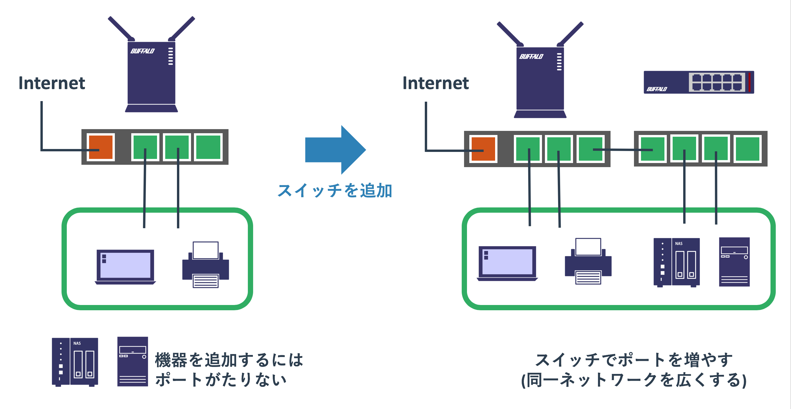

# 機器の種類

## 概要

## 機器の種類について

ネットワークを構成する機器には様々なものがあります。
それらの特徴を覚えることが重要

同じ用語であっても、使われる場面によって意味が変わってくることがある

これから学ぶ知識が説明の前提になる場合がある。
厳密に理解できない場合であっても、なんとなくでOK

## ホスト

ホストは通信の送信元および宛先となる機器のことです。
送信元となるホストのことを送信元ホスト、宛先となるホストを宛先ホストと呼びます。

ネットワークを介してPCがプリンターにプリントの依頼をすることがありますが、
依頼元は「**クライアント**」であり、依頼先は「**サーバー**」と呼ばれています。
クライアントもサーバーも共にホストと呼ばれています。
自宅であればスイッチとルーター以外のネットワークを使うほとんどの機器はホストです。

#### 図:クライアントサーバーモデル

高機能なスイッチやルーターであれば、フレームやパケットの転送をするだけでなく自分自身から管理用の通信を行うことができます。
それらの通信をする場合はネットワーク機器もホストとしてふるまいます。

## L2

L2の機器はネットワークに複数の機器を繋げる役割を果たします。
MACアドレスを使ったフレーム転送が主な仕事です。

### ノンインテリジェントスイッチ

一般的な家庭で利用している5000円以下のスイッチはほぼノンインテリジェントスイッチです。
バッファローやIOデータの1Gスイッチはほとんどこれです。

#### 図: ノンインテリジェントスイッチ

このスイッチは特別な機能はなく、ネットワークを広げるためだけに用いられます。
新しくプリンタなどを買った場合にポートが足りなければ、
PCのUSBポートが足りない際にUSBハブをさす感覚でスイッチが接続されます。

このスイッチの仕事はMAC学習と適切なポートからフレームを転送するだけです。
安価で電源ケーブルとLANケーブルをさすだけで動くため、
ネットワークが一つしかない自宅内では気軽に利用することができます。
属することができるネットワーク(ブロードキャストドメイン)は1つしかありません。

ノンインテリジェントスイッチに似た製品にハブ(通称バカハブ)というものがありますが、
これはMAC学習をしないため、届いたフレームを他の全てのポートに拡散させます。
ノンインテリジェントスイッチが安価に購入できる現在では、あえてハブを選ぶ理由はありません。
ただ、全てのポートからパケットを出すという動きを利用して、
パケットを傍受するために利用されることはあります。

MAC学習と適切なポートからの転送以上のことをやりたければ、
業務用のスイッチを購入する必要があります。

最近だと家庭用スイッチと業務用スイッチの中間程度のスイッチが比較的安価に販売されていますので、
詳しい人はそれらを自宅で使っていることもあります。
本来はSOHOと呼ばれる小規模なオフィス向けの製品です。

### L2スイッチ

業務用のスイッチにもいくつかの種類があり、L2の機能のみを持つものは「L2スイッチ」と呼ばれています。
ノンインテリジェントスイッチと異なり、様々な機能があり管理もできるため「インテリジェントスイッチ」と呼ばれることもあります。

#### 図: 業務用L2スイッチ

L2スイッチの主な役割はノンインテリジェントスイッチと同じくMAC学習と適切なインターフェースからのフレームの送信です。
ただ、それに加えてVLANというブロードキャストドメインを区切る仕組みを使うことができます。
VLANを使うことで複数のネットワークを拡張することができます。

また不適切にケーブルを接続してもネットワークのなかでループが発生しないようにするといったネットワークを保護する仕組みもあります。
他にも様々な機能がありますが、それらは本サイトで順に紹介します。

このスイッチは適切に管理されることを前提としています。
ノンインテリジェントスイッチは電源さえ入れれば動きますが、業務用のL2スイッチは適切に設定を加えないとまともに使えません。
きちんとしたネットワークの知識を持った人でないと使いこなせません。

#### 図: ノンインテリジェントスイッチとインテリジェントスイッチの違い

### アクセスポイント

アクセスポイントはwifiを提供する機器です。
アクセスポイントはL2スイッチと似ていてネットワークを拡張するために使われます。

ただ、L2スイッチは有線でネットワークを拡張するために使われるのに対し、
アクセスポイントは無線でネットワークを拡張します。

#### 図: アクセスポイント

アクセスポイントは接続するホストに対して「SSID」を見せています。
これは複数アクセスポイントが存在する状況下で、どのネットワークに属するか(どのアクセスポイントに接続するか)を選択させる意味があります。
また、スイッチは「物理的に接続できる」といったかたちでセキュリティを保てますが、
wifiは部外者が簡単にアクセスできてしまいます。
そのため、パスワードをかけることで第三者が勝手にネットワークに接続してくることを防げます。

家庭向けのアクセスポイントはこれらの機能のみを提供しますが、
業務用のアクセスポイントだとVLANが使えたり、コントローラーで一括管理したり、
高度なユーザー認証が使えるといった特徴があります。

### ハイパーバイザーと仮想スイッチ

昨今の物理サーバーのCPUパワーは高く、多くのメモリーを搭載することができます。
このような状況で2005年あたりから「**仮想化**」と呼ばれる1つの物理ハードウェアで複数のOSを動かす仕組みが利用され始めました。
VMWare Player(fusion)やVirtualBoxを使っているかたであれば、それの業務版だと思ってもらえば分かりやすいかもしれません。

仮想化では「**ハイパーバイザー**」と呼ばれる特別なOSが、内部で仮想マシンと呼ばれるOSを複数動かします。
ハイパーバイザーが物理的に持つCPUやメモリを複数の仮想マシンに分け与えることで資源を共有します。
1台のハードウェアでサーバーOSを何台も動かせるため経済的で、なおかつハードウェア故障の影響も小さくなるため多くの企業が導入しています。

このハイパーバイザー内にもスイッチが存在し、それは「**仮想スイッチ**」と呼ばれています。
物理的なL2スイッチに比べればできることが限られていますが、VLANを使うといったことは実現できます。

#### 図: 仮想スイッチ

## L3

L3の機器の役割はネットワークとネットワークを接続することです。
宛先IPアドレスを使ってパケットを正しいネットワークに届けることがその役割です。

## ルーター

ルーターには家庭用のルーター(ブロードバンドルーターと呼ばれる)と業務用のルーターがあります。
ここでは業務用のルーターについて扱います。
後ほど扱うブロードバンドルーターは厳密にはルーターというより独自の機器です。

#### 図: ルーター

インターネットには数多くのネットワークがあります。
また、中規模以上の会社であれば社内のネットワークも複数あります。
スイッチはネットワークをまたがった通信はできないため、
これらの異なるネットワークのホスト間の通信にはルーターが必要になります。

ルーターはどのネットワークに接続されているかを認識していて、
どのネットワークの先にどういったネットワークが存在するかという「ネットワークの地図」を持っています。
ホストからのパケットがルーターに届けられると、その宛先IPアドレスとネットワークの地図を照らし合わせることで、
どこの誰にパケットを届ければよいかを判断して転送処理をします。

#### 図: ルーターの役割

他には「**NAT**」と呼ばれるIPアドレスの変換機能もルーターの重要な役割の1つです。
一般的な家庭や企業のネットワークに属するホストはインターネットに出られる必要がありますが、
インターネットの外からアクセスできる必要はさほどありません。

そのため多くのネットワークは「**プライベートアドレス**」と呼ばれるインターネットに出られない特別なアドレスを使います。
インターネットとの接続地点にあるルーターは、
プライベートアドレスを持つホストからインターネットへの通信をインターネットで使えるアドレスに変換して送信します。
多くの場合は送信元ホストのIPをルーターが持つインターネット側のアドレスに変換します。

パケットを届けられたサーバーは送信元であるクライアントにデータを送り返しますので、
パケットは変換をしたルーターに届けられます。
ルーターはそのパケットの内容を確認して先ほどの内部ホストからの通信であることを知ると、
宛先アドレスを内部ホストに変換したうえで内部ネットワークへ転送処理します。

#### 図: NAT

このような仕組みがあるため、世界にはIPアドレスの台数以上の機器が存在しても大丈夫なことが分かります。

## L3スイッチ

L3スイッチはL3機能を持つスイッチです。
昔はルーターとL2スイッチがあり明確に役割が分かれていましたが、
ルーターの機能も果たせるスイッチがあれば便利ではないかということでL3スイッチが開発されました。

L2スイッチにはVLANがあるため複数のネットワークに属することができますが、
スイッチとしてMAC転送することしかできないためネットワークをまたがる通信はルーターに任せる必要がありました。
L3スイッチはVLANごとに仮想的なインターフェース(SVI)を作成することと、ルーターと同様にネットワークの地図をもたせることで、
あるVLANのSVIから受け取ったパケットを別のVLANのSVIから出すことができるようになりました。

#### 図: VLANインターフェース(SVI)によるルーティング

一般的なL3スイッチが提供するL3の機能は「ルーティング」と呼ばれるパケット転送処理に関わるものだけです。
上記のVLAN間ルーティングやネットワークの地図を構築するのに関わる仕組みはサポートするものの、
NATなどはサポートされないことが多いです。

そのため、「L3スイッチがあればルーターはいらない」とはなりません。
L3スイッチがあればL2スイッチは不要ですが、L3スイッチのほうが高価です。
そのため、L2機能だけが必要であればL2スイッチを使うことが多いです。

### ブロードバンドルーター

ブロードバンドルーターは家庭や小さいオフィスで使われるインターネットへの接続を提供するルーターです。
先に扱った業務用のルーターとはかなり仕組みが異なっていて、以下の図のように複数の製品を組合せたような構成になっています。

#### 図: ブロードバンドルーターの中身

ブロードバンドルーターに繋がるネットワークは「家の中」と「家の外」の2つだけです。

家の中の通信はノンインテリジェントスイッチとアクセスポイントのようにMACアドレスを基準にして転送を行い、
家の外への通信はNATでIPアドレスを変換してサービスプロバイダーのルーターに処理を依頼するだけです。
ノンインテリジェントスイッチに比べると設定は複雑ですが、サービスプロバイダーに接続する設定と、
家の中のネットワークのアドレスの設定、wifiのSSIDとパスワードあたりさえ設定してしまえば動きます。

ブロードバンドルーターに複雑なことをやらせることはできませんが、
小さいネットワークに必要とされる仕組みを1つのハードウェアのなかに全て詰め込んでいるため、
管理が難しい高機能な複数の業務機器で同じことをするより効率的です。

企業であっても社内でネットワークを分ける必要がないのであれば、ブロードバンドルーターで十分です。
ただ、ブロードバンドルーターを使ったネットワークは、
社内のセキュリティはほとんどなく、障害が発生するとネットワークが全て使えなくなるような構成です。
ある程度以上の規模であればブロードバンドルーターではなく業務用の製品を適切な設定のもとに利用することが必要です。

## その他のネットワーク機器

### ファイアーウォール

### ロードバランサー

### SANスイッチ
