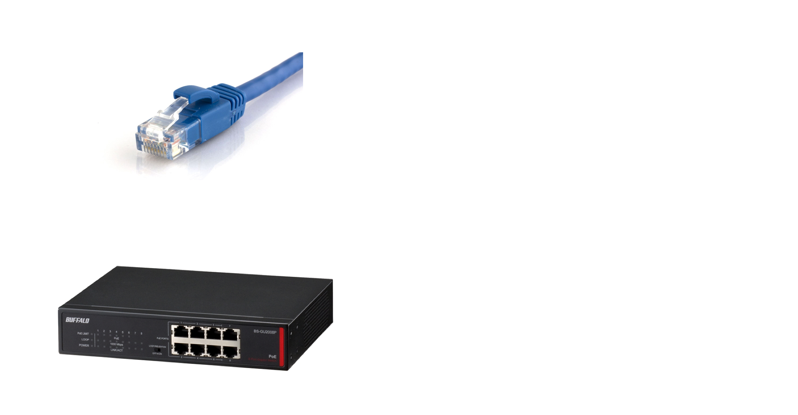
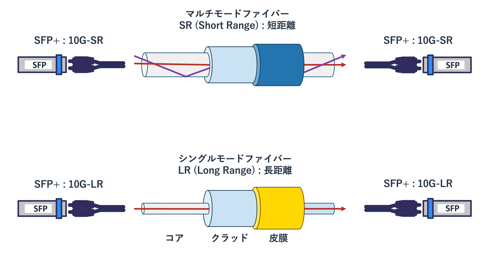
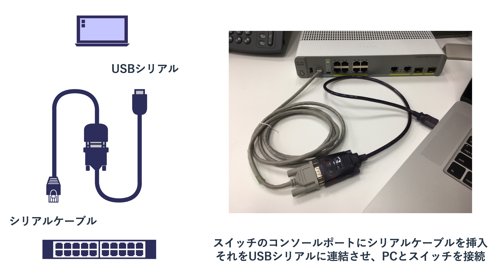
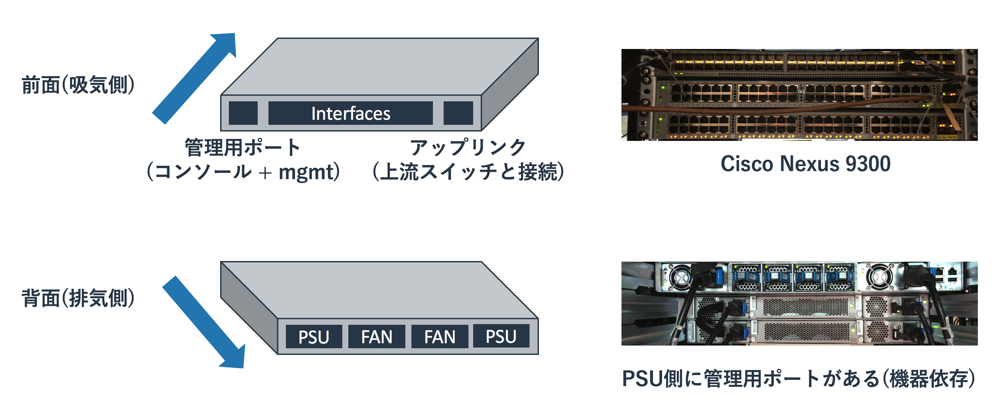
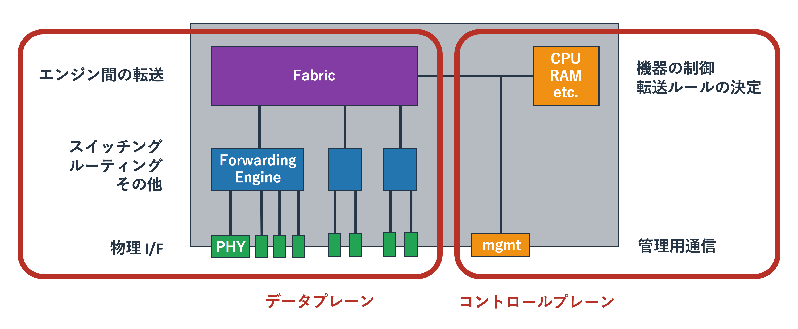
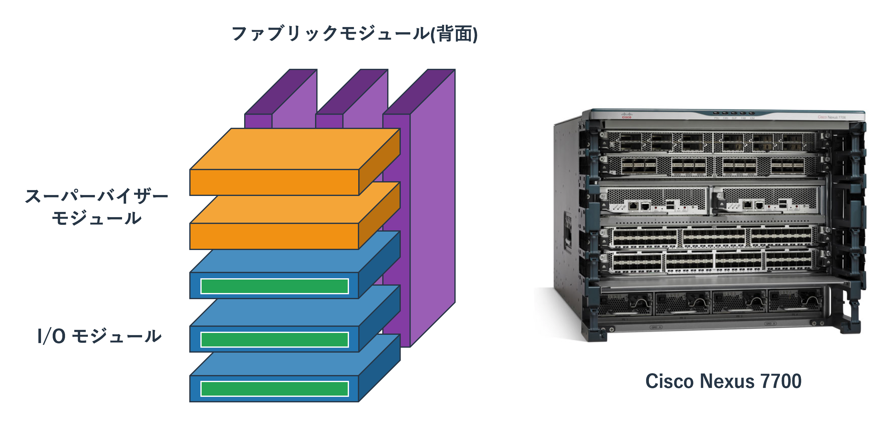
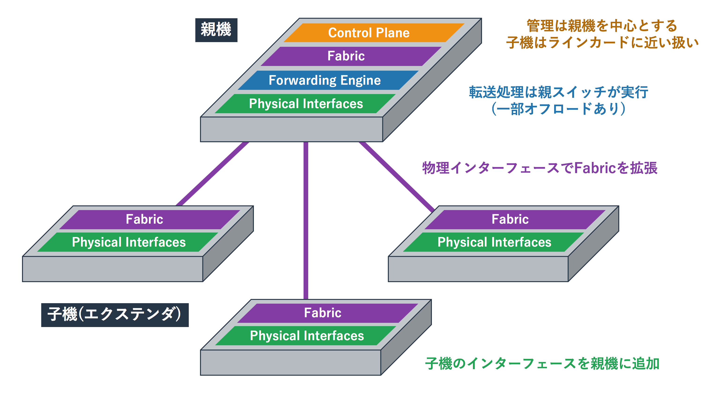

# ハードウェア

## ケーブルの種類

自宅のネットワークで利用される通信ケーブルはいわゆるLANケーブルのみです。
ただ、業務で利用される機器では様々な種類のケーブルを利用します。
実際に使ったことがないと想像しにくいと思いますので、大まかなカテゴリを紹介します。

### ツイストペアケーブル

一般的に「LANケーブル」と呼ばれるているのが、「**RJ45**」という規格のコネクタを使う「**ツイストペアケーブル**」です。
ユーザーが使うPCや機器に使われる有線のネットワークはこれ以外はほとんど使われません。

ツイストペアという名前はケーブル内にある内部の銅線ケーブルの扱いから来ています。
外側の被膜の内側に8本の銅線がありますが、それが2本ずつよりあわせられています。
これは銅線を電気が流れて磁界が発生する影響を抑えるための仕組みです。
ようするにノイズが電気信号へ与える影響を少なくするということです。
ただ、少なくするだけでなくなるわけではないため、100mを越える長距離の配線には向きません。

どの程度の距離をどの程度の通信速度で利用できるかということはRJ45の「**カテゴリー**」に依存します。
カテゴリーは規格のことで、外側の見た目は全く同じでも内部のケーブルの品質が異なります。
厳密な値を覚える必要はありませんが、カテゴリーが大きくなるほど通信帯域が大きくなること、
ケーブルがノイズ対策用の保護皮膜でシールドされているほどノイズに強いという特徴があります。
一般的にはシールドされていないケーブルが主流で、それは「**UTP(Unshielded Twisted Pair)**」と呼ばれます。
シールドされているものは「**STP(Shielded Twisted Pair)**」と呼ばれます。
STPはノイズが強い環境(野外や工場内)で利用されていましたが、
現在はそういった環境ではノイズの影響がほとんどない光ファイバーが利用されることが多いです。

2018年現在だと古いケーブルはカテゴリー5eであり、
現在購入するのであればカテゴリー6/6Aあたりが主流となっています。
カテゴリー7以上も販売されていますが、
コネクタがRJ45の上位互換のものが必要になったりするといった要因でほとんど利用されていません。

|カテゴリ|通信帯域|その他|
|:--|:--|:--|
|Cat5|100Mbps|1Gが出せないので注意|
|Cat5e|1Gbps|1Gbpsを出せるがCat6を推奨|
|Cat6|1Gbps|10Gbpsも出せるが、その場合は6Aを推奨|
|Cat6A|1Gbps/10Gbps|Cat6より信号の減衰が少ないが太い|
|Cat7|1Gbps/10Gbps|GG45などのコネクタを持たないと実質Cat6/6Aと同じ|

基本的にはカテゴリーがあがるほど高性能で帯域が広く長い距離を使えますが、
ケーブルに接続される両端の機器がそのカテゴリーのスピードを使えないと性能を活かせません。
GG45などの新しいコネクタ規格が普及するまでは自宅やオフィス機器には取り回しのしやすいCat6を選択し、
サーバーなどが10Gを必要とする場合は6Aを利用しておくのがよいと思われます。

### SFP

業務用のスイッチには大きく2種類あります。
ユーザーのPCやオフィス内で使う様々な機器(プリンタやアクセスポイントなど)に繋げる「**アクセススイッチ**」と、
複数のスイッチ間を接続する「**コアスイッチ**」です。

アクセススイッチに接続される機器はPCやプリンターといったRJ45を利用する機器がほとんどであるため、
スイッチのポートもRJ45を利用することが多いです。
ただ、コアスイッチは複数のアクセススイッチを束ねるという目的から「10G以上の帯域が広いケーブルが必要」
「100m以上のケーブルが必要」といったことを実現できる必要があります。

このような理由からコアスイッチのポート及び、
アクセススイッチが持つコアスイッチと接続するポート(**アップリンク**)は、
RJ45ではなく汎用性が高い「**SFP(Small Form Factor Pluggable)**」と呼ばれるアダプタと、
それに合う広帯域のケーブルを使うことが多いです。

#### 図: ツイストペアとSFP

スイッチの本体にはSFPをさすためのSFPポートという口(メス)があり、
そこにSFPのスイッチ側の接続端子(オス)をさしこみます。
SFPにはケーブルをさすポート(メス)があるので、そこにケーブル(オス)をさすというかたちで使います。
ようするにSFPはSFPポートをケーブルに応じた規格に変換するためのアダプタにすぎません。

SFPを利用するケーブルの種類はおおまかに3つあります。
1つめはツイストペアケーブルで、SFPポートを持つスイッチを使っている場合でも相手側がRJ45のポートを保つ場合はRJ45用のSFPを使います。
2つめは光ファイバーケーブルで、機器間の距離が離れている場合やノイズが強い環境で利用をします。
光ファイバーケーブルを使う場合は光ファイバー用のSFPを用い、それには光信号を送信/受信するためのレンズがついています。
3つめはSFPポートに直接さすケーブルで「**DAC(Direct Attach Copper)**」や「**Twinax**」と呼ばれているケーブルです。
10Gが使えるケーブルとSFPポートを接続される両機器ぶんの2つを揃えるより、
ケーブルにSFPが直結しているDACを使うほうが安価で信頼性が高いため、近距離のラック内の配線などに利用されます。

RJ45のSFPやTwinaxの規格は多くないため分かりやすいですが、
光ファイバー用のSFPには多種多様なものが存在しています。
全てを覚える必要はありませんが、1G用のものと10G用のものがあり、
光信号の種類に「シングルモード」と「マルチモード」があることは知っておく必要があります。

#### 図: 光ファイバーの種類

光信号はケーブルの中心部の「**コア**」と呼ばれる箇所を通ります。
これはガラスやプラスチックでできています。
コアは「**クラッド**」と呼ばれるコアよりも屈折率の低いガラスやプラスチックで覆われており、
光は全反射によりコア内に閉じ込められます。

マルチモードは光のモードが複数(マルチ)あり、各モードにより伝送される距離が若干異なってきます。
上記図では中央を通る赤の光に対して、全反射を繰り返す紫の光の伝送距離が長くなります。
そのため、左側のSFPは赤と紫の光を同時に出したにもかかわらず、それを受け取る右側のSFPは紫の信号を少し遅れて受け取ります。
これは伝送信号の劣化を意味しますので、あまり長距離の伝送には向いていません。

シングルモードではマルチモードと異なり細いコアに一つ(シングル)のモードで光が伝送されます。
マルチモードに比べると減衰が少ないため、より長距離の伝送に利用されます。
ただ、ケーブルがデリケートであるため取扱が難しく、SFPもマルチモードに比べると高価です。
一般的に同一ビル内のLAN配線ではマルチモードが用いられて、ビル間の配線や幹線網にはシングルモードが用いられます。

### シリアル(コンソールポート)

シリアルケーブルはシリアル通信と呼ばれるケーブルで繋がれた双方向の機器で同期をとる通信に利用されます。
昔はWANに接続するルーター間のデータ通信で利用されることが多く、
イーサネットとは異なる「Frame Relay」や「PPP」といったL2プロトコルを利用していました。
ただ、現在はシリアル通信はイーサネット通信に比べて利用されておらず、
データ通信用のシリアルのポートを持たない機器がほとんどです。

シリアルのポートはデータ通信用だけでなく管理用にももうけられており、
現在のシリアル通信は「設定用のシリアルケーブル(コンソールケーブル)を使った機器の操作」でしか使われていません。
購入してきたPCを操作するためにディスプレイケーブルとUSBキーボード/マウスをさすのと同じように、
購入したネットワーク機器を操作するためにシリアルケーブルで機器と操作端末(ノートPCなど)をつないで操作します。

#### 図: シリアルケーブル(コンソール)

シリアル通信をする際は両方の機器で通信速度を揃える必要があります。
機器に設定された値(設定していなければデフォルト値)と同じ値を操作端末に設定すれば、
機器のCLIが操作端末に表示されます。
UnixやLinuxに触れたことがない人だと分かりにくいかもしれまんせが、
WindowsやMacのようなGUIではなくコマンドで機器を操作します。

ただ、ネットワーク機器に限らずサーバーなどのインフラ用の機械は物理的にディスプレイや操作機器を繋げるのではなく、
ネットワーク越しにリモートデスクトップやSSHなどで操作をすることが主流です。
これらの機器は台数が多く、離れた場所にあることもありますので、
いちいち物理的にケーブルを繋いで現地で操作をするのは手間がかかるためです。

リモートで操作できるようにするための初期設定をコンソールケーブルで行い、
リモート操作ができるようになればSSHで操作をするようにします。
なお、安い機器でなければ、リモート操作専用のネットワークのポートが設けられていることもあります。
これらのポートは業務用のトラフィックが流れるネットワークに障害が発生しても使えるように作られた
「**マネージメントネットワーク**」に接続されることが一般的です。

## 筐体の種類

ネットワーク機器を取り扱うには、設定の前に機器の選定や設置といった作業が発生します。
論理的にどのようなネットワークを構築するか、どの程度のパフォーマンスが必要か、
どの程度のダウン時間や障害を許容できるかといったことを念頭においたうえで、
それにあう機材を選定します。

どのようなネットワークを構築するかにより使う機材の種類(ルーター、L2スイッチ、L3スイッチ)は決まりますが、
ルーターといってもピンからキリまであり、10万円で買えるものから1億円以上のものまであります。
高い機材を買う際は正しい判断をするために各機種のスペックシートや特徴などを細かく調べます。
ただ、機材の構造はある程度の共通性があるため、
「どういった構造の機器があるのか」「それの欠点と長所はなにか」といったことを理解していると個別機種の特徴をすぐに把握できるようになります。

ここではボックス型とシャーシ型の機材について扱います。

### ボックス型

ボックス型の機材は平べったい形をしていることが多く、
買ってくればそれ単体で動かせるものがほとんどです。

機材の片面にネットワークのインターフェースが存在し、
その反対側に電源ユニット(PSU)とファンユニットがつけられているという構造です。
これらの機材は前面から吸気し、背面から排気するというエアフローになっています。

#### 図: ボックス型の機器(スイッチ)

前面にポートがある機材がほとんどですが、
スイッチの一部の機器は背面側にポートがあります。
機器の選定や取り付ける向きには注意を払う必要があります。

ポートが前面にある機器か背面にある機器のどちらを選ぶかは、
その機材を何に接続するかを基準に選びます。
ラックにマウントするサーバーは背面にポートを持つことが多く、
そのような機器に接続するスイッチであれば背面側にポートがあるほうがケーブリングがやりやすいです。

ボックス型スイッチの内部構造はポートグループごとに設けられた転送用の「**ASIC**」を、
ファブリック用のASICが接続するという構造になっています。
ネットワーク機器がどのようにパケットを転送するというルール自体を考えるのは複雑なので、
CPUがそれを判断します。
ただ、いったんルールが決まってしまえば、あとはそれに従って転送をするだけなので単純な作業となります。
この単純な作業を転送用のASIC(Forwarding Engine)にやらせて、
転送用のASIC間でのやりとりをFabric用のASICが行います。

#### 図: ボックス型の機器の中身

昔は大量の単純なトラフィックを処理するスイッチだけがこういった仕組みとなっていて、
ルーターは転送処理もCPUとメモリで実現していました。
ただ、昨今のルーターも上記のスイッチに近いハードウェア構造となっています。

ファイアーウォールやロードバランサーなどにもASICが使われることがありますが、
ルーターやスイッチに比べて仕事が複雑(流れているデータの解析など)で頻繁なアップデートが求められるため、
多数の汎用CPUとソフトウェアの力技で機能を実現していることが多いです。

### シャーシ型

シャーシ型は比較的大型のルーターやスイッチで採用されている構造です。
ボックス型のように単体で動作をするのではなく、複数のパーツを組み合わせることで柔軟な構成を作ることができます。

シャーシ型の大まかなパーツは以下となります。

* シャーシ及び電源やファン
* スーパーバイザーモジュール(コントロールプレーン)
* I/Oモジュール(転送エンジン。データプレーン)
* ファブリックモジュール(ファブリック。データプレーン)

様々なパーツが組み合わさってシャーシ型の機器は構成されますが、
大きな視点で見ればその構造はボックス型の機材と大差ありません。
コントロールプレーンとデータプレーン(転送エンジンとファブリック)でなりたっています。
ただ、ボックス型の機器は筐体内部に全ての機能がつめこまれているのにたいして、
シャーシ型機器ではシャーシに各機能を果たすモジュールを搭載します。

#### 図: シャーシ型の機器(スイッチ)

CPUを持つスーパーバイザーモジュールが転送用のルールを作り、
それをI/Oモジュールが持つ転送エンジンにを教えます。
ファブリックモジュールはI/Oモジュール間や、I/Oモジュールとスーパーバイザーモジュールを結びます。
シャーシがファブリックを内蔵している機種もあり、
そういった機種ではファブリックカードは必要ありません。

この構造を取るメリットはコントロールプレーン、データプレーンがボックス型よりも冗長化でき、
なおかつ高いパフォーマンスを1台の機器で実現できるというものです。
たとえばボックス型のスイッチではCPUやメモリが壊れれば機器が使えなくなりますが、
シャーシ型であれば1つのモジュールが壊れても、それ以外のモジュールは動作を継続できます。

高いパフォーマンスや冗長性を実現するためにボックス型スイッチを大量に用意すると、
ネットワークの設計が複雑になり管理に手間がかかるようになります。
10台のボックス型機器が必要な場所に2つのシャーシ型機器をおくことで、
シンプルなものの高いパフォーマンスと冗長性を実現できます。

シャーシ型機器は高価なことが多いため、
ボックス型機器を「**スタック**」でまとめて高いパフォーマンスと冗長性を実現するという使い方もよくされます。

### エクステンダ型

ボックス型の機器は物理的に様々な場所に設置できるというシャーシ型にはない利点がありますが、
管理する機器の数が多くなるため運用コストが増加するという問題があります。
一方、シャーシ型は少ない台数で運用できるという利点がありますが、
物理的に一箇所に集約する必要があるという問題があります。

エクステンダ型の機器はシャーシ型のIOモジュールに相当するボックス型の機器を、
ファブリックに相当するボックス型の機器に繋ぐという構成をとります。
具体的には以下の図のようなかたちになります。

#### 図: エクステンダ型の機器(スイッチ)

エクステンダ型は物理的に異なる場所にある機器を少ない管理箇所で扱えるというメリットがあります。
物理的に一箇所に集約されてしまうシャーシ型の機材より融通性があり、
価格的にも比較的安価となる傾向があります。
ただ、完全なシャーシ型の機器に比べれば冗長性が低いという問題点もあります。
