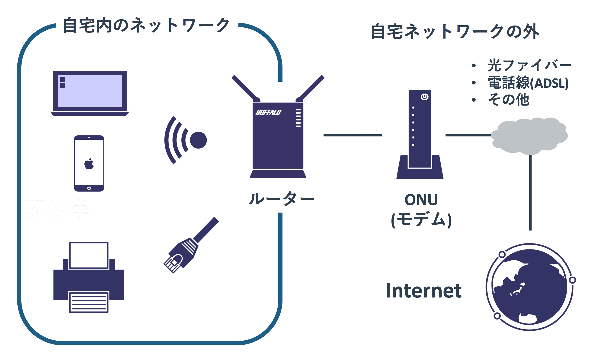

# ハードウェア

## ケーブルの種類

自宅のネットワークで利用される通信ケーブルはLANケーブルのみです。
ただ、業務で利用される機器では様々な種類のケーブルを利用します。

### RJ45

一般的に「LANケーブル」と呼ばれるているのが、「**RJ45**」という規格のコネクタを使うケーブルです。
ユーザーが使うPCや機器に使われる優先のネットワークはほとんどこれを使います。

同じポート形状であってもいくつかの規格があり、その規格は「**カテゴリー**」と呼ばれています。
現在使用されいている主流のものは「カテゴリー5e」「カテゴリー6/6a」あたりですが、
これより前の世代(古くなったので使われない)や後の世代(まだ高価だし太いので使われない)もあります。

<<表>>

基本的にはカテゴリーがあがるほど高性能で帯域が広く長い距離を使えますが、
ケーブルに接続される両端の機器がそのカテゴリーをサポートしていないと古いカテゴリーのケーブルと同じ性能となります。
カテゴリーには後方互換性があるため、新しい種類のケーブルを古い機器で利用することができます。

### SFP + Fiber

業務用のスイッチには大きく2種類あります。
ユーザーのPCや家庭やオフィス内で使う様々な機器(プリンタやアクセスポイントなど)に繋げる「アクセススイッチ」と、
複数のスイッチを束ねる「コアスイッチ」です。

アクセススイッチは相手側の機器がRJ45を利用するため、スイッチのポートもRJ45を利用することが多いです。
ただ、コアスイッチは複数のアクセススイッチを束ねるという目的から「帯域が広いケーブルが必要」
「100m以上のケーブルが必要」といったことを実現できる必要があり、なおかつRJ45も利用できる必要があります。

そのため、コアスイッチ本体にケーブルを接続するのではなく、
アダプタである「**SFP(Small Form Factor Pluggable)**」を本体にさして、そのSFPにケーブルをさします。
スイッチにさすSFPのオス側は全て同じ形ですが、
SFPのメス側(つまりケーブルをさすところ)は様々なタイプがあるので、
利用したいケーブルによりSFPを選択します。

RJ45型のSFPも提供されていますが、他にも光ファイバー用のSFPも提供されています。
光ファイバーは光という特質上、信号の劣化が発生しにくいためRJ45よりも通信距離が長い場合に利用します。
ただ、高価でRJ45に比べると壊れやすいという特徴もあります。

光ファイバーの規格には大きく2種類あり、「シングルモード」と「マルチモード」があります。
前者は1つの光で

### Twinax

### シリアル(コンソールポート)

## 筐体の種類

### ボックス型

### シャーシ型
