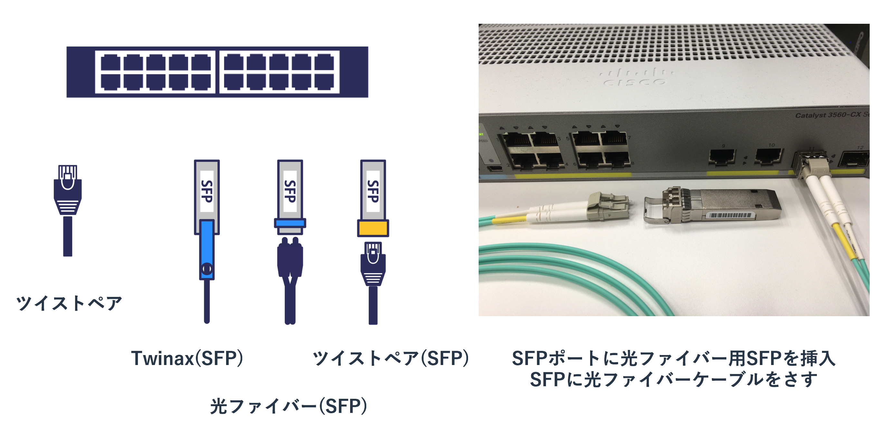
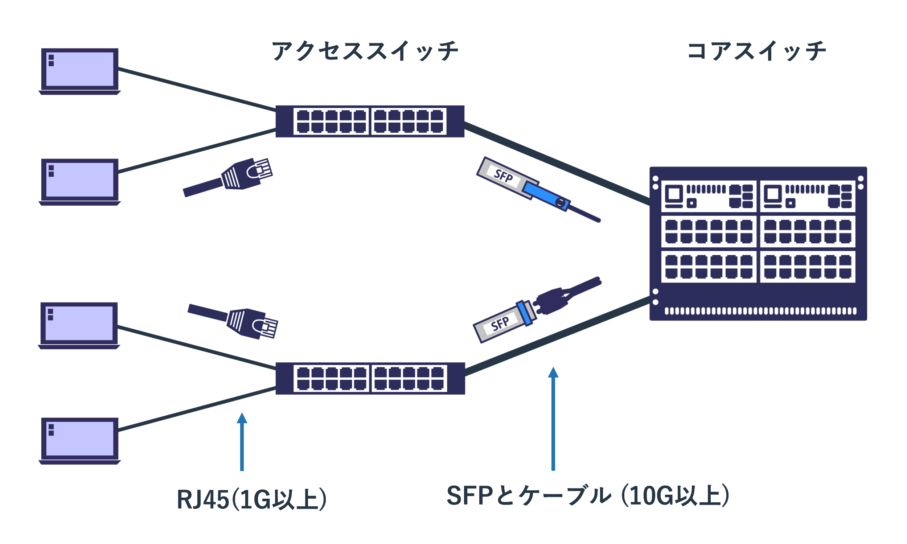

# ハードウェア

## ケーブルの種類

自宅のネットワークで利用される通信ケーブルはいわゆるLANケーブルのみです。
ただ、業務で利用される機器では様々な種類のケーブルを利用します。
実際に使ったことがないと想像しにくいと思いますので、大まかなカテゴリを紹介します。

### ツイストペアケーブル

一般的に「LANケーブル」と呼ばれるているのが、「**RJ45**」という規格のコネクタを使う「**ツイストペアケーブル**」です。
ユーザーが使うPCや機器に使われる有線のネットワークはこれか、無線を使うかのどちらかです。

ツイストペアという名前はケーブル内にある内部の銅線ケーブルの扱いから来ています。
外側の被膜の内側に8本の銅線がありますが、それが2本ずつよりあわせられています。
これは銅線を電気が流れて磁界が発生する影響を抑えるための仕組みです。
ようするにノイズが電気信号へ与える影響を少なくするということです。
ただ、少なくするだけでなくなるわけではないため、100mを越える長距離の配線には向きません。

どの程度の距離をどの程度の通信速度で利用できるかということはRJ45の「**カテゴリー**」に依存します。
カテゴリーは規格のことで、外側の見た目は全く同じでも内部のケーブルの品質が異なります。
厳密な値を覚える必要はありませんが、カテゴリーが大きくなるほど通信帯域が大きくなること、
ケーブルがノイズ対策用の保護皮膜でシールドされているほどノイズに強いという特徴があります。
一般的にはシールドされていないケーブルが主流で、それは「**UTP(Unshielded Twisted Pair)**」と呼ばれます。
シールドされているものは「**STP(Shielded Twisted Pair)**」と呼ばれます。
STPはノイズが強い環境(野外や工場内)で利用されていましたが、
現在はそういった環境ではノイズの影響がほとんどない光ファイバーが利用されることが多いです。

2018年現在だと古いケーブルはカテゴリー5eであり、
現在購入するのであればカテゴリー6/6Aあたりが主流となっています。
カテゴリー7以上も販売されていますが、
コネクタがRJ45の上位互換のものが必要になったりするといった要因でほとんど利用されていません。

|カテゴリ|通信帯域|その他|
|:--|:--|:--|
|Cat5|100Mbps|1Gが出せないので注意|
|Cat5e|1Gbps|1Gbpsを出せるがCat6を推奨|
|Cat6|1Gbps|10Gbpsも出せるが、その場合は6Aを推奨|
|Cat6A|1Gbps/10Gbps|Cat6より品質がよいが太い|
|Cat7|1Gbps/10Gbps|GG45などのコネクタを持たないと実質Cat6/6Aと同じ|

基本的にはカテゴリーがあがるほど高性能で帯域が広く長い距離を使えますが、
ケーブルに接続される両端の機器がそのカテゴリーのスピードを使えないと性能を活かせません。
GG45などの新しいコネクタ規格が普及するまでは自宅やオフィス機器にはCat6を選択し、
サーバーなどの広帯域を必要とする可能性がある機器には6Aを利用しておくのがよいと思います。

### SFP

業務用のスイッチには大きく2種類あります。
ユーザーのPCやオフィス内で使う様々な機器(プリンタやアクセスポイントなど)に繋げる「**アクセススイッチ**」と、
複数のスイッチ間を接続する「**コアスイッチ**」です。

アクセススイッチに接続される機器はPCやプリンターといったRJ45を利用する機器がほとんどであるため、
スイッチのポートもRJ45を利用することが多いです。
ただ、コアスイッチは複数のアクセススイッチを束ねるという目的から「10G以上の帯域が広いケーブルが必要」
「100m以上のケーブルが必要」といったことを実現できる必要があります。

このような理由からコアスイッチのポート及び、
アクセススイッチが持つコアスイッチと接続するポート(**アップリンク**)は、
RJ45ではなく汎用性が高い「**SFP(Small Form Factor Pluggable)**」と呼ばれるアダプタと、
それに合う広帯域のケーブルを使うことが多いです。

スイッチの本体にはSFPをさすためのSFPポートという口(メス)があり、
そこにSFPのスイッチ側の接続端子(オス)をさしこみます。
SFPにはケーブルをさすポート(メス)があるので、そこにケーブル(オス)をさすというかたちで使います。
ようするにSFPはSFPポートをケーブルに応じた規格に変換するためのアダプタにすぎません。

SFPを利用するケーブルの種類はおおまかに3つあります。
1つめはツイストペアケーブルで、SFPポートを持つスイッチを使っている場合でも相手側がRJ45のポートを保つ場合はRJ45用のSFPを使います。
2つめは光ファイバーケーブルで、機器間の距離が離れている場合やノイズが強い環境で利用をします。
光ファイバーケーブルを使う場合は光ファイバー用のSFPを用い、それには光信号を送信/受信するためのレンズがついています。
3つめはSFPポートに直接さすケーブルで「**DAC(Direct Attach Copper)**」や「**Twinax**」と呼ばれているケーブルです。
10Gが使えるケーブルとSFPポートを接続される両機器ぶんの2つを揃えるより、
ケーブルにSFPが直結しているDACを使うほうが安価で信頼性が高いため、近距離のラック内の配線などに利用されます。

RJ45のSFPやTwinaxの規格は多くないため分かりやすいですが、
光ファイバー用のSFPには多種多様なものが存在しています。
全てを覚える必要はありませんが、1G用のものと10G用のものがあり、
光信号の種類に「シングルモード」と「マルチモード」があることは知っておく必要があります。

### シリアル(コンソールポート)

シリアルケーブルはシリアル通信と呼ばれるケーブルで繋がれた双方向の機器で同期をとる通信に利用されます。
昔はWANに接続するルーター間のデータ通信で利用されることが多く、
イーサネットとは異なる「Frame Relay」や「PPP」といったL2プロトコルを利用ていました。
ただ、現在はシリアル通信はイーサネット通信に比べて利用されておらず、
データ通信用のシリアルのポートを持たない機器がほとんどです。
イーサネットの世界と考え方が大きく異なるのですが、
現在のネットワークエンジニアがそれを学ぶメリットはあまり多くありません。

シリアルのポートはデータ通信用だけでなく管理用にももうけられており、
現在のシリアルケーブル(通称コンソールケーブル)の
ルーターやスイッチと設定を行うPCを接続するために利用されることがほとんどです。
と、設定用のシリアルのポートは異なっており、
設定用のシリアルポート

いまではルーターやスイッチの設定に利用されることがほとんどです。

## 筐体の種類

### ボックス型

### シャーシ型
