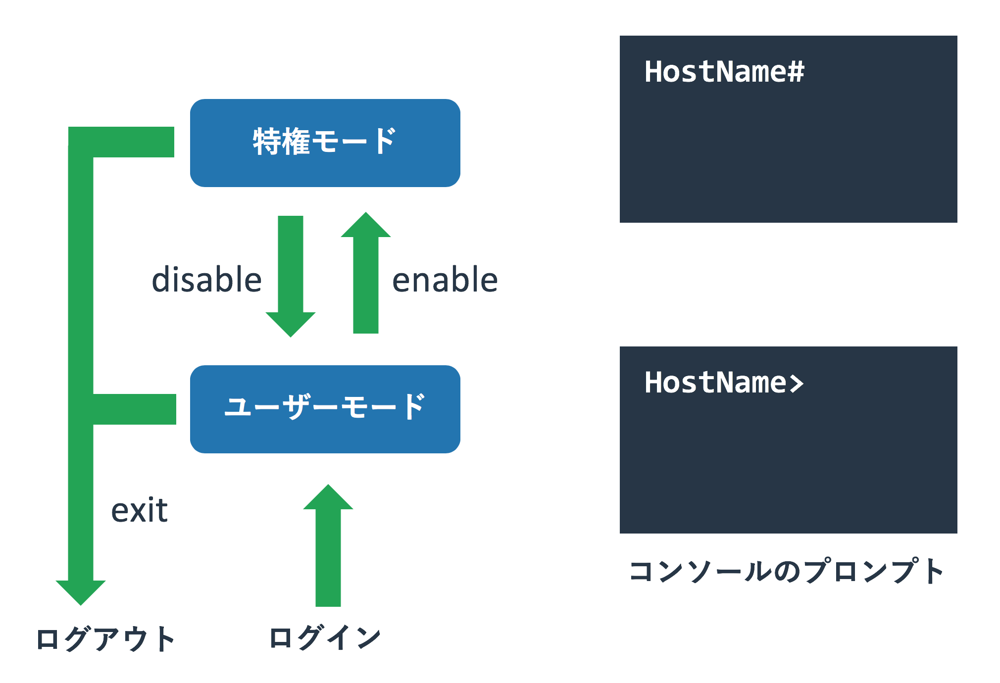
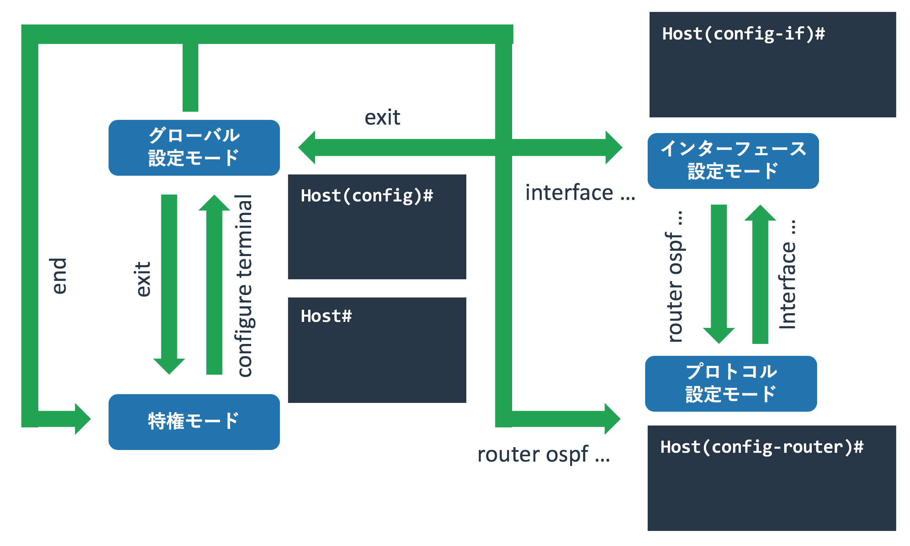
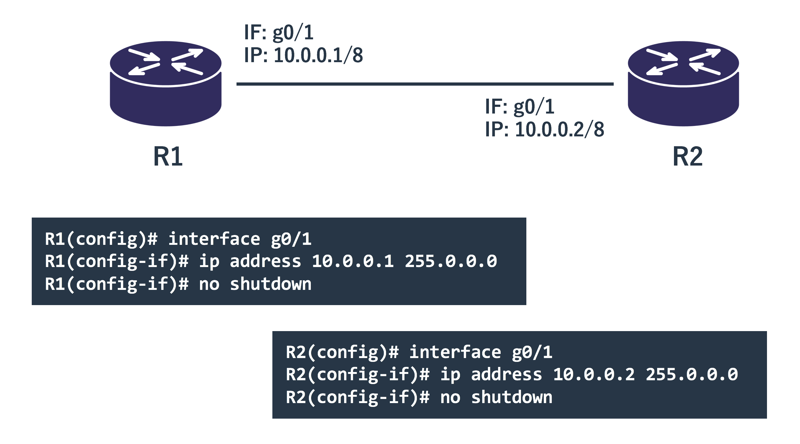
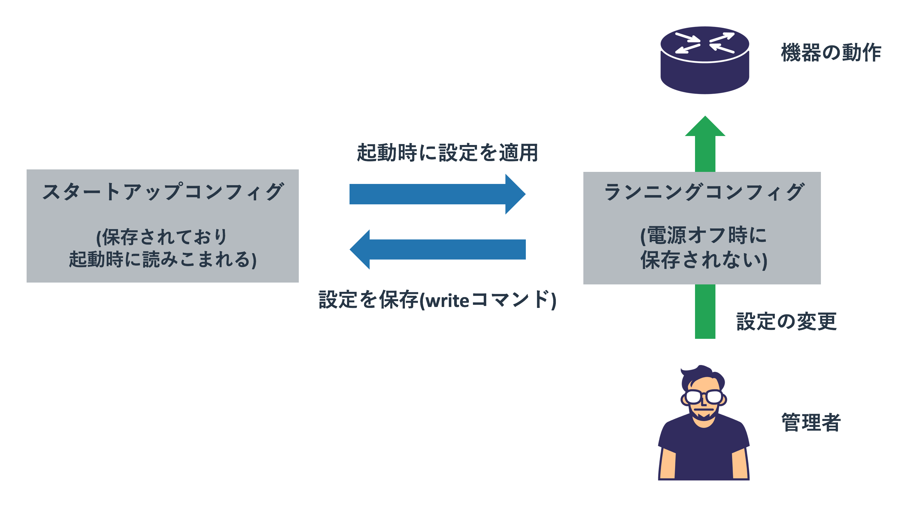

# Cisco機器の操作方法

{{ TOC }}

## 概要

## 操作方法

本サイトではネットワークの動きを実際に機器を操作しながら学びます。
ページが取り扱う項目に応じた具体的な設定方法は各ページで説明しますが、
それらで共通する基本的な操作方法などについては本ページで扱います。

利用する機器は業務用ネットワーク機器として最も標準的なCisco社のL3スイッチとルーターを利用します。
Cisco社のスイッチやルーターにも様々な種類がありますが、最も普及しているIOSと呼ばれるOSを使ったCatalystとISRを想定しています。
なお、操作するのは実機ではなくVIRLというCisco社のネットワークテストツールを使っています。
VIRLの詳細については別ページ(作成中)にて紹介しています。


### Cisco機器への接続方法

機器の設定を加えるには、その機器にログインする必要があります。
Ciscoのルーターやスイッチも同様で、この両者に違いはありません。

ログイン方法として「コンソールに直結したログイン」と
「SSHやTelnetを使ったリモートからのログイン」の2種類があります。


シスコの機器は「**コンソールポート**」と呼ばれるポートを持っています。
コンソールポートの見た目はLANケーブルをさすポートと同じかたちなので大差ありませんが、
ポートの上か下に「Console」などと書かれています。

このポートに「片側がRJ45となるシリアルケーブル」をさし、
操作する機器側にシリアルポートをさせば操作機器とCiscoの機器が接続されます。
図にあるように現在はUSBシリアル変換ケーブルを使うことが一般的です。
機器を購入した直後や設定を初期化した直後はリモートからのログインができないため、
コンソールを使って初期設定を施す必要があります。

シリアルを使った機器操作で気をつけないといけないのは「ボーレート」と呼ばれる通信速度です。
通信をする双方の機器で揃える必要があるのですが、勝手に相手にあわせるということはしないため、
双方で同じ速度を設定する必要があります。
Cisco側のデフォルトは9600bpsですので、操作端末側も同じ9600を設定します。

コンソールを使った操作は機器のコンソールに直結する必要があり若干面倒なため、
初期設定でリモートログインできるようにしたあとは「SSHを使って機器に接続することが一般的」です。
現在のCisco機器で暗号化されていないTelnetを使う理由はないため、
可能な限りはSSHのみを使うようにしてください。


### モード

Ciscoの機器はUnixやLinuxなどと同じようにコマンド(CLI)で操作をします。
その際に重要になるのが「モード」という概念で、
コマンドを使ってモードを行き来することで機器の設定や状態を見たり、設定変更を加えたりします。
各モードによってできる操作が変わってきます。

以下にIOSにおけるモードの遷移図を記載します。
全く知識がない場合はモードの多さにぎょっとするかもしれませんが、操作しているうちに慣れてきます。
機器の状態を確認したり、設定をする場合には「今はどのモードにいるのか」ということを意識してください。


「**ユーザモード**」は管理者ではないものの、機器の状態を一部だけ見ることを許されている状態です。
ネットワーク管理者はこのモードをあまり使いませんが、
管理者が異なる隣接する機器に一般モードの利用のみ許されているという場合もあります。

「**特権モード**」は全ての機器の状態(一般ユーザには許可されていないものも含む)を確認でき、
なおかつ設定変更モードにも移れるモードです。
ネットワーク管理者はこのモードを主に利用します。

機器の状態確認をする際に最も使われるモードで、設定の変更を加えている場合以外はこのモードを使うようにしてください。
機器の再起動などもできてしまいますが、誤って設定を変更してしまうというリスクがなくなります。

「**設定モード**」は名前の通り、機器の設定を変更できる状態です。
管理者モードから設定モードに移行するため、一般ユーザーが機器の設定をすることはありません。
設定変更モードも細かく分類ができ、機器のホスト名といった全般的なものを変更できるのが「グローバル設定変更モード」です。
管理者モードから設定変更モードに移るとこれになります。
一方、インターフェースの設定は「グローバル設定変更モード」から「インターフェース設定変更モード」に移って行います。
グローバル設定変更モード以外の詳細な設定を変更するモードは多数あり、
インターフェースやルーティングプロトコルなどの管理単位で分かれています。


## 構成図

本ページでは以下のような構成を使います。
ルーター2台を直接接続し、それぞれの物理インターフェースにIPを設定して通信をさせます。


実際に機材を設定することでネットワークの理解が進むので、
可能であれば実機なりシミュレーターなりを使って実際に設定や実験をしてください。
本ウェブサイトのサンプルは全てCiscoのシミュレーターである「**VIRL**」を利用して構築しています。


## 初期設定

新しいCiscoのルーター(スイッチも同じ)にコンソールを接続して初回起動すると、
設定が何もされていないのでダイアログ(質問形式)で設定をするかと聞かれます。

今回は手動で入力していきますので、「no」と回答し、エンターボタンで次に進みます。

```text
% Please answer 'yes' or 'no'.
Would you like to enter the initial configuration dialog? [yes/no]: no

Press RETURN to get started!
```

コンソールログインはデフォルトではパスワードを求められません。
先に説明したユーザーモードとしてログインされます。

```text
Router>
```

一般ユーザーモードにいるか管理者モードにいるかはプロンプトで分かります。
ホスト名(デフォルトはRouter)の横に「**>**」がプロンプトとして表示されていれば、ユーザーモードとして動作しています。

一般ユーザーは機器に影響を与える操作はできませんが、
機器の状態が確認されるのがセキュリティ的に望ましく場合は、
パスワードの設定をすることが推奨されます。

ユーザーモードからログアウトをするには「**exit**」コマンドを利用します。
コンソールでログインしていればログイン画面に移り、SSHでログインしていればセッションが終了します。


## モードの移行方法

### ユーザーモードから特権モードへの移行

管理者として操作をするには、ユーザーモードから特権モードに移行する必要があります。
管理者モードに移行するには「**enable**」コマンドを使います。

```text
Router>enable
Router#
```

プロンプトが一般ユーザーモードの「>」から、特権モードの「**#**」に変わりました。
設定がされていないデフォルト状態では特権モードへの移行はパスワードなしで実現できます。
本番環境で使っている機器では誰でも管理者として機器を操作できる状態はセキュリティ上望ましくありません。
必ずパスワードを設定してください。




### 特権モードからユーザーモードへの移行

特権モードからユーザーモードに移るには「**disable**」コマンドを使います。
ただ、管理者がユーザーモードを利用する理由はないため、あまり利用されません。

```text
Router#disable
Router>
```

特権モードから「exit」コマンドを使うと、
ユーザーモードを経由せずにログアウトします。

### 管理者モードから設定モード

ルーターの設定をするために、管理者モードから設定モードに移行します。
これには「**configure terminal**」コマンドを入力します。

```text
Router#configure terminal
Enter configuration commands, one per line.  End with CNTL/Z.
Router(config)#
```

プロンプトが「ホスト名#」から「ホスト名(config)#」に代わり、
機器の設定ができるようになりました。
移行するタイミングで「Enter configuration commands, one per line.  End with CNTL/Z.」というメッセージも出力されています。

設定モードは主に機器の設定を変更するためのモードであるため、
変更操作をしない場合には入らないようにしてください。
複数の機器を操作している際に変更している機器以外は管理者モードにしておけば、
間違った機器に変更を加えてしまうといったリスクを避けられます。

また、単純に設定モードだと機器の状態確認をやり辛くなります。
これについては後述じます。

### 設定モード間の移動

設定モードには「グローバル設定モード」と特定の機能の設定モードがあります。
「configure terminal」をした直後はグローバル設定モードになっています。

特定機能の設定モードに移るためには、その設定をするためのコマンドを入力します。
たとえば設定モードから「インターフェース設定モード」に移るには
「**interface <設定したいインターフェース名>**」とします。
今回は「GigabitEthernet0/1」というインターフェースを設定します。

```text
R1(config)#interface GigabitEthernet0/1
R1(config-if)#
```

設定モードの種類に応じて、プロンプトが変わります。
これから現在どの設定モードにいるのかが判断できます。

特定の設定モードからグローバル設定モードに戻るには「exit」コマンドを利用します。

```text
R1(config-if)#exit
R1(config)#
```

特定の設定モードから別の特定の設定モードに移るには、
必ずしもグローバル設定モードを経由する必要はありません。

たとえばインターフェース設定モードからOSPF設定モードに直接移行することもできます。

```text
R1(config)#interface gigabitEthernet 0/1
R1(config-if)#router ospf 1
R1(config-router)#
```

これらのモードやコマンドの意味については後ほど扱います。




### 設定モードから管理者モードへの戻り方

設定モードから管理者モードに戻るには2種類の方法があります。
「**exit**」コマンドで設定モードから1階層戻るという動きをし、
「**end**」コマンドで一気に管理者モードまで戻るという動作をします。

OSPF設定モードにいた場合にexitを入力すると、グローバル設定モードに戻り、
グローバル設定モードでexitを入力すると管理者モードに戻ります。

```text
R1(config-router)#exit
R1(config)#exit
R1#
```

一方、endコマンドを使うとどのような設定モードであったとしても、
グローバル設定モードを経ずに管理者モードに戻ります。

```text
R1(config-if)#end
R1#
```


## コマンドの補完と省略

コマンドの入力は必ずしも全てを手で入力する必要はありません。
入力中にタブを押すことで補間をしたり、候補が複数ある場合はそれを表示することができます。

```text
R1>en [Tabボタンを押す]
R1>enable
```

上記はユーザーモードで「en」と入力したあとでTabボタンを押した際の動きです。
ユーザーモードで「en」から始まるコマンドが「enable」しかないため、そのコマンドが全て補間されています。

「e」だけだとコマンドが特定できないため、補間が働きません。
その場合は「?」で入力候補を表示させられます。

```text
R1>e [Tabボタンを押す]
R1>e
R1>e?
enable  ethernet  exit  

R1>e
```

eから始まる候補が3つあり、それが列挙されています。
続く文字を入力することでコマンドを特定できるようにしてください。

補間でコマンドを完成させられる状態であれば、
補完をしなくてもコマンドを発行することができます。
たとえば「enable」の代わりに「en」と入力することで管理者モードに移ることができます。

```text
R1>en
R1#
```

長いコマンドを全て入力するのは手間ですし、なにより覚えきれていないことが多いです。
タブや?を使うことで操作の負担を減らして下さい。


## showコマンドでの状態確認

機器を利用するには現在の機器の状態を正しく把握することが必要です。
機器の様々な状態や設定などを確認するには「**show**」コマンドを利用します。
showコマンドは主にユーザーモードと管理者モードで利用します。

たとえば機器の現在時刻を確認するコマンド「show clock」をユーザーモードと管理者モードで実行すると以下のようになります。

```text
R1>show clock   
*01:06:47.548 UTC Wed Apr 11 2018
R1>en
R1#show clock
*01:06:54.319 UTC Wed Apr 11 2018
R1#
```

showコマンドの一部は管理者モードでは使えるが、ユーザーモードでは使えないようになっています。
たとえば「show running-config」という機器の設定を全て確認するコマンドは管理者モードでしか使えません。

```text
R2>show running-config
         ^
% Invalid input detected at '^' marker.

R2>
R2>en
R2#show running-config
Building configuration...

Current configuration : 4801 bytes
!
! Last configuration change at 23:23:10 UTC Wed Apr 11 2018
!
version 15.6
service timestamps debug datetime msec
service timestamps log datetime msec
no service password-encryption
...
```


### doコマンド

設定モードは設定変更をするためのモードであるため、
showコマンドを使うことができません。

```text
R2(config)#show clock
             ^
% Invalid input detected at '^' marker.

R2(config)#
```

ただし、「**do**」コマンドに続けてshowコマンドを続けることで、
設定モードであってもshowコマンドを利用できます。

```text
R2(config)#do show clock
*00:01:52.018 UTC Thu Apr 12 2018
R2(config)#
```

doコマンドを使うとタブや?が使えないため、
コマンドを完全に暗記している場合にしか利用できません。
設定を加えている最中に現在の設定を確認したりすることが多いです。

### インターフェースの一覧確認

showコマンドにも体系がありますが、とりあえず使うことを優先して細かな説明は省きます。
「**show ip interface brief**」コマンドでルーターのインターフェースの一覧を得ます。

```text
Router#show ip interface brief
Interface                  IP-Address      OK? Method Status                Protocol
GigabitEthernet0/0         unassigned      YES unset  administratively down down    
GigabitEthernet0/1         unassigned      YES unset  administratively down down    
```

この例ではインターフェース「GigabitEthernet0/0」と「GigabitEthernet0/1」があり、
それぞれのIPアドレスは設定されていません。
インターフェースの状態が「administratively down(明示的にdownさせている)」となっています。

### インターフェースの状態確認

個別のインターフェースを確認するには「**show interface <インターフェース名>**」コマンドを使います。

```text
R2#show interfaces gigabitEthernet 0/1
GigabitEthernet0/1 is administratively down, line protocol is down
  Hardware is iGbE, address is fa16.3e49.367e (bia fa16.3e49.367e)
  MTU 1500 bytes, BW 1000000 Kbit/sec, DLY 10 usec,
     reliability 255/255, txload 1/255, rxload 1/255
  Encapsulation ARPA, loopback not set
  Keepalive set (10 sec)
  Auto Duplex, Auto Speed, link type is auto, media type is RJ45
  output flow-control is unsupported, input flow-control is unsupported
  ARP type: ARPA, ARP Timeout 04:00:00
  Last input never, output never, output hang never
  Last clearing of "show interface" counters never
  Input queue: 0/75/0/0 (size/max/drops/flushes); Total output drops: 0
  Queueing strategy: fifo
  Output queue: 0/40 (size/max)
  5 minute input rate 0 bits/sec, 0 packets/sec
  5 minute output rate 0 bits/sec, 0 packets/sec
     0 packets input, 0 bytes, 0 no buffer
     Received 0 broadcasts (0 IP multicasts)
     0 runts, 0 giants, 0 throttles
     0 input errors, 0 CRC, 0 frame, 0 overrun, 0 ignored
     0 watchdog, 0 multicast, 0 pause input
     0 packets output, 0 bytes, 0 underruns
     0 output errors, 0 collisions, 1 interface resets
     0 unknown protocol drops
     0 babbles, 0 late collision, 0 deferred
     0 lost carrier, 0 no carrier, 0 pause output
     0 output buffer failures, 0 output buffers swapped out
R2#
```

このコマンドはインターフェースの詳細な状況を確認できます。
アップしているか否か、IPアドレス、MACアドレス。
それに加えてどの程度パケットを送受信しているかといったこともわかります。


## 機器の設定

機器を利用するには設定を正しくおこなうことが必要です。
使う機能により設定が異なるため全てカバーすることはできませんが、
機器名やインターフェースにIPを設定するといった基本的な内容をここで扱います。

### ホスト名(グローバル設定モード)

グローバル設定モードでは特定の機能に依存しない一般的な設定をします。
たとえばホスト名の設定などです。

ホスト名の変更は「**hostname <ホスト名>**」というコマンドを使います。
全ての機器の名前が同じだと区別がしにくいため、図と同じ名前であるPC1を設定します。

```text
Router(config)#hostname PC1
PC1(config)#
```

プロンプトに表示されていたホスト名が変更されました。

### IPアドレス(インターフェース設定モード)

ルーターのインターフェースに設定されるIPは、機器全般の一般的な設定というよりは、
そのインターフェースの設定です。
このようなインターフェースやプロトコルといった何かに属する設定は、
それの設定モードで実施します。

インターフェースに設定を加えるのであれば、
「**interface <設定したいインターフェース名>**」としてグローバル設定モードからインターフェース設定モードに移ります。

```text
R1(config)#interface GigabitEthernet0/1
R1(config-if)#
```



図にあるように「10.0.0.1/8」という設定を加えます。
IPを設定するにはインターフェース設定モードで「**ip address <IPアドレス> <サブネットマスク>**」とします。
そしてダウンさせている設定を「**no shutdown**」とすることでアップさせる設定にします。

```text
R1(config)#interface GigabitEthernet0/1
R1(config-if)#ip address 10.0.1.101 255.255.255.0
R1(config-if)#no shutdown
R1(config-if)#
*Oct 25 00:14:33.986: %LINK-3-UPDOWN: Interface GigabitEthernet0/1, changed state to up
*Oct 25 00:14:34.986: %LINEPROTO-5-UPDOWN: Line protocol on Interface GigabitEthernet0/1, changed state to up
R1(config-if)#end
R1#
*Oct 25 00:15:17.728: %SYS-5-CONFIG_I: Configured from console by console
```

ルーターからインターフェースがアップしたという旨のメッセージが得られました。

再度、インターフェースの状態を「show ip interface brief」コマンドで確認します。
そうすると、インターフェースにIPが振られていることが確認できました。

```text
R1#show ip int bri
Interface                  IP-Address      OK? Method Status                Protocol
GigabitEthernet0/0         unassigned      YES unset  administratively down down    
GigabitEthernet0/1         10.0.1.101      YES manual up                    up      
```

インターフェース G0/1 にIPアドレスが振られていることがわかりますね。
最後に「write」コマンドで設定をルーターに保存します。
様々なコマンドを打つことで設定はルーターやスイッチに適用されていきますが、
設定を保存しないと再起動をした際に更新した設定が全て消えています。


## 設定の確認と保存

Ciscoのルーターやスイッチに加えた設定は、保存をしないと電源オフや再起動で消えてしまいます。
正しく設定を保存したり変更するには、どのように設定が扱われているかをきちんと理解する必要があります。

設定ファイルには「**startup-config**」と「**running-config**」の2つがあります。
その名前から分かるようにstartup-configは起動時に利用される設定情報で、
running-configは現在起動しているその機器の設定となります。



Ciscoの機器は起動時にstartup-configに書かれている内容をrunning-configにコピーして、
「running-config」の設定に書かれているように動作をするようになります。

running-configの確認は「**show running-config**」コマンドでおこなえます。
このコマンドは全ての設定を画面に出力しますが、
特定の設定だけが必要な場合は「show running-config」に項目を続けます。
例えば先ほど設定したインターフェースだけの設定を確認することもできます。

```text
R1#show running-config interface g0/1
Building configuration...

Current configuration : 109 bytes
!
interface GigabitEthernet0/1
 ip address 10.0.0.1 255.0.0.0
 duplex auto
 speed auto
 media-type rj45
end
```

自分が設定していないspeedなどの設定も入っていますが、初期値だと思って下さい。
逆に「no shutdown」などの設定も入っていませんが、それがデフォルト値で省略されているためです。

たとえばインターフェースのIPを変更すると、
このrunning-configの値も変わります。

```text
R1(config)#int g0/1
R1(config-if)#ip add 10.0.0.100 255.0.0.0
R1(config-if)#end
R1#show run int g0/1
Building configuration...

Current configuration : 111 bytes
!
interface GigabitEthernet0/1
 ip address 10.0.0.100 255.0.0.0
 duplex auto
 speed auto
 media-type rj45
end

R1#
```

このrunning-configの設定は保存をしないと機器を停止したり再起動するとなくなってしまいます。
「**write**」コマンドを使うことでrunning-configの内容を、
起動時に読み込む設定ファイルであるstartup-configにコピーすることができます。


```text
R1#write
Building configuration...
[OK]
R1#
*Oct 25 00:16:41.001: %GRUB-5-CONFIG_WRITING: GRUB configuration is being updated on disk. Please wait...
*Oct 25 00:16:41.831: %GRUB-5-CONFIG_WRITTEN: GRUB configuration was written to disk successfully.
```

停止した際にrunning-configの内容を失っても、
startup-configに同じ内容があるため再起動時にrunning-configにコピーされて同じ状態に戻ります。


## 通信テストをするコマンド

### ping

```text
R1#ping 10.0.1.102
Type escape sequence to abort.
Sending 5, 100-byte ICMP Echos to 10.0.1.102, timeout is 2 seconds:
.!!!!
Success rate is 80 percent (4/5), round-trip min/avg/max = 4/4/5 ms
```

### traceroute


## 便利なコマンド

### 間違えたコマンド入力時に名前解決を防ぐ

Ciscoの機器は誤ったコマンドを入力した際に名前解決しようとする場合があります。

たとえば存在しないコマンド「hello」を入力すると以下のように名前解決をしようとして、
それに10秒以上は時間を取られます。

```text
R1#hello
Translating "hello"...domain server (255.255.255.255)
 (255.255.255.255)
Translating "hello"...domain server (255.255.255.255)

% Bad IP address or host name
% Unknown command or computer name, or unable to find computer address
R1#
```

この名前解決を避けるには「**no ip domain-lookup**」コマンドを設定します。
このコマンドを設定してから「hello」とすると、1秒ほどでレスポンスが戻ってきます。

```text
R1(config)#no ip domain-lookup
R1(config)#end
R1#hello
Translating "hello"

Translating "hello"

% Bad IP address or host name
% Unknown command or computer name, or unable to find computer address
```

### 出力割り込み時に再表示

機器を操作している最中にリンクアップやダウンなどが発生すると、
そのイベント出力文字と現在のコマンド入力が混ざって操作しにくくなります。

これを防ぐためにコンソール及びリモート接続で「**logging synchronous**」と設定すれば、
機器からの割り込みの出力が発生したとしても次の行に入力中のコマンドが再表示されます。

```text
R1(config)#line console 0
R1(config-line)#logging synchronous
R1(config)#line vty 0 15
R1(config-line)#logging synchronous
```

上記は「line console 0」がコンソール接続の設定モードとなり、
「line vty 0 15」がリモート接続の設定モードとなります。


### 長い出力をまとめて表示

「show running-config」の出力は非常に多くなるため、途中で出力が止まって「--More--」と表示されます。
これはLinuxのmoreコマンド(lessコマンドとほぼ同じ)と同じく、
エンターボタンで1行進み、スペースボタンで複数行進みます。
出力を抜けるにはQuitの「q」を入力します。

```text
R1#show running-config
Building configuration...

Current configuration : 4823 bytes
!
! Last configuration change at 00:33:01 UTC Fri Apr 13 2018
!
version 15.6
service timestamps debug datetime msec
<省略>
!
!
mmi polling-interval 60
 --More--
```

何行出力されるかという設定は「**terminal length**」コマンドで決まります。
0とすれば全て出力という意味になるため、出力を中断されたくない場合は「terminal length 0」と設定します。

```text
R1#terminal length 0
```

ただ、このコマンドは機器に対して永続的な設定となるわけではなく、再起動すれば消えてしまいます。
セッションごとに設定が必要です。
