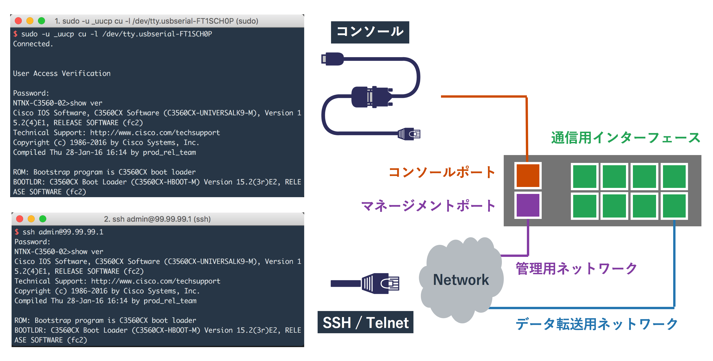
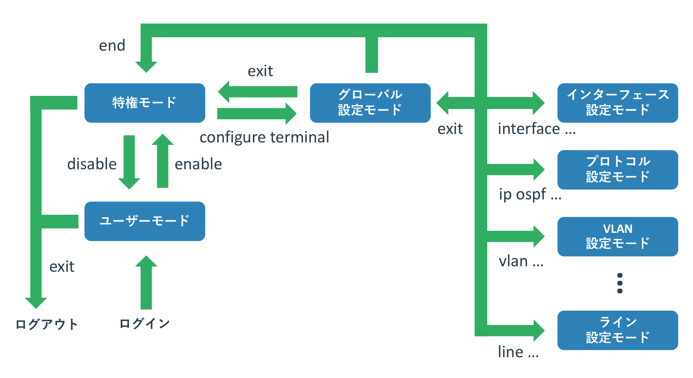
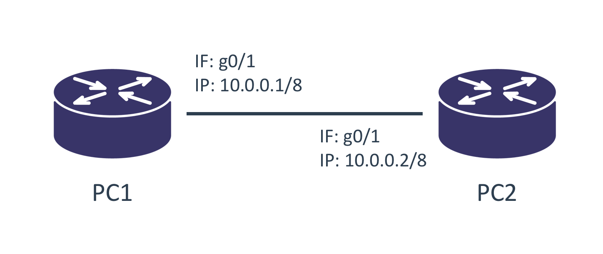

# Cisco機器の操作方法

{{ TOC }}

## 概要

CDP, LLDP

## 操作方法

本サイトではネットワークの動きを実際に機器を操作しながら学びます。
ページが取り扱う項目に応じた具体的な設定方法は各ページで説明しますが、
それらで共通する基本的な操作方法などについては本ページで扱います。

利用する機器は業務用ネットワーク機器として最も標準的なCisco社のL3スイッチとルーターを利用します。
Cisco社のスイッチやルーターにも様々な種類がありますが、最も普及しているIOSと呼ばれるOSを使ったCatalystとISRを想定しています。
なお、操作するのは実機ではなくVIRLというCisco社のネットワークテストツールを使っています。
VIRLの詳細については別ページ(作成中)にて紹介しています。


### Cisco機器への接続方法

機器の設定を加えるには、その機器にログインする必要があります。
Ciscoのルーターやスイッチも同様で、この両者に違いはありません。

ログイン方法として「コンソールに直結したログイン」と
「SSHやTelnetを使ったリモートからのログイン」の2種類があります。



シスコの機器は「コンソールポート」と呼ばれるポートを持っています。
コンソールポートの見た目はLANケーブルをさすポートと同じかたちなので大差ありませんが、
ポートの上か下に「Console」などと書かれています。

このポートに「片側がRJ45となるシリアルケーブル」をさし、
操作する機器側にシリアルポートをさせば操作機器とCiscoの機器が接続されます。
図にあるように現在はUSBシリアル変換ケーブルを使うことが一般的です。
機器を購入した直後や設定を初期化した直後はリモートからのログインができないため、
コンソールを使って初期設定を施す必要があります。

シリアルを使った機器操作で気をつけないといけないのは「ボーレート」と呼ばれる通信速度です。
通信をする双方の機器で揃える必要があるのですが、勝手に相手にあわせるということはしないため、
双方で同じ速度を設定する必要があります。
Cisco側のデフォルトは9600bpsですので、操作端末側も同じ9600を設定します。

コンソールを使った操作は機器のコンソールに直結する必要があり若干面倒なため、
初期設定でリモートログインできるようにしたあとは「SSHを使って機器に接続することが一般的」です。
現在のCisco機器で暗号化されていないTelnetを使う理由はないため、
可能な限りはSSHのみを使うようにしてください。


### モード

Ciscoの機器はUnixやLinuxなどと同じようにコマンド(CLI)で操作をします。
その際に重要になるのが「モード」という概念で、
コマンドを使ってモードを行き来することで機器の設定や状態を見たり、設定変更を加えたりします。
各モードによってできる操作が変わってきます。

以下にIOSにおけるモードの遷移図を記載します。
全く知識がない場合はモードの多さにぎょっとするかもしれませんが、操作しているうちに慣れてきます。
機器の状態を確認したり、設定をする場合には「今はどのモードにいるのか」ということを意識してください。



「**ユーザモード**」は管理者ではないものの、機器の状態を一部だけ見ることを許されている状態です。
ネットワーク管理者はこのモードをあまり使いませんが、
管理者が異なる隣接する機器に一般モードの利用のみ許されているという場合もあります。

「**特権モード**」は全ての機器の状態(一般ユーザには許可されていないものも含む)を確認でき、
なおかつ設定変更モードにも移れるモードです。
ネットワーク管理者はこのモードを主に利用します。

機器の状態確認をする際に最も使われるモードで、設定の変更を加えている場合以外はこのモードを使うようにしてください。
機器の再起動などもできてしまいますが、誤って設定を変更してしまうというリスクがなくなります。

「**設定モード**」は名前の通り、機器の設定を変更できる状態です。
管理者モードから設定モードに移行するため、一般ユーザーが機器の設定をすることはありません。
設定変更モードも細かく分類ができ、機器のホスト名といった全般的なものを変更できるのが「グローバル設定変更モード」です。
管理者モードから設定変更モードに移るとこれになります。
一方、インターフェースの設定は「グローバル設定変更モード」から「インターフェース設定変更モード」に移って行います。
グローバル設定変更モード以外の詳細な設定を変更するモードは多数あり、
インターフェースやルーティングプロトコルなどの管理単位で分かれています。


## 構成図

本ページでは以下のような構成を使います。
ルーター2台を直接接続し、それぞれの物理インターフェースにIPを設定して通信をさせます。



実際に機材を設定することでネットワークの理解が進むので、
可能であれば実機なりシミュレーターなりを使って実際に設定や実験をしてください。
本ウェブサイトのサンプルは全てCiscoのシミュレーターである「**VIRL**」を利用して構築しています。


## 初期設定

新しいCiscoのルーター(スイッチも同じ)にコンソールを接続して初回起動すると、
設定が何もされていないのでダイアログ(質問形式)で設定をするかと聞かれます。

今回は手動で入力していきますので、「no」と回答し、エンターボタンで次に進みます。

```text
% Please answer 'yes' or 'no'.
Would you like to enter the initial configuration dialog? [yes/no]: no

Press RETURN to get started!
```

コンソールログインはデフォルトではパスワードを求められません。
先に説明した一般ユーザーモードとしてログインされます。

```text
Router>
```

一般ユーザーモードにいるか管理者モードにいるかはプロンプトで分かります。
機器名の横に「**>**」がプロンプトとして表示されていれば、ユーザーモードとして動作しています。

一般ユーザーは機器に影響を与える操作はできませんが、
機器の状態が確認されるのがセキュリティ的に望ましく場合は、
パスワードの設定をすることが推奨されます。

ログアウトをするには「**exit**」コマンドを利用します。
コンソールでログインしていればログイン画面に移り、SSHでログインしていればセッションが終了します。


## モードの移行方法

### ユーザーモードから特権モードへの移行

管理者として操作をするには、ユーザーモードから特権モードに移行する必要があります。
管理者モードに移行するには「**enable**」コマンドを使います。

```text
Router>enable
Router#
```

プロンプトが一般ユーザーモードの「>」から、特権モードの「**#**」に変わりました。
デフォルトでは特権モードへの移行はパスワードなしで実現できます。
ただ、本番環境で使っている機器ではセキュリティ上望ましくないので、パスワードを設定します。


### 特権モードから一般ユーザーモードへの移行

特権モードからユーザーモードに移るには「**disable**」コマンドを使います。
ただ、管理者がユーザーモードを利用する理由はないため、あまり利用されません。

```text
Router#diable
Router>
```

特権モードから「exit」コマンドを使うと、
ユーザーモードを経由せずにログアウトします。


### 管理者モードから設定モード

次にルーターの設定をします。
管理者モードから設定モードに移行するには「**configure terminal**」コマンドを入力します。
そうするとプロンプトが代わり、機器の設定ができるようになりました。

```text
Router# configure terminal
Router(config)#
```

このモードは主に機器の設定を変更するためのモードであるため、
変更操作をしない場合には入らないようにしてください。
機器のチェックなどは管理者モードで行います。


### 設定モード間の移動

「**interface <設定したいインターフェース名>**」とすることで、
設定モードから「インターフェース設定モード」に移ります。

設定モードの種類に応じて、プロンプトが若干変わります。

```text
R1(config)#interface GigabitEthernet0/1
R1(config-if)#
```

特定の設定モードからグローバル設定モードに戻るには「exit」コマンドを利用します。

```text
R1(config-if)#exit
R1(config)#
```

特定の設定モードから別の設定モードに移るには、
必ずしもグローバル設定モードを経由する必要はありません。
たとえばインターフェース設定モードからOSPF設定モードに直接移行することもできます。

```text

```


### 設定モードから管理者モードへの戻り方

設定が完了したので、設定モードから管理者モードに戻ります。
「**exit**」コマンドで設定モードから1階層戻るという動きをし、
「**end**」コマンドで一気に管理者モードまで戻るという動作をします。

```text
R1(config-if)#exit
R1(config)#end
R1#
*Oct 25 00:15:17.728: %SYS-5-CONFIG_I: Configured from console by console
```


## showコマンドでの状態確認

機器を利用するには現在の機器の状態を正しく把握することが必要です。
機器の様々な状態や設定などを確認するには「**show**」コマンドを利用します。


### コマンドの補完と省略

showコマンドや設定コマンドはタブを押すことで補完したり、候補を確認できます。

```text

```

現在の入力が完全なものでなくても、入力される候補が複数無ければ動作します。

```text
```


### doコマンド

設定モードに入るとshowコマンドで状態確認ができなくなります。

```text
サンプル
```

doコマンドに続けてshowコマンドを続けることで、この制約が解除できます。

```text
サンプル
```

ただ、doコマンドを使っているとコマンドの補完ができません。
コマンドを完全に覚えていない場合は管理者モードに戻ってshowコマンドを実施してください。


### インターフェースの一覧確認

showコマンドにも体系がありますが、とりあえず使うことを優先して細かな説明は省きます。
「show ip interface brief」コマンドでルーターのインターフェースの一覧を得ます。

```text
Router#show ip interface brief
Interface                  IP-Address      OK? Method Status                Protocol
GigabitEthernet0/0         unassigned      YES unset  administratively down down    
GigabitEthernet0/1         unassigned      YES unset  administratively down down    
```

インターフェースが2つあり、IPアドレスは設定されておらず、
状態が「administratively down(明示的にdownさせている)」となっています。
VIRLではG0/0のインターフェースは機器の管理用に作成されているため、
トポロジには表示されていません。

「configure terminal」で設定モードに入るとshowコマンドで状態確認ができなくなります。

### インターフェースの状態確認

show int XXXXX


## 機器の設定

管理者モードで「configure terminal」で
設定モードで設定を加えて、もういちど確認をしたい場合は管理者モードに戻って操作をします。

### グローバルコンフィグ

ホスト名の変更は「**hostname <ホスト名>**」というコマンドを使います。
全ての機器の名前が同じだと区別がしにくいため、図と同じ名前であるPC1を設定します。
プロンプトに表示されていたホスト名が変更されました。

```text
Router(config)#hostname PC1
PC1(config)#
```

### 設定モード間の移行

次にこのルーターのインターフェースにIPアドレスを与えます。
「**interface <設定したいインターフェース名>**」とすることで、
設定モードから「インターフェース設定モード」に移ります。

```text
R1(config)#interface GigabitEthernet0/1
R1(config-if)#
```

設定が完了したので、設定モードから管理者モードに戻ります。
「**exit**」コマンドで設定モードから1階層戻るという動きをし、
「**end**」コマンドで一気に管理者モードまで戻るという動作をします。

```text
R1(config-if)#exit
R1(config)#end
R1#
*Oct 25 00:15:17.728: %SYS-5-CONFIG_I: Configured from console by console
```

### インターフェース設定モード

そして「**ip address <IPアドレス> <サブネットマスク>**」とすることで、
ルーターのインターフェースにIPをふることができます。
こちらも図の通りに設定しています。
インターフェースが「admin shut」ですので「**no shutdown**」でインターフェースをアップさせます。

```text
R1(config)#interface GigabitEthernet0/1
R1(config-if)#ip address 10.0.1.101 255.255.255.0
R1(config-if)#no shutdown
R1(config-if)#
*Oct 25 00:14:33.986: %LINK-3-UPDOWN: Interface GigabitEthernet0/1, changed state to up
*Oct 25 00:14:34.986: %LINEPROTO-5-UPDOWN: Line protocol on Interface GigabitEthernet0/1, changed state to up
R1(config-if)#end
R1#
*Oct 25 00:15:17.728: %SYS-5-CONFIG_I: Configured from console by console
```

ルーターからインターフェースがアップしたという旨のメッセージが得られました。

再度、インターフェースの状態を「show ip interface brief」コマンドで確認します。
各コマンドで使われる単語は他に被る単語がない状態であれば、省略可能です。
そのため「show ip int bri」と入力すれば「show ip interface brief」として動きます。

```text
R1#show ip int bri
Interface                  IP-Address      OK? Method Status                Protocol
GigabitEthernet0/0         unassigned      YES unset  administratively down down    
GigabitEthernet0/1         10.0.1.101      YES manual up                    up      
```

インターフェース G0/1 にIPアドレスが振られていることがわかりますね。
最後に「write」コマンドで設定をルーターに保存します。
様々なコマンドを打つことで設定はルーターやスイッチに適用されていきますが、
設定を保存しないと再起動をした際に更新した設定が全て消えています。

## 設定の確認と保存

Ciscoのルーターやスイッチは「**startupコンフィグ**」と「**runningコンフィグ**」を持っています。

```text
R1#write
Building configuration...
[OK]
R1#
*Oct 25 00:16:41.001: %GRUB-5-CONFIG_WRITING: GRUB configuration is being updated on disk. Please wait...
*Oct 25 00:16:41.831: %GRUB-5-CONFIG_WRITTEN: GRUB configuration was written to disk successfully.
```

以上でルーターをPC1として使う設定が完了しました。
名前とIPを変えた同じ設定をPC2とPC3にも加えて下さい。

最後にスイッチの設定を変更します。

## 通信テストをするコマンド

### ping

```text
R1#ping 10.0.1.102
Type escape sequence to abort.
Sending 5, 100-byte ICMP Echos to 10.0.1.102, timeout is 2 seconds:
.!!!!
Success rate is 80 percent (4/5), round-trip min/avg/max = 4/4/5 ms
```

### traceroute


## 小ネタ

### 名前解決を防ぐ

```text
no ip domain-lookup
```

### 出力割り込み時に再表示

```text
line con 0
logging synchronous
line vty 0 15
logging synchronous
```

### 出力を中断しない

```text
terminal length 0
```
