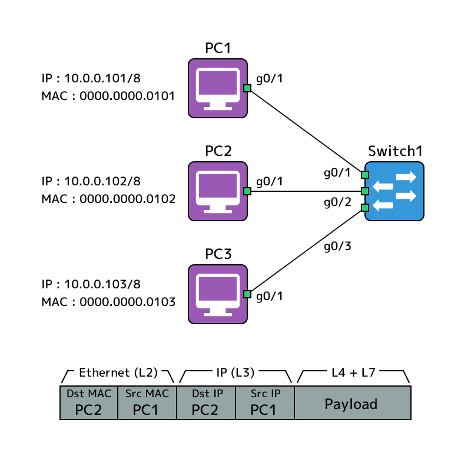

# スイッチを使った同一ネットワーク内の通信

{{ TOC }}

## 概要


## L2転送の概要

ネットワークを流れるパケットは複数のプロトコルのヘッダを持っていて、
それぞれのプロトコルは決められた役割に使われます。

IPアドレスを使うIPプロトコルは通信の「送信元ホスト(たとえばPC)」と
「宛先ホスト(たとえばYahooのサーバー)」を繋げる役割を果たします。
ただ、自分のPCとYahooのサーバーの間には多数のネットワークがあり、
データはその各ネットワークをバケツリレーのようにして転送されていきます。
この機器から機器への通信を担当しているのが「**L2転送**」です。
L2転送で利用されるプロトコルは様々なものがありますが、
現在のネットワークでは「**イーサネット**」が主流となっており、これ以外を利用することは稀です。
イーサネットが利用するアドレスはIPアドレスではなく「**MACアドレス**」で、
送信元の機器が宛先の機器のMACアドレスを指定して送信します。

一方、IPアドレスはバケツリレーにおいて「バケツの渡し先が複数いる際にバケツを正しい方向に渡す」ための判断に利用されます。
この判断は「**L3転送**」と呼ばれており、判断の詳細な仕組みは次ページ以降で扱います。
実際にケーブル上を電気なり光なりでデータ転送するのはL2転送の役割であり、
L3転送はL2転送を正しい方向に行うために使われます。

以下にL2転送とL3転送の違いを示す図を記載します。


上記の図では隣接する機器は同じネットワークに属しています。
これはL2転送での通信は必ず「**同じネットワークアドレスに属する機器同士**」が行うというルールがあるためです。
たとえば10.0.0.0/8のネットワークにいる10.0.0.1と10.0.0.2を接続してL2通信をすることはできますが、
異なるネットワークに属する10.0.0.1と192.168.0.1を接続してL2通信をさせるということはできません。

自宅や職場を想像してもらえば通常は1つのネットワークには3台以上の機械があることがわかります。
無線で機械を接続するアクセスポイントに加えて、ケーブルを複数接続できる「**スイッチ**」を使います。
スイッチはどこのインターフェースの先にどういったMACアドレスを持つ機器がいるかを記憶しており、
そのアドレス宛のフレーム(L2転送されるデータ)を受け取ったら、それをそちらにL2転送をします。
PC3がPC2に通信をする際は、PC3がPC2のMACアドレスを宛先にしてフレームを送信すれば、
それを受け取ったスイッチが宛先通りにPC2のポートからL2転送します。
スイッチ自体は同一ネットワーク内の機器から機器への通信の中継をするだけです。

ネットワークを越える通信を行う場合は「**ルーター**」と呼ばれる機器にL2転送を行い、
ルーターがL3転送で隣のネットワークから次のホップ(バケツの受けて)に対してパケットを届けるという仕事をします。
PC1がルーターのMACアドレスを指定してフレームを送信し、
スイッチがそれにしたがってルーターにフレームを届けます。
これを受け取ったルーターはL3転送で異なるネットワークからフレームを次のホップ(図で言うとNetwork-Bの右側のルーター)にL2転送をします。


ただ、たとえば自宅のネットワークでプリンタやNASを利用する際に、
それらの機器をどのように指定するかというとIPアドレスです。
つまり同一ネットワーク内の通信でもユーザーが宛先を指定するにはIPアドレスを利用します。

L2転送をするにはMACアドレスが必要だが、通信相手はIPで指定するという状況ですので、
各スイッチはIPアドレスとMACアドレスの対応表である「**ARPテーブル**」を持っています。
ARPテーブルには「IPアドレス1の機器のMACアドレスはMACアドレス1」などと記載されているので、
IPアドレス1あてのL2転送にはMACアドレス1を使えばよいことがわかります。

このARPテーブルは人間が設定することもできますが、
同一ネットワークに接続する機器同士が「**ARP(Address Resolution Protocol)**」というプロトコルを利用して作成するのが一般的です。
宛先のIPアドレス1に対してL2転送をしたい場合にそれに対応するMACアドレスが分からなければ、
ARPが「IPアドレス1のMACアドレスを教えてください」とネットワーク上の全ての機器に問い合わせを行い、
そのIPを持っている機器が「私がそのIPを持っています。MACアドレスはMACアドレス1です」などと応答します。
そしてその結果がARPテーブルに記載されます。

ここまでの話をまとめると、同一ネットワーク内の機器同士の通信は以下の手順でおこなわれます。

0. IPアドレスで相手の機器を指定する
0. ARPテーブルで相手のMACアドレスを得る
0. 相手のMACアドレス宛にフレームを送信する
0. フレームを受け取ったスイッチは相手のMACアドレスが接続されるポートへフレームを転送
0. 宛先の機器はフレームを受け取る

以後の本ページではこの流れの詳細を実際に機器を操作しながら確認します。
どのようにARPが利用され、どのようにスイッチがフレームを宛先に転送するか。


### MACアドレス

L2転送の仕組みは利用するプロトコルによりますが、
標準的なイーサネットプロトコルではMACアドレスというアドレスを利用します。

MACアドレスは48bit(IPアドレスは32bit)持ち、一般的には16進数(4bit)の12桁で表現されます。
たとえば私のノートPCには「b8e8.563c.6736」というアドレスが設定されていました。
12桁を続けるのではなく人が見やすいように4桁ごとにドットやコロンで区切ります。

MACアドレスの前半部(上記で言えば「b8e8.56」)は製造ベンダーが記載されています。
たとえば「mac address b8e856」などとgoogleで検索すると、「Vendor: Apple, Inc.」などとでてきます。
アドレスの後半部(上記の「3c.6736」)はベンダーが設定する箇所で、
同じネットワークに自社製品が複数接続されてもMACアドレスが重複しないように異なる値とします。


### ユニキャストとブロードキャスト

MACアドレスを使ったL2の転送には2種類あります。
「**ユニキャスト**」と呼ばれる特定の宛先に対する通信と、
「**ブロードキャスト**」と呼ばれる全ての宛先に対する通信です。

ユニキャストは「特定のホストから特定のホスト」にデータを届けるための通信なので、
フレームは宛先に辿り着くための一本の経路を使ってデータを送ります。
同じネットワーク内のプリンターやNASを使う場合はユニキャストを使っており、
他のほとんどの通信もユニキャストです。
宛先の指定には宛先のMACアドレスを使います。

ブロードキャストは同一ネットワーク上の全ての機器に対するデータ転送です。
きちんとケーブルや無線で繋がっている限り、送信元以外の全ての機器はブロードキャストのフレームを受け取ります。
ブロードキャスト用の特別な宛先MACアドレス「**FFFF.FFFF.FFFF**」宛にフレームを送信すると、
それを受け取ったL2スイッチは受け取ったポートを除く全ての他のポートからそのフレームを送ります。
PCやプリンタといったホストだけでなく、ルーターなどのネットワーク機器にもブロードキャストは届けられます。


ブロードキャストは全員にファイルを届けるといった用途よりも、
ネットワーク内での問い合わせに利用されることが多いです。
たとえば先ほど紹介したARPのように「この情報を知っている人はいますか」と、
同一ネットワーク全体に対して問い合わせを行うような場面で使われます。

ブロードキャストに似たものに「**マルチキャスト**」というものがありますが、
L2のフレーム転送においてはブロードキャストと大差はありません。
ただ、そのフレームを受け取ったホストがブロードキャストであれば無条件にフレームの内容をチェックするのに対し、
マルチキャストだとそのホストが関心があるMACアドレス宛以外のものは全て破棄(無視)します。


## 機器の設定

### 構成図

本ページではL2転送を試すためにスイッチに複数のホストが接続されているという構成を作ります。


この構成にはルーターが存在しないため、
異なるネットワークに接続することはできません。
ただ、同一ネットワーク内の通信にはルーターは利用されないため、
図にあるホスト(PC)同士の通信はスイッチのみで可能です。

なお、本来であればホストPCにWindowsやLinuxを利用するのでしょうが、
本サイトではCiscoのルーターをホストとして使います。
他のホストからのパケットの転送などはさせずに、単純に送信元ホスト及び宛先ホストとして使えば大差ありません。

各ホストに以下の設定を加えます。

* ホスト名
* IPアドレス
* サブネットマスク
* MACアドレス(通常は不要)
* デフォルトゲートウェイ

全てのホストOSにおいてネットワークを利用するためには、
IPアドレス及びサブネットマスクの設定は必須です。

MACアドレスの値は先にお伝えしたように工場出荷時に既にハードウェアに書き込まれていますが、
その値は「b8e8.563c.6736(私のPCのもの)」といった分かりにくい値になっているため、
IPアドレスと対応が取れている値を設定します。
たとえばIPアドレス「10.0.0.101」の機器のMAアドレスは「0000.0000.0101」といった具合です。

MACアドレスを変更するのはトラブルのもとですので、特別な理由がないかぎりは変更をしないでください。
本ページで変更するのはL2転送の仕組みを学ぶために分かりやすくするためです。
同じアドレスを複数の機器に設定してしまうとトラブルになるため注意してください。

デフォルトゲートウェイは「異なるネットワークへの通信を誰に中継させるか」という設定です。
インターネットや社内の他のネットワークに接続するには必須の設定ですが、
本ページでは不要であるため設定しません。


### ホストへのIPアドレス及びMACアドレスの設定

ユーザーモードから特権モードを経てコンフィグモードに移り、
ホスト名を設定します。

```text
Router>enable
Router#conf t  
Router(config)#hostname PC1
PC1(config)#
```

インターフェースの設定はコンフィグモードでインターフェース名を指定し、
インターフェースコンフィグモードで行います。
IPアドレスの設定は「**ip address <IPアドレス> <サブネットマスク>**」とするのでした。
サブネットは「/8であれば、255.0.0.0」「/16であれば255.255.0.0」「/24であれば255.255.255.0」とします。

CiscoのルーターではIPアドレスだけでなくMACアドレスの変更をすることも可能です。
それにはインターフェースコンフィグモードで「**mac-address <MACアドレス>**」とします。
IPアドレスとともにMACアドレスを設定し、
「**no shutdown**」コマンドでインターフェースをupさせます。

```text
PC1(config)#int g0/1
PC1(config-if)#ip addr 10.0.0.101 255.0.0.0
PC1(config-if)#mac-address 0000.0000.0101
PC1(config-if)#no shut
PC1(config-if)#end
```

特権モードでインターフェースの設定を「**show interface <インターフェース名>**」で確認します。

```text
PC1#show int g0/1
GigabitEthernet0/1 is up, line protocol is up                       <=== インターフェースの状態
  Hardware is iGbE, address is 0000.0000.0101 (bia fa16.3e1f.a079)  <=== MAC ADDRESS
  Internet address is 10.0.1.101/24                                 <=== IP ADDRESS
  MTU 1500 bytes, BW 1000000 Kbit/sec, DLY 10 usec,
     reliability 255/255, txload 1/255, rxload 1/255
  Encapsulation ARPA, loopback not set
  Keepalive set (10 sec)
  Auto Duplex, Auto Speed, link type is auto, media type is RJ45
以下省略
```

IPアドレスに加えて、先ほど設定したMACアドレス「0000.0000.0101」が設定されています。
その右側にあるものはデフォルトのMACアドレスで、
MACアドレスの設定を加えなければこの値がMAC値として利用されます。


## スイッチでのL2転送の仕組み

### L2フレームの構造

ユニキャスト通信では送信元ホストが宛先ホストのMACアドレスあてにフレームを送信します。
このフレームのL2ヘッダはイーサネットの形式ですので、
以下のような構造となっています。
各項目はフィールドと呼ばれています。


図では省略していますが、宛先MACの前には「プリアンブル」と呼ばれる決まった01の組合せがあります。
これは電気信号や光信号で「ここからフレームが始まりますよ」と分かるための目印のようなものです。
転送などには大きく関わらないため、通常時は無視して構いません。

プリアンブルに続く「**宛先MACアドレス**」および「**送信元MACアドレス**」がL2転送において重要な役割を持ちます。
宛先MACアドレスは宛先ホストのアドレスとなっていて、
スイッチはこれを基準に転送するポートを決めます。
また、送信元MACアドレスがあることで、
宛先ホストや中継するスイッチが誰が送ってきたフレームかを判別することができます。
PC1からPC2にフレームを送信するのであれば、宛先MACアドレスはPC2の値である「0000.0000.0102」となり、
送信元MACアドレスはPC1の値である「0000.0000.0101」となります。

それに続く「**タイプ**」はイーサネットフレームがどういったデータをカプセル化しているかということを示すためのものです。
TCP/IPではマトリョーシカ人形のようにL4,L3,L2とレイヤを下るごとにヘッダを先頭に追加していきますが、
上のレイヤのデータを確認する際にどういったプロトコルを使っているかが下のレイヤのヘッダに書かれていると処理しやすいです。
たとえばイーサネットのヘッダのタイプに「データはIPですよ」と示していれば、
データをIPの処理に渡して処理してもらうことができます。
タイプに「データはARPですよ」と書かれていれば、IPではなくARPの処理に渡す必要があることもわかります。

フレームの最後にある「**FCS(Frame Check Sequence)**」はフレームが壊れていないことを確認するためのものです。
フレームの送信側がフレームのフィールドから計算したCRC(Cyclic Redundancy Check)という値を、FCSに書き込んで送ります。
ケーブルを流れるデータ信号や光信号が外部からの影響で狂ってしまった場合は、
受信側で受けたフレームのフィールドの値とFCSの値が食い違いうため壊れていることが検知できます。


### MACアドレステーブル

スイッチには複数の機器が接続されており、
「どのポートの先にどのMACアドレスを持つ機器が存在するか」という情報を「**MACアドレステーブル**」として管理しています。

スイッチはフレームを受け取った際に、そのフレームの宛先MACアドレスとMACアドレステーブルを見比べます。
そうすることで「フレームはこの宛先MACなので、ポートXから送信すればよい」といった判断ができます。


たとえばPC1からPC2に送られたフレームを送ったとすると、
スイッチでは宛先MACが「0000.0000.0102」のフレームをポートg0/1ポートで受け取ることになります。
スイッチは宛先MACとMACアドレステーブルを比較することで、「0000.0000.0102」がポートg0/2の先にいることが分かります。
そのためスイッチはフレームをポートg0/2から送信し、ホストであるPC2はそれを受け取ることができます。

スイッチでMACアドレステーブルを確認するには管理者モードで「**show mac address table**」コマンドを使います。

```text
S1#show mac address-table
          Mac Address Table
-------------------------------------------

Vlan    Mac Address       Type        Ports
----    -----------       --------    -----
   1    fa16.3e1f.a079    DYNAMIC     Gi0/1
   1    fa16.3e7f.78a1    DYNAMIC     Gi0/2
```

出力にはVLAN、MACアドレス、タイプ、ポートという項目があります。
VLANは後述するグループ分けの機能でどのグループに属するかということを示していて、
タイプはどのようにして学習したかということを示しています。
それ以外は既に説明したとおりとなっています。

MACアドレステーブルは人の手で「このポートの先にこのMACアドレスがある」と設定するのではなく、
後述するMACアドレス学習という仕組みを使って自動で作成されます。

なお、まだスイッチが宛先アドレスを学習していない場合はどのポートを使えばいいか分かりません。
このような状況では「同一ネットワーク全体に対してフレームを送れば、どこかにいる宛先ホストに届くだろう」という考えで、
「フレームを受け取ったポート以外の全てのポートからフレームを出す」という動作をします。
宛先アドレスがどこにいるか分からないユニキャストの通信のことを「**アンノウンユニキャスト**」と呼び、
アンノウンユニキャストのフレームを拡散する動きのことを「**フラッド**」と呼びます。


フラッドされたフレームを受け取った宛先ホストは宛先MACが自分自身なので処理をします。
宛先ホスト以外のホストはフレームの宛先MACが自分宛てでないため、そのフレームは破棄します。
ネットワークに不要なトラフィックが流れるため、
アンノウンユニキャストによるフラッドは望ましくはありません。


### MACアドレス学習

スイッチのポートは多数あり、スイッチの先にスイッチがあるという構成だとひとつのポートの先にある機器も多数となります。
そのような状況でスイッチに「このポートの先に、このMACアドレスを持つ機器があります」と全て設定していくことは現実的ではありません。
また、たとえそのようなことができたとしても、機器を別のポートに差し替えたり、
配線の変更などのたびに大量のMACアドレスの登録変更をすることは難しいです。
このような背景から、スイッチはMACアドレステーブルを自動で構築するという動きをします。

イーサネットのフレームには宛先MACアドレスだけでなく、送信元MACアドレスが書かれています。
スイッチはフレームをポートで受け取った際に「この受け取ったポートの先に、
送信元MACアドレスのMACアドレスを持つホストが存在する」と分かりますので、そのタイミングでMACアドレステーブルにエントリを作成します。


たとえばスイッチがPC2のMACアドレスを未学習な状態で、PC2からPC1にフレームを送ったとします。
このとき「スイッチのポートg0/2で送信元MACアドレス0000.0000.0102を受け取る」というタイミングで、
MACアドレステーブルに「ポートg0/2の先にはMACアドレス0000.0000.0102を持つホストが存在する」とエントリを作成します。

このフレームを受け取った際に送信元MACアドレスからMACアドレステーブルのエントリを作る仕組は
「**MACアドレス学習**」と呼ばれています。
フレームの転送は宛先MACアドレスを基準にしておこなわれるのにたいして、
学習は送信元MACアドレスが基準となります。
宛先MACアドレスを見て学習しているわけではないので、注意してください。

なお、一般的に通信は2つのホスト間で双方向に行われますので、
ホストAとホストBの通信を行えば、スイッチは両方のホストのMACアドレスを学習します。
そのため、アンノウンユニキャストによるフラッドは一旦届いてしまえば発生しなくなりますので、
一時的なものであることが多いです。


### MACアドレスの削除と更新

学習したMACアドレスの機器がそのポートの先に存在するということは、
永久に保証できるものではありません。
たとえばPC1をスイッチのポートg0/1からg0/4につなぎかえたら、
MACアドレステーブルのエントリである「0000.0000.0101 : g0/1」は誤った情報となり、
正しくは「0000.0000.0101 : g0/4」となります。
MACアドレステーブルの情報を正しく保つためには、
エントリを登録するだけでなく消したり更新したりすることが欠かせません。

機器がそのポートの先に存在しなくなると判断できるのは、
そのポートがダウン状態になった場合です。
ポートからフレームを送信できなため、そのポートとMACアドレスを紐付けておく必要はありません。
ダウンしたポートで学習したMACアドレスは全てMACアドレステーブルから削除されます。

もうひとつは長期間通信が発生しなかった場合です。
「ホスト -> スイッチA -> スイッチB」という構成だと、
ホストがスイッチAに接続するケーブルを抜いて別の場所に動いても、直接接続されていないホストBはそれを知りません。
ずっとホストがスイッチAの先にいると思ってフレームをスイッチA側に転送し続けてしまうことを防ぐために、
スイッチBはスイッチAから「送信元MACアドレスがホストとなっているフレーム」を一定時間受け取らなければ、
ホストのMACアドレスのエントリをMACアドレステーブルから削除します。
このような状況のことを「タイムアウト」と呼んでいます。
一般的には5分が設定されています。



上記のスイッチBの状況で、タイムアウトが発生するまえにホストの送信元MACアドレスを持つフレームが別のポートからくれば、
MACアドレスのエントリはタイムアウトを待つこと無く新しいアドレスとポートのペアで更新されます。
フレームが届くということは、その受信ポートの先に送信元MACアドレスを持つ機器がいるということが確実だからです。

よくある障害としては同一MACアドレスを持つ機器がネットワークに2つあり、
それらがフレームを送り続けることでMACアドレスのテーブルのエントリが不安定になるというものがあります。
通称、MACフラップと呼ばれるもので、手動で機器にMACアドレスを設定するのに不備があると発生します。


## ARP

あるホストが別のホストにデータを送信しようとした場合は宛先ホストをIPで指定します。
自動で検出できないネットワークプリンタを使おうと思えばプリンタをIPで登録する必要がありますし、
自宅のNASなどに接続する場合もIPを入力します。
つまり、同一ネットワーク内のフレームの転送にはMACアドレスを利用するものの、
通信相手の特定にはIPアドレスが利用されるということです。

このページのようにMACアドレスを手動で設定すれば通信相手の指定をMACアドレスで指定することも可能でしょうが、
通常はハードウェアが持つほとんど規則性のない12桁の16進数となるため、
それを確認して登録することは大変です。
一方、IPアドレスは「ネットワークアドレス」と「ホストアドレス」という規則性を持つアドレスを使っていますので、
相手を指定することはMACアドレスに比べれば簡単です。

このような背景からTCP/IPでは「同一ネットワーク内の通信相手をIPで指定」し、
「そのIPアドレスを持つホストのMACアドレスを取得する」という方法でMACアドレスを使ったL2通信を開始します。
これを実現するための仕組みが「**ARP(Address Resolution Protocol)**」で、
L2ブロードキャストを使って「このIPアドレスを持つホストはMACアドレスを教えてください」と同一ネットワーク全体に問い合わせを行い、
そのIPアドレスを持つホストは「私がそのIPアドレスを持っています」とユニキャストで応答します。
問い合わせをしたホストはその応答から宛先MACを知り、L2通信が開始されます。

### ARPリクエスト

PC1(10.0.0.101)がPC2(10.0.0.102)にpingで通信をする際は、
PC1にて「ping 10.0.0.102」とコマンドを発行しました。

pingのフレームにはMACアドレスを持つイーサネットヘッダと、
IPアドレスを持つIPヘッダ、pingのデータがあります。
このうち、宛先MACアドレス以外のフィールドについては既に送信元ホストであるPC1は知っています。
あとは宛先MACさえ分かれば、PC2に送るpingのフレームは完成するので、
ARPを使って宛先MACアドレスを解決します。

宛先MACを知るためには、そのMACアドレスに対応するIPを持つホストにたいして
「MACアドレスを教えてください」という「**ARPリクエスト**」をL2通信で届ける必要があります。
相手のMACアドレスを知らない状況で、どこにいるか分からない相手に対してリクエストを届ける必要があるため、
ARPリクエストの宛先MACアドレスはブロードキャストアドレスである「FFFF.FFFF.FFFF」を使います。
ブロードキャストを受け取ったスイッチは受信ポート以外からフレームを拡散させますので、
同一ネットワーク内にARPリクエストの対象IPを持つ機器が存在すれば確実に届きます。


ARPリクエストを受け取った機器の全てはリクエストの内容を確認し、
それが自分宛てであるかをチェックします。
自分宛てでなければ無視し、自分宛てのリクエストであればARPリプライをリクエスト元に返します。

### ARPリプライ

ARPリクエストを受け取ったホストはリクエストの内容をチェックします。
もしそれが自分が持つIPアドレスに対するリクエストであれば、
「**ARPリプライ**」を送信元に送り返します。

ARPリクエストは宛先が特定できておらずどこにリクエスト先の機器がいるかも分からない状況だったのでブロードキャストを使いましたが、
ARPリプライはリクエスト元が特定できているのでユニキャストで応答を返します。


この応答のフレームの宛先MACアドレスはリクエスト元のMACアドレスになっているので、
スイッチを経由してリクエスト元にARPリプライが返ります。

ARPリプライにはIPアドレスとMACアドレスの組合せが書かれていますので、
PC1はPC2のIPアドレスとMACアドレスの組合せ「10.0.0.102 : 0000.0000.0102」を知ることができます。
これでPC1はPC2に対してpingのフレームを送信する準備ができたため、
宛先MACアドレスに「0000.0000.0102」をセットしてpingを送ります。


### ARPテーブル

宛先MACアドレスを知らない場合はARPを使ってMACアドレスを解決する必要があります。
ただ、1フレーム送るたびにこのような解決を繰り返すのは非効率ですので、
ホストはIPアドレスとMACアドレスの組合せをしばらく記憶(キャッシュ)しておきます。

このARP結果のキャッシュのことを「**ARPテーブル**」や「**ARPキャッシュ**」と呼びます。
ARPの学習状況がどのようになっているかは以下のコマンドで確認できます。

```text
PC1#show ip arp  
Protocol  Address          Age (min)  Hardware Addr   Type   Interface
Internet  10.0.1.101              -   fa16.3e1f.a079  ARPA   GigabitEthernet0/1
Internet  10.0.1.102              3   fa16.3e7f.78a1  ARPA   GigabitEthernet0/1
```

上記はPC1のARPテーブルですが、PC2と通信をしたためIPアドレスとMACアドレスのペアが登録されていることが分かります。
自分自身のペアも登録されています。

まだ通信をしていないPC3にたいしてpingをおこない、
もういちどARPテーブルを確認します。

```text
PC1#ping 10.0.1.103
Type escape sequence to abort.
Sending 5, 100-byte ICMP Echos to 10.0.1.103, timeout is 2 seconds:
.!!!!
Success rate is 80 percent (4/5), round-trip min/avg/max = 4/4/5 ms

PC1#show ip arp    
Protocol  Address          Age (min)  Hardware Addr   Type   Interface
Internet  10.0.1.101              -   fa16.3e1f.a079  ARPA   GigabitEthernet0/1
Internet  10.0.1.102              6   fa16.3e7f.78a1  ARPA   GigabitEthernet0/1
Internet  10.0.1.103              0   fa16.3e18.af47  ARPA   GigabitEthernet0/1
```

先ほどのPC2に加えて、PC3のペアも登録されていることがわかります。

ARPテーブルにあるAgeは学習してからどれほどの時間が経過したかを示しています。
MACアドレスとIPアドレスの組合せはずっと同じとは限りません。
たとえばPC2がIPアドレスやMACアドレスは設定しだいで変わる場合があるからです。
そのため、ARPの結果も消されたり更新されたりします。

ARP学習をしてからしばらく時間がたつと、エントリが消える前に再度ARPをおこなって、
その組合せが正しいかを再確認します。
正しければARPテーブルのエントリは引き続き保持されます。


## 大きなネットワークの構築

1つのネットワークに接続する機器が全て同じスイッチに接続されているとは限りません。
スイッチはネットワークを拡張する役割があるので、スイッチにスイッチを繋げるとより大きなネットワークを作ることができます。

業務用のスイッチの多くは24ポートもしくは48ポートですので、大きな部署で人数分のPCとIP電話を繋げばすぐにポートを使い尽くしてしまいます。
そのような時はスイッチを木構造で繋げることで大きな一つのネットワークを作ります。
一般的にはコアスイッチにアクセススイッチを接続するという2階層の構造を作ります。


実際はこの階層化に加えて冗長化技術(機器が壊れてもネットワークを提供し続けられる)も使いますが、
話が複雑になるので冗長化は後のページで別途扱います。

スイッチにPCを直結した場合はポートと宛先MACアドレスの組合せは1対1でしたが、
接続相手がスイッチだと1つのポートに多数の宛先MACアドレスが紐付けられます。
上記の階層構造のトポロジでMAC学習をさせると、
各スイッチのMAC学習の状況は以下のようになります。


S1はPC3をS3を経由して学ぶため、PC3のMACは「S3が接続されているG0/3インタフェース」で学んでいます。
S2スイッチはPC1,2をS3を経由して学ぶため、S3が接続されるG0/2で2つのPCを学習しています。
S3はS1に接続される2つのPCのMACをS1が接続されるG0/1で学び、PC3はG0/2で学んでいます。

各スイッチの実際のMACテーブルは以下のようなものとなっていました。

```text
S1#show mac address-table          
          Mac Address Table
-------------------------------------------

Vlan    Mac Address       Type        Ports
----    -----------       --------    -----
   1    0000.0000.0101    DYNAMIC     Gi0/1
   1    0000.0000.0102    DYNAMIC     Gi0/2
   1    0000.0000.0103    DYNAMIC     Gi0/3
   1    fa16.3e3a.db08    DYNAMIC     Gi0/3
   1    fa16.3e56.0961    DYNAMIC     Gi0/3


S2#show mac address-table          
         Mac Address Table
-------------------------------------------

Vlan    Mac Address       Type        Ports
----    -----------       --------    -----
   1    0000.0000.0101    DYNAMIC     Gi0/2
   1    0000.0000.0102    DYNAMIC     Gi0/2
   1    0000.0000.0103    DYNAMIC     Gi0/1
   1    fa16.3e3a.a66a    DYNAMIC     Gi0/2
   1    fa16.3ea4.4f78    DYNAMIC     Gi0/2

S3#show mac address-table
         Mac Address Table
-------------------------------------------

Vlan    Mac Address       Type        Ports
----    -----------       --------    -----
   1    0000.0000.0101    DYNAMIC     Gi0/1
   1    0000.0000.0102    DYNAMIC     Gi0/1
   1    0000.0000.0103    DYNAMIC     Gi0/2
   1    fa16.3e56.0961    DYNAMIC     Gi0/2
   1    fa16.3ea4.4f78    DYNAMIC     Gi0/1      
```

上記のテーブルにはPC以外のMACアドレスも学習されていますが、
これはスイッチのインターフェースに割り当てられているものです。

実はスイッチ間ではホスト間でやりとりするフレーム以外にも、お互いの機器情報の交換といった様々な通信が行われています。
スイッチ間のやりとりもMACアドレスを使って届け合うため、MAC学習されてMACテーブルにのってきます。


### 大きなネットワークの問題点

スイッチにスイッチを繋げる階層構造を繰り返せば、
理屈的には世界中の機器を1つのネットワークに接続することができます。
ただ、実際は業務用環境であっても1つのネットワークが持つホストの台数は多くても数百台(オフィス)から数千台(データセンター)です。
無限にネットワークを大きくしない理由にはいくつかあります。

まず、同一ネットワーク内のL2通信はARPといったブロードキャストや、
アンノウンユニキャストによるフラッドといったネットワーク全体に対するトラフィックがあります。
スイッチやホストが数十台や数百台からのARP応答には対応できたとしても、
数万台のホストが送り合うARPを処理するだけでも大きな仕事となります。

次の問題はMACアドレステーブルの大きさです。
今回の実験を通して分かったと思いますが、MACテーブルのエントリの数はおおよそネットワークに属する機器の数と同じになります。
スイッチがフレームを受け取った際にどこの出口から出せばいいかということを管理していますが、
高速な転送をするために転送チップに直接エントリを書くためそれほど多くの学習はできません。
MACテーブルの上限値を超えたフレームの学習はできないため、なにかを忘れる必要があり、
それが再びアンノウンユニキャストによるフラッディングを導いてしまいます。

また、スパニングツリー(詳細はL2冗長化で扱う)の仕組み上、
同一ネットワークの通信は特定の機器を常に経由します。
そのため、ネットワークを大きくすればするほど、
通信の負荷がネットワークの中心にいる機器に集中してしまうため、
その機器がボトルネックになります。

他には障害が発生した場合の影響箇所を狭めるという意味合いもあります。
たとえば部署ごとにネットワークを切っていれば、ある部署の障害はその部署に閉じます。
一方、社内全員が同じネットワークに属していれば、障害は全社規模となってしまいます。
不必要に大きいネットワークを作ると、小さなトラブルが大きな影響を与える可能性があります。

セキュリティ的な観点でいえば、機器同士の通信を制御しにくいという問題点もあります。
例えば会社を訪問してきたお客さまと社員が同じネットワークに参加していると、
社員向けのサーバーにお客さまがアクセスできてしまうという問題が考えられます。
ゲスト向けのネットワークと社員向けのネットワークが適切に分けられていれば、
「ゲストのネットワークから社員のネットワークにアクセスできない」などといった制御ができます。

これらの観点からネットワークは「物理的な場所」や「組織の論理的な構造」に応じて適切なサイズで作成することが必要で、
ネットワークとネットワークの間の接続はL3の機器であるルーターもしくはL3スイッチで制御するというのが一般的です。
