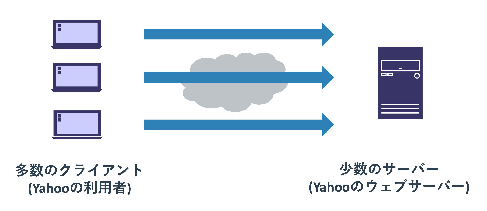

# ルーティングその他

## 経路選択アルゴリズム

ルーティングテーブルにおいて「0.0.0.0/0」のデフォルトルートより、
宛先「10.0.0.100」は「10.0.0.0/8」の経路が優先されます。
このようにルーティングテーブルのエントリには優先度があり、
複数の経路の選択肢がある場合は最も優先度が高いものが選ばれます。

経路選択の優先度は以下の順序で決まります。

0. プレフィックス長の比較
0. AD値の比較
0. メトリックの比較

プレフィックス長の比較で優先度が同じであれば、AD値の比較に移る。
AD値の比較でも優先度が同じであればメトリックの比較をするという流れです。
メトリックも同じであった場合にどうなるかはプロトコル及び設定次第ですが、
一般的にはどれか一つのルートを使うか、ロードバランス(全て使う)するかのどちらかです。

それぞれの比較方式について説明します。

### プレフィックス長の比較

経路選択においていちばん重要なルールは「経路がより詳細に指定されているエントリを優先する」というものです。
具体的にはサブネットマスクの長さ(プレフィックス長)が長いものを、短いものより優先するということです。
「10.1.0.0/16」のネットワークへのルーティングは「10.0.0.0/8」よりも「10.1.0.0/16」のエントリを優先します。



実際にスタティックルートとTracerouteを使って、この動きを確認します。


```text
ルーティングテーブルの表示
```

```text
Tracerouteの表示
```

### AD値の比較

経路学習には様々な手法やプロトコルがあります。
たとえば管理者が手動で設定するスタティックルートや、OSPFによる自動学習などです。

これらの経路の学習元(ソース)には信頼性が設定されており、
それは「**AD値(Administrative Distance)**」と呼ばれています。
スタティックルートにもOSPFにもAD値が設定されており、
同じ経路を複数のソースから学習していた際は、ソースのAD値を比較することでどのルートを使うかを決めます。
AD値は「**値が低いものが優先される**」というルールがあります。

CiscoのルーターにおけるデフォルトのAD値は以下のようになっています。
学んでいないプロトコルなどもあるので知らないものは無視してもらって構いませんが、
今まで学んだものだと「直接接続されるネットワーク」「スタティックルート」「OSPF」という順で経路を選択することがわかります。
なお、AD値の比較よりプレフィックス長の比較の優先度が高いため、
より細かい経路を学習してしまうと直接接続しているネットワークあての通信だったとしても、
パケットが他のネットワークに転送されてしまうといったことは発生します。

```text
接続済み	0
スタティック	1
eBGP	20
EIGRP（内部）	90
IGRP	100
OSPF	110
IS-IS	115
RIP	120
EIGRP（外部）	170
iBGP	200
EIGRP サマリー ルート	5
```

このデフォルトのAD値には「自動学習したものより自分で設定したものを優先する」といった常識的なルールが適用されています。
EIGRPというCisco独自のルーティングプロトコルをOSPFより優先するといった点もありますが、
組織内で複数のルーティングプロトコルを同時に動かすことは滅多にないため考慮は不要かと思います。
ただ、BGPは他のルーティングプロトコルと共用されることがあるため、若干注意が必要です。


```text
ルーティングテーブルの表示
```

```text
Tracerouteの表示
```

なお、各ソースのAD値は変更することができます。
スタティックルートは各エントリごとにAD値を調整することができるので、
「ルーティングプロトコルにトラブルが起きて経路情報を失った際はここに転送する」といった使い方をまれにします。

AD値を意識しなければいけないようなネットワークを構築することは可能な限り避けて下さい。
複数のソースで複雑なエントリを構築しているということは、理解しにくいネットワーク構造になっている可能性が高いです。


### メトリックの比較

「**メトリック**」は各ルーティングプロトコルの経路選択のルールです。
各ルーティングプロトコルごとに異なるメトリックのルールを持っているため、OSPFのメトリックはOSPFのなかだけで使われます。
他のプロトコルとの比較はメトリックではなくAD値で行われます。

メトリックは特定のルーティングプロトコルで組織内で運用する際に重要な役割を果たします。
複数のルーターが階層的に接続されている状況では、あるネットワークに辿り着く経路が複数ある場合があります。
メトリックはそういった際に「この経路が良さそうだから、これを使う」といったことを判断する仕組みです。

たとえば以下の図では左側のネットワークから右側のネットワークまで辿り着く経路が上下にあります。
プレフィックス長も同じで、AD値も共にOSPFなので同じです。


ただ、宛先までに辿り着くホップ数が異なっています。
OSPFのメトリックの細かい計算方法は割愛しますが、
「高帯域の経路を優先する」「もし同じ帯域ならホップ数が短いものを優先する」というルールを覚えておけば十分です。
今回の場合は経路の帯域が全て同一ですので、ホップ数が短い上側の経路を選択します。
もし上側の経路の帯域が下側より少ない(通常は1/10になる)場合は、下側のルートを選びます。

```text
ルーティングテーブルの表示
```

```text
Tracerouteの表示
```

このように複数の経路で宛先にネットワークにいける場合は片側の経路が障害などで使えなくなったとしても、
もう片側の経路を使うことができます。


## ルート再配送

スタティックルートや複数のルーティングプロトコルを同時に使っている環境では、
あるソースから学んだ経路を別のソースに対して伝播させることができます。
この経路情報を異なるプロセスに伝播させることを「**ルート再配送**」と呼びます。
ルート再配送はスタティックルートやEIGRPの経路情報をOSPFに流すといった使い方はもちろんですが、
複数のOSPFのプロセス間(OSPFのグループ1、グループ2)で経路情報をやりとりするといった使い方もできます。

ルート再配送が使われるよくあるシナリオとしては、
組織の中にもいくつかのネットワーク管理グループが分かれていて、
そのグループ間で経路情報をやりとりしなければいけないといったものです。
もしくは組織間で使われるBGPで学んだ経路情報を、組織内でOSPFなどとして伝播するといったものです。


なお、ルート再配送は積極的に利用するものではありません。
使わずに済むのであれば、ネットワークの設計を変更するなどして綺麗な構成にすることを推奨します。
たとえば後述する経路集約をすることを前提としてネットワークを設計すれば、
組織内の細かいルートを再配送する必要はなくなり、おおまかなルートでグループ間の経路情報を定義できます。

### OSPFのルート再配送

### サンプル


## 経路集約

経路集約はネットワークの設計に関わる非常に重要な概念です。

経路集約は「連続した小さな複数のネットワーク」を「大きな一つのネットワーク」として外に見せるテクニックです。
これを使うことでルーティングテーブルに記載されるエントリの数が減らせるので、ネットワークを管理しやすくなります。
ただ、「連続した」とあるようにネットワークの設計をする際にレンジが近いネットワークアドレスを固める必要があります。


たとえば上記の図は複数の支店がある会社のネットワークの設計です。
各支店のアドレスは「10.1.0.0/16」「10.2.0.0/16」「10.3.0.0/16」などと大まかに区切られており、
支店の中でそのアドレスをやりくりしてネットワークを構築しています。

このような構成を取ると学習する経路情報は「支店間のルータは各支店の/16のネットワーク」
「各支店内のルーターは各支店内の細かいルートで、10.0.0.0/8は支店間のルーターに全て任せる」とできます。
このような構成を取るメリットはまず第一に分かりやすいものとなることがあげられます。
また、全てのルーターが組織内の全ての経路情報の全てを学習する必要がなくなります。

ネットワークの障害は複雑な構成なネットワークで機器が故障したり設定変更をした際に発生することが多いので、
シンプルな綺麗な構成を作れば「障害発生確率が減る」「障害発生のインパクトが減る」「復旧にかかる時間が短くなる」といいことずくめです。


経路集約を実現するテクニックは様々ありますが、よく使われるのは
「全てを一つのルーティングプロトコルで実現する」
「集約する境界で別のルーティングプロトコルのプロセスを使う」
「集約されたルート間はスタティックルートで実現する」
あたりです。
昨今だと支店間をVPNで接続して、スタティックルートで本社と支店の間での経路情報を設定するというパターンが多いです。
支店間の間のデータのやりとりは一旦本社を経由します。

ここではOSPFの経路集約機能を使って、全てをOSPFで実現するという手法を扱います。

### OSPFの経路集約


### サンプル構成


# コラム

ルーターとスイッチのソフトウェアとハードウェア
RIBとFIB
転送用のASICとバックプレーン側のASIC


PCとルーターは同じネットワークに接続されているため、パケットをルーターに送るには第二章で説明した手順が使われます。
復習がてらに説明すると以下の流れとなります。

1. ARPでデフォルトゲートウェイのMACアドレスを問い合わせ(キャッシュされている場合は3へ)
2. デフォルトゲートウェイであるルーターがMACアドレスを通知
3. 宛先MACアドレスをデフォルトゲートウェイのMACに設定し、パケットを転送
4. パケットを受け取ったルーターは宛先に応じてそのパケットをさらに転送

ルーターから他のルーターに転送する場合も同様にARPを使って、
次の宛先となるルータのMACアドレスを取得して同じネットワーク内の転送をします。
ルーターから「パケットを届ける宛先の最終地点であるホスト」に転送する場合もARPとL2転送が使われます。

ルーターの転送の仕組みは追って話しますが、ネットワークA,B,Cという構成でネットワークAにいるホストから、
ネットワークCにいるホストに通信をする場合は以下のようなパケットになります。
